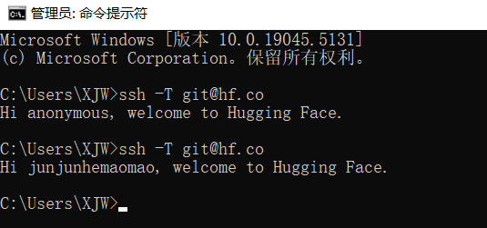
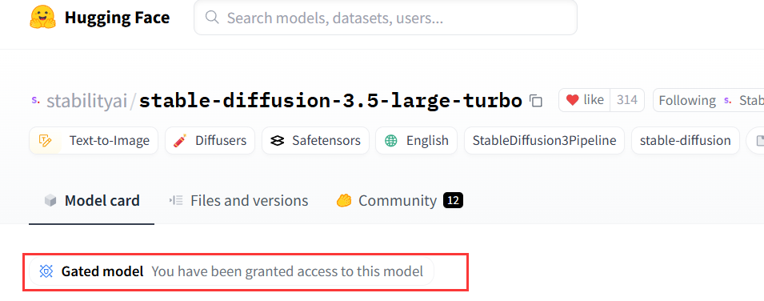

# Hugging Face使用
同步模型clone的前提是生成了相关的key  
## 生成SSH 密钥
打开终端，输入以下命令
```
ssh-keygen -t ed25519 -C "xiejinwu1986@gmail.com"
```
可以全部默认，执行结果如下
```
C:\Users\XJW>ssh-keygen -t ed25519 -C "xiejinwu1986@gmail.com"
Generating public/private ed25519 key pair.
Enter file in which to save the key (C:\Users\XJW/.ssh/id_ed25519):
Enter passphrase (empty for no passphrase):
Enter same passphrase again:
Your identification has been saved in C:\Users\XJW/.ssh/id_ed25519
Your public key has been saved in C:\Users\XJW/.ssh/id_ed25519.pub
The key fingerprint is:
SHA256:64hw2U7/DAjR7PzZ2SiFsF13Ytwi38pgW7tdJ6rbuxk xiejinwu1986@gmail.com
The key's randomart image is:
+--[ED25519 256]--+
|                 |
|     o     . .   |
|    . +   o * o  |
|     + + o = =   |
|    . + S + o .  |
|     + o * O o   |
|  . o + * = E . o|
|   o + + + . * o.|
|    . o o.=oBo.  |
+----[SHA256]-----+
```
启动SSH Agent   
    
在终端中运行以下命令启动 SSH Agent：
```
ssh-agent
```
添加ssh   
```
ssh-add C:\Users\XJW\.ssh\id_ed25519
```
添加SSH key     
[SSH & GPG Keys](https://huggingface.co/settings/keys)    
   
测试   
```
ssh -T git@hf.co
``` 
   
模型需要填写同意授权等   
   
获得权限   
   
同步成功。等待完成  

