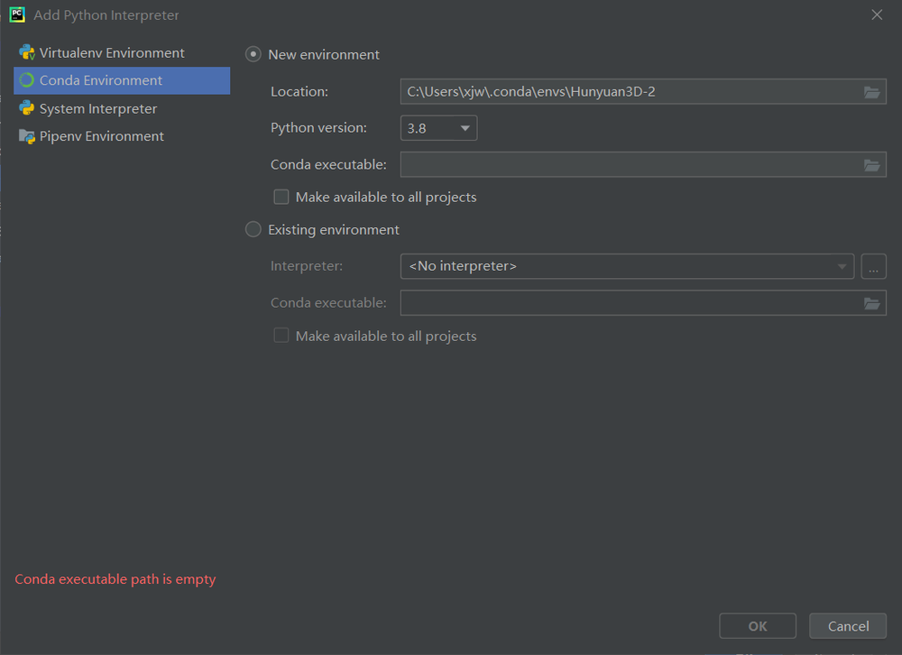

# Hunyuan3D
## 创建虚拟环境

要创建一个名为Hunyuan3D且安装 Python 3.8 的环境
```
conda create --name Hunyuan3D python=3.8
```
创建完成后,可以使用conda activate命令激活新环境
```
conda activate Hunyuan3D
```
## 安装Pytorch
查看显卡及驱动版本   
   
查看CUDA版本支持   
显卡驱动566，可以支持CUDA12   
<https://docs.nvidia.com/cuda/cuda-toolkit-release-notes/index.html>   
   
pytorch官网: <https://pytorch.org/get-started/locally/>   
```
conda install pytorch torchvision torchaudio pytorch-cuda=12.4 -c pytorch -c nvidia
```
## Pycharm配置
   
如何在Anaconda Navigator中找到conda executable的路径: 
1. 打开 Anaconda Navigator，在主界面左侧点击 “Environments”（环境）选项卡   
2. 在环境列表中，任选一个环境（比如 base），点击其右侧的图标   
3. 在弹出的菜单中选择 “Open Terminal”（打开终端），此时会弹出一个终端窗口
4. 在终端窗口中输入命令which conda（Linux 或 macOS 系统）或where conda（Windows 系统）并回车执行。
5. 执行后，终端会显示 conda executable 的路径

在 Windows 系统中，路径一般类似C:\Anaconda3\Scripts\conda.exe ；
在 Linux 和 macOS 系统中，路径通常形如/home/user/anaconda3/bin/conda （user为用户名）

## 安装剩余的依赖项
```
pip install -r requirements.txt
```
