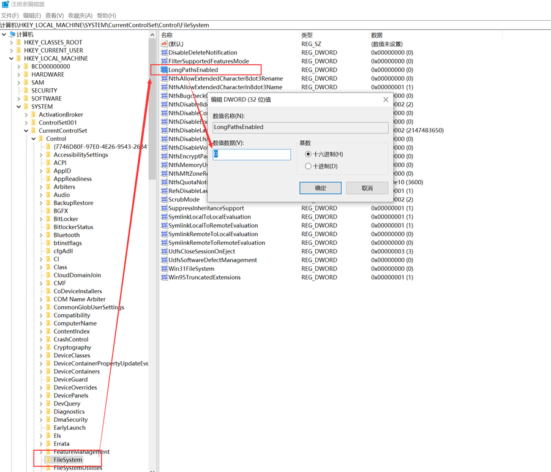
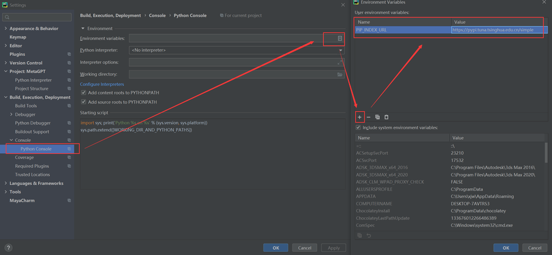
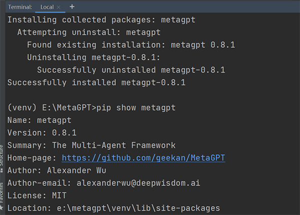
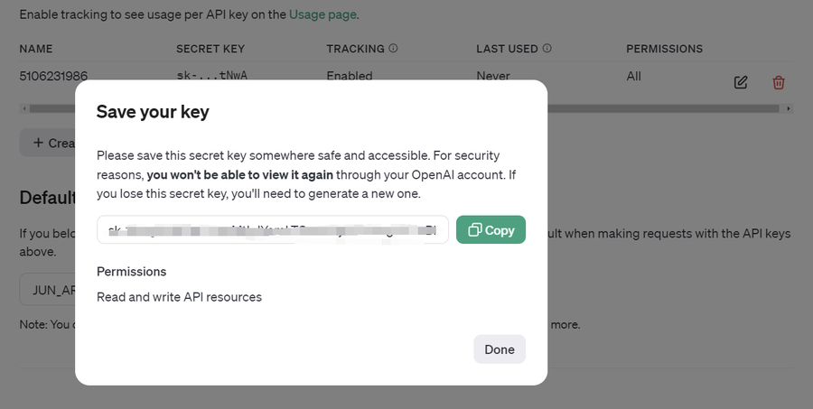
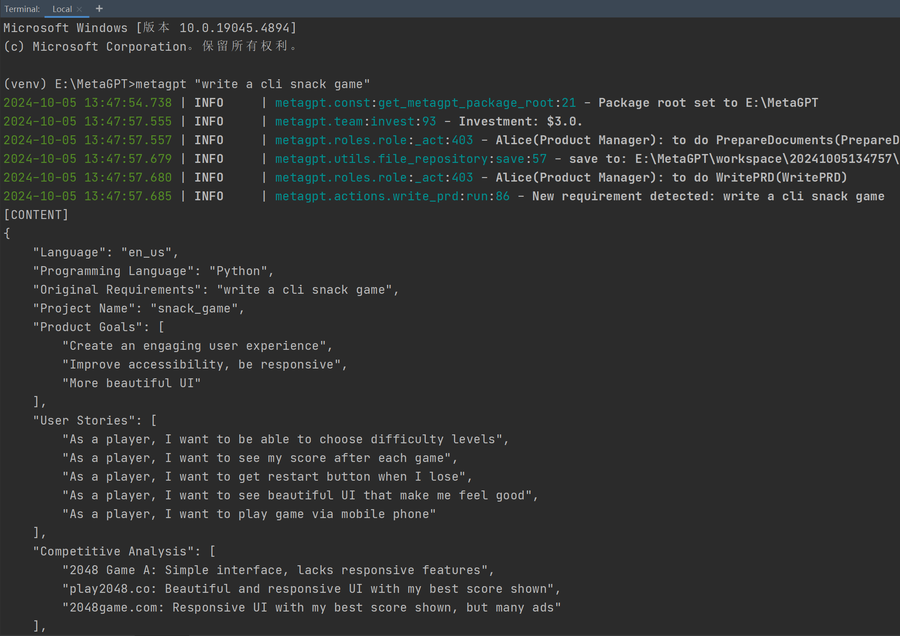

# MetaGPT   
   
学习社区：
<https://deepwisdom.feishu.cn/wiki/KhCcweQKmijXi6kDwnicM0qpnEf>     
## 安装的坑
## 电脑里有多个python
修改系统环境变量的path，需要把python310对应的路径和对应的pip置顶。  
失败的原因往往是只添加了python版本的环境变量，没有添加pip,导致安装并没启用对应的pip。  
   

## 自动安装的bug,最后报错
> ERROR: Failed building wheel for volcengine-python-sdk   

该包是字节跳动的火山引擎SDK for Python。BUG暂时还没有被修复（2024.10.5）
  
使用pip安装，某些包的文件名或路径过长可能会导致安装失败。   
对于 Windows 10 及其之后的版本，启用长路径支持可以有效解决这个问题。

### 解决方案：启用 Windows 长路径支持
1. 打开注册表编辑器：
   - 按 Win + R，输入 regedit，然后按 Enter。
2. 导航到对应的路径：
   - 依次展开：HKEY_LOCAL_MACHINE -> SYSTEM -> CurrentControlSet -> Control -> FileSystem。
3. 修改或创建 LongPathsEnabled 项：
   - 在 FileSystem 目录下找到 LongPathsEnabled 项。
   - 如果 LongPathsEnabled 不存在：
       - 右键点击 FileSystem 目录，选择 “新建” -> “DWORD (32 位) 值”。   
       - 将新建的项命名为 LongPathsEnabled。
   
   - 双击 LongPathsEnabled，将其值设置为 1（启用长路径支持）。
4. 重启电脑：  
   - 修改注册表后，通常需要重启系统才能使更改生效。  



## 修改pip镜像源
   
Name: PIP_INDEX_URL   
Value: https://pypi.tuna.tsinghua.edu.cn/simple  

以下是国内常用的 PyPI 镜像源列表：   
- 阿里云: https://mirrors.aliyun.com/pypi/simple/
- 清华大学: https://pypi.tuna.tsinghua.edu.cn/simple/
- 豆瓣: https://pypi.douban.com/simple/
- 中国科技大学: https://pypi.mirrors.ustc.edu.cn/simple/
- 华中理工大学: https://pypi.hustunique.com/   

选择其中一个配置后，可以显著提升 pip 安装速度

## 安装
安装依赖包   
```
pip install -e .
```
安装说明链接：  
<https://docs.deepwisdom.ai/main/zh/guide/get_started/installation.html>  
安装成功后显示如下：  

## 获取API Key
OpenAI的API需要付费才能调用。这里是详细说明：  
<https://docs.deepwisdom.ai/v0.8/zh/guide/get_started/configuration.html>        
这里是OpenAI的key生成地址：   
<https://platform.openai.com/settings/profile?tab=api-keys>     
  
请将这个密钥保存在安全且易于访问的地方。出于安全原因，您将无法通过 OpenAI 帐户再次查看它。如果您丢失了该密钥，则需要生成一个新密钥。  


## 使用  
在Terminal内输入 **metagpt + “你的需求”**，以下代码是贪吃蛇游戏的例子，可以直接复制运行：
```
metagpt "write a cli snack game"
```
```
llm:
  api_type: "openai"  # or azure / ollama / groq etc.
  model: "gpt-3.5-turbo"  # or gpt-3.5-turbo
  base_url: "https://api.openai.com/v1"  # or forward url / other llm url
  api_key: "sk-3HngiZxBZdfYXimMtIglYemLTGsAPGj0i7PcJkglTLT3BlbkFJabrE03aPQ_HFyYF9Xc8NCtF_grlWHBCQ3yTMoptNwA"
```
我使用免费的gemini-pro大模型。  
<https://aistudio.google.com/app/apikey>    
测试结果如下，可以看到在开始自动干活了。workspace里的文件就是生成的东西。     
  
测试生成的结果 。有很多错误。可能配置了一个AI有关。


metagpt "write a mario game "
