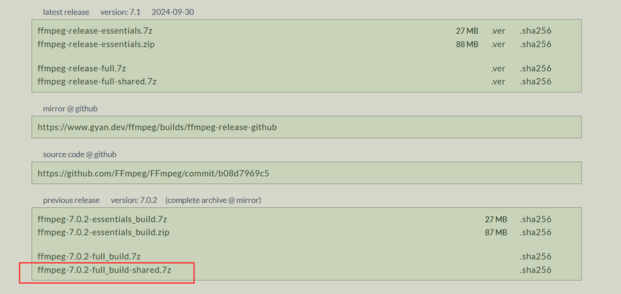

# MockingBird
## 安装
1. Anaconda Prompt中创建一个虚拟环境，确保后续安装依赖的成功
   ```
   conda create -n MockingBird python=3.9
   conda activate MockingBird
   ```
2. [安装Pytorch](/技术美术/AI工具/pytorch/Pytorch.md)  
3. 安装[ffmpeg](https://www.gyan.dev/ffmpeg/builds/)    
   
   - 下载并解压开后，复制bin的路径，如：E:\ffmpeg-7.0.2-full_build-shared\bin  
   - 添加路径到系统环境变量   
        
   - CMD测试，看是否有版本信息.**ffmpeg -version**  
     
4. 打开MockingBird工程，运行`pip install -r requirements.txt` 来安装剩余的必要包。  
   