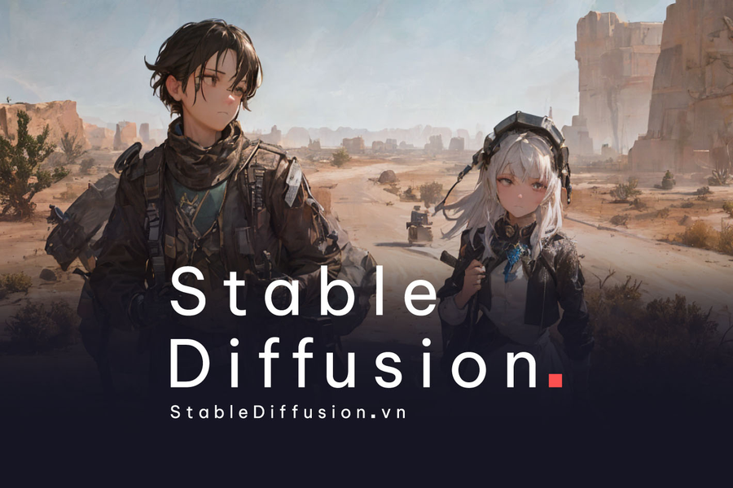
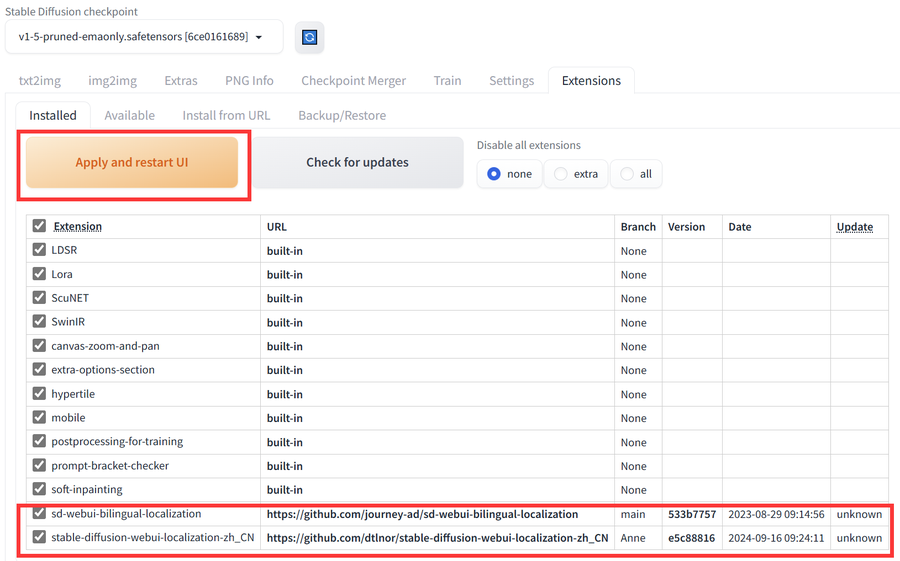
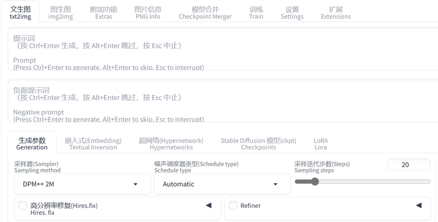
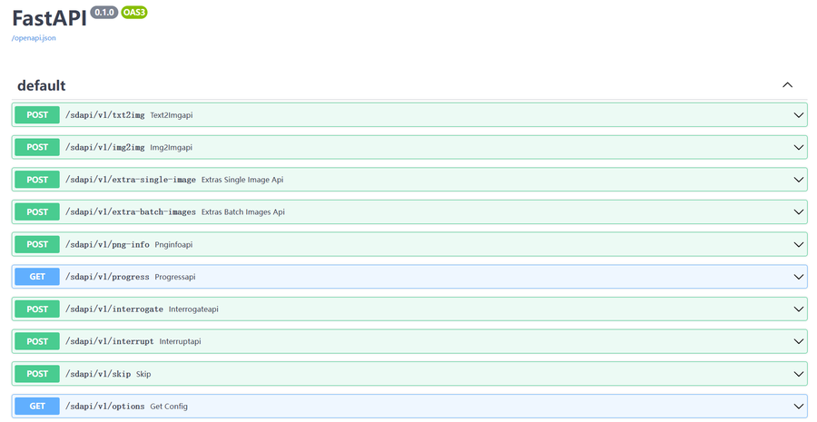
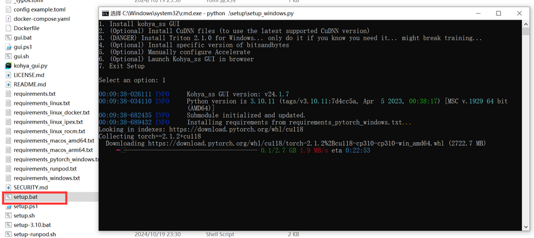

# Stable Diffusion   
   
安装较简单，是自动化下载处理。需要依赖python3.10.6 和NVIDIA显卡。  
## 中英文双显配置 
中文语言包   
https://github.com/dtlnor/stable-diffusion-webui-localization-zh_CN    
双语插件   
https://github.com/journey-ad/sd-webui-bilingual-localization   
   
可以看到已经安装好了，重启UI   
  
设置并Apply Settings再重启UI   
   
成功有了中英文显示    


## 工具插件
C站助手  <https://github.com/butaixianran/stable-Diffusion-Webui-civitai-Helper>   
ControlNet 插件  <https://github.com/Mikubill/sd-webui-controlnet>    

## powershell启用API
```
.\webui.bat --xformers --nowebui --api   
```
>
在stable-diffusion-webui路径下运行上述命令
通过发送POST请求来调用Stable Diffusion API生成图片。
然后，访问 http://127.0.0.1:7861/docs 来确认API接口是否已正常运行。  
如果成功会看到下面的API窗口。   


## LoRA训练及使用 
    
- 什么是LoRA？  

低秩自适应 (LoRA, Low-Rank Adaptation) 是一种在预训练语言模型 (如GPT、BERT等) 上进行高效微调的技术，特别适合在内存受限或计算资源有限的情况下使用。LoRA 的核心思想是通过将模型的权重变化限制为低秩矩阵的形式，来减少微调过程中需要更新的参数数量，从而降低计算成本和内存占用。
具体来说，LoRA 通过以下方式实现这一目标：

低秩矩阵分解：在微调时，LoRA 将预训练模型中的某些权重矩阵表示为两个较小的矩阵的乘积（即低秩分解）。通过这种分解，LoRA 可以在微调时只对这两个小矩阵进行更新，而不需要更新整个大矩阵。

冻结预训练权重：LoRA 在微调过程中会冻结预训练模型的原始权重，只对分解出的低秩矩阵进行训练和更新。这减少了参数更新的数量，从而显著降低内存和计算需求。

与模型无缝集成：LoRA 不改变原始模型架构，它仅在原有模型上插入低秩矩阵的适应层，因此它可以与各种预训练模型无缝结合。

优点
效率高：相比于直接对整个模型进行微调，LoRA 只需要更新少量参数，计算效率更高。
内存占用低：只需存储和更新两个小矩阵，大大降低了内存开销，适合在边缘设备或资源有限的环境中使用。
易于集成：由于不改变原始模型的结构，可以与多种模型一起使用，适应性强。
总的来说，LoRA 是一种简化和优化模型微调的技术，能够在不牺牲性能的情况下大幅降低资源消耗。


## 模型训练——Kohya 
<https://github.com/bmaltais/kohya_ss>   
同步好工程后，运行setup.bat文件   
首选选择1，安装GUI相关   
