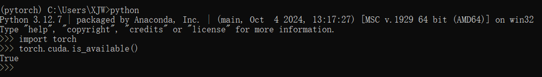
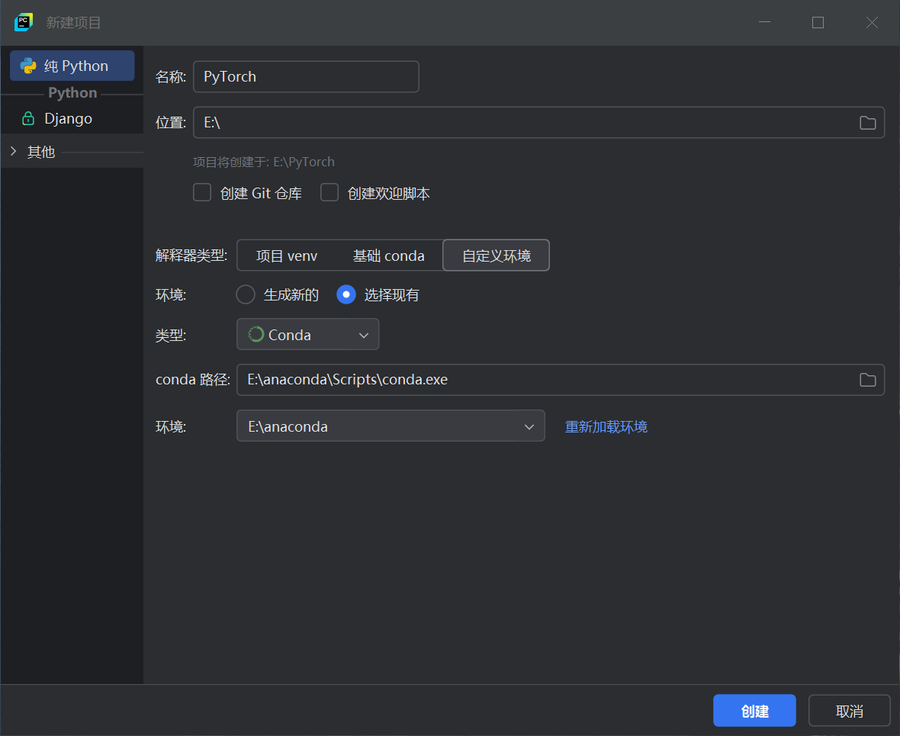

# Pytorch
## 环境安装
1. 安装anacnda   
2. 创建虚拟环境  
   ```
    conda create --name my-env 
   ```   
     
3. 激活刚创建的虚拟环境，在此虚拟环境下安装Pytorch  
    ```  
   conda activate myenv
    ```
4. 查看本机显卡及驱动版本   
5. 查看Nvidia的CUDA版本支持：<https://docs.nvidia.com/cuda/cuda-toolkit-release-notes/index.html>   
Pytorch官网查找安装命令   
   ```
   conda install pytorch torchvision torchaudio pytorch-cuda=12.4 -c pytorch -c nvidia 
    ``` 
1. 等待一阵子，安装完成。额外可以验证是否成功
    ```
    import torch
    torch.cuda.is_available()   
    ```   
    
## pycharm的使用
   
添加conda虚拟环境的解释器    
   
这样就正确使用上了创建的虚拟环境   
   
## 神经网络的层级结构
   