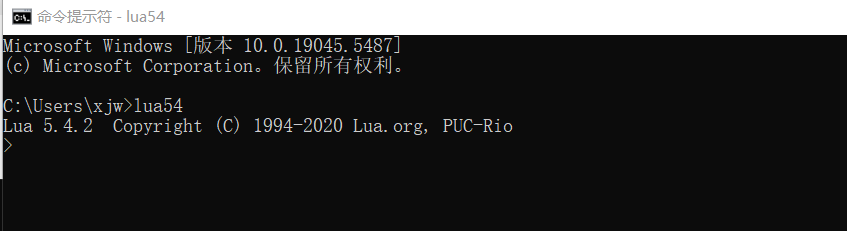
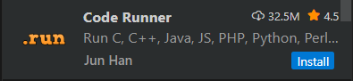
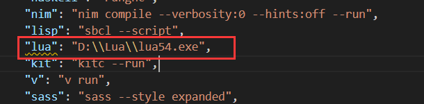
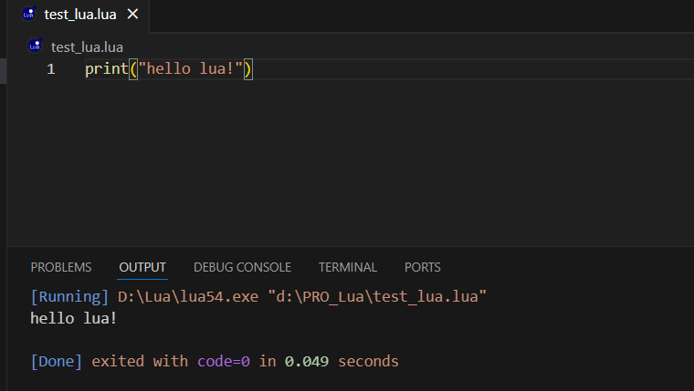

# Lua 安装及配置

## [Lua官网下载](https://luabinaries.sourceforge.net/)  
   
解压并放在`D:\Lua`   

## 配置系统环境变量  
    

## 查看版本  
`cmd`输入lua54   
   
## VSCode配置   
安装插件   
    
   
编辑设置    
   
添加路径   
    

## VSCode测试   
   
