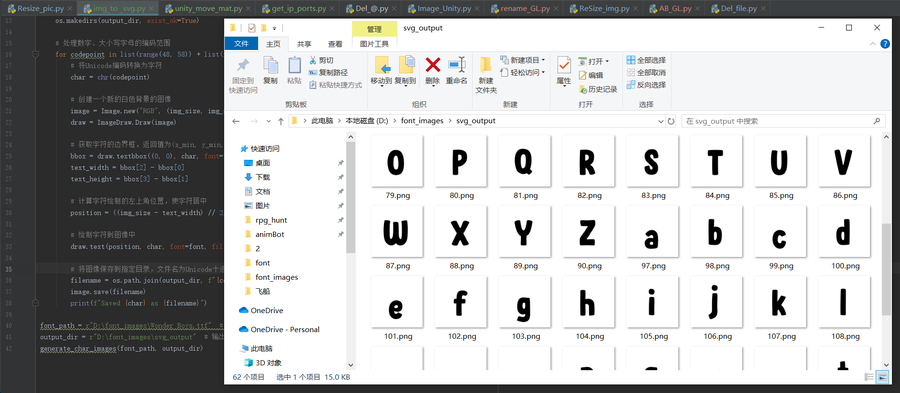
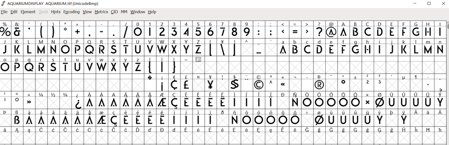
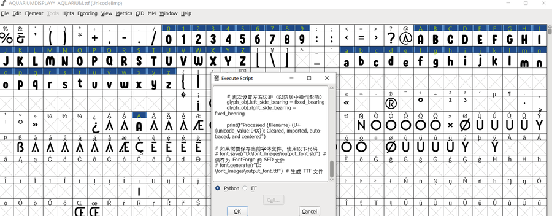

# 制作及修改字体
一些坑爹的情况下，需要对老项目字体进行修改，既要保持一定的熟悉度又要避免字体所有者的钓鱼敲诈。使用FontForge对字体进行修改。  
#### [FontForge软件下载](https://fontforge.org/en-US/downloads/windows-dl/)  
   
***
## 准备字体文件
原理：将自己准备的像素图片处理成svg矢量格式，采用掺沙子的办法，替换高频词，随机再改几个字符，加大被检测出的难度。 
#### 符合编码规则 
另存为nuicode编码序列的图片，编码是用10进制表示，字母 "A" 在 Unicode 编码中的十进制值是 65   
  
#### 高频原则
替换高频出现的字符，比如10个数字和26个字母（包含大小写）
- 数字编码字段：
  48——57（0——9）
- 大写字母编码字段：
  65——90（A——Z）
- 小写字母编码字段：
  97——122（a——z）

### 生成新的字符
原理：原则上不要自己做这种低价值的活，找现成字体文件掺沙子，先准备好若干替换的字符。  
> 图片尺寸：1000*1000
 
#### 生成字符代码： 
添加了char_proportion参数单独控制字符在图片中的占比。  
```python
from PIL import Image, ImageFont, ImageDraw
import os

def generate_char_images(font_path, output_dir, img_size=1000, char_proportion=0.8):
    # 确保输出目录存在
    os.makedirs(output_dir, exist_ok=True)

    # 处理数字、大小写字母的编码范围
    for codepoint in list(range(48, 58)) + list(range(65, 91)) + list(range(97, 123)):
        # 将Unicode编码转换为字符
        char = chr(codepoint)

        # 计算初始字体大小
        font_size = int(img_size * char_proportion)
        font = ImageFont.truetype(font_path, size=font_size)

        # 获取字体的 ascent 和 descent
        ascent, descent = font.getmetrics()

        # 创建一个新的白色背景的图像
        image = Image.new("RGB", (img_size, img_size), "white")
        draw = ImageDraw.Draw(image)

        # 获取字符的边界框，返回值为(x_min, y_min, x_max, y_max)
        bbox = draw.textbbox((0, 0), char, font=font)
        text_width = bbox[2] - bbox[0]
        text_height = bbox[3] - bbox[1]

        # 计算字符的总高度，包括 ascent 和 descent
        total_height = ascent + descent

        # 计算字符绘制的左上角位置，使字符基准线对齐并垂直居中
        x_position = (img_size - text_width) // 2  # 水平方向居中
        y_position = (img_size - total_height) // 2 + ascent  # 基于 ascent 和 descent 的垂直居中

        # 绘制字符到图像中
        draw.text((x_position, y_position - ascent), char, font=font, fill="black")

        # 将图像保存到指定目录，文件名为Unicode十进制编码
        filename = os.path.join(output_dir, f"{codepoint}.png")
        image.save(filename)
        print(f"Saved {char} as {filename}")

font_path = r"D:\font_images\nasalization-free.rg-regular.otf"  # 替换为你的字体文件路径
output_dir = r"D:\font_images\svg_output"  # 输出图像保存的目录
generate_char_images(font_path, output_dir)
```
#### 生成结果

#### 筛选替换
1. 有偷感的选择出要替换的字符，删掉不用的。 
2. 运行FontForge，打开要修改的字体文件，运行自动化脚本。


### FontForge脚本批处理导入   
>  如果人力手工替换，很繁琐低效，且容易出错。FontForge内有API支持定制开发。   

一些坑：
导入新的字符图片前需要清除原始字符的相关信息，并初始化相应的字符位置。

```python
import fontforge
import os
import psMat

# 获取当前打开的字体
font = fontforge.activeFont()

# 检查是否有打开的字体
if not font:
    print("No font is open. Please open a font file first.")
    exit()

# 图片文件目录
image_dir = r"D:\font_images\svg_output"

# 固定边距值
fixed_bearing = 5  # 左右边距设置为相同的值

# 遍历目录中的所有 PNG 文件
for filename in os.listdir(image_dir):
    if filename.endswith(".png"):
        # 提取文件名中的 Unicode 编码（十进制）
        unicode_value = int(os.path.splitext(filename)[0])

        # 将 Unicode 编码转换为字符
        glyph = chr(unicode_value)

        # 检查字体中是否已经有此字符，如果没有则创建
        if unicode_value not in font:
            glyph_obj = font.createChar(unicode_value)
        else:
            glyph_obj = font[unicode_value]

        # 完全清除现有的字符信息
        glyph_obj.clear()  # 删除现有矢量图
        glyph_obj.unlinkRef()  # 移除引用的任何组件
        glyph_obj.transform(psMat.identity())  # 重置变换信息
        glyph_obj.width = 1000  # 重置字符宽度
        glyph_obj.left_side_bearing = fixed_bearing  # 重置左边距
        glyph_obj.right_side_bearing = fixed_bearing  # 重置右边距

        # 导入对应的 PNG 文件
        image_path = os.path.join(image_dir, filename)
        glyph_obj.importOutlines(image_path)

        # 执行 autotrace
        glyph_obj.autoTrace()

        # 计算轮廓边界框，并居中对齐
        bbox = glyph_obj.boundingBox()
        glyph_width = bbox[2] - bbox[0]  # 计算轮廓宽度
        x_offset = (glyph_obj.width - glyph_width) / 2 - bbox[0]

        # 将轮廓居中
        glyph_obj.transform(psMat.translate(x_offset, 0))

        # 再次设置左右边距（以防居中操作影响）
        glyph_obj.left_side_bearing = fixed_bearing
        glyph_obj.right_side_bearing = fixed_bearing

        print(f"Processed {filename} (U+{unicode_value:04X}): Cleared, imported, auto-traced, and centered")

# 如果需要保存当前字体文件，使用以下代码
# font.save(r"D:\font_images\output_font.sfd")  # 保存为 FontForge 的 SFD 文件
# font.generate(r"D:\font_images\output_font.ttf")  # 生成 TTF 文件

```
#### 替换结果 
原始字体  
   
可以看到字母和数字都被替换了。  

#### 修改字体名或版权信息  
Element—— Font Information   
  
这里是字体文件可以被识别的命名。Copyright是版权信息。
**版权费清朝已交过，放心用。**
#### 生成字体  


## 总结
大概率原作者就很难辨别版权问题了。遇到了问题再和他斗智斗勇。