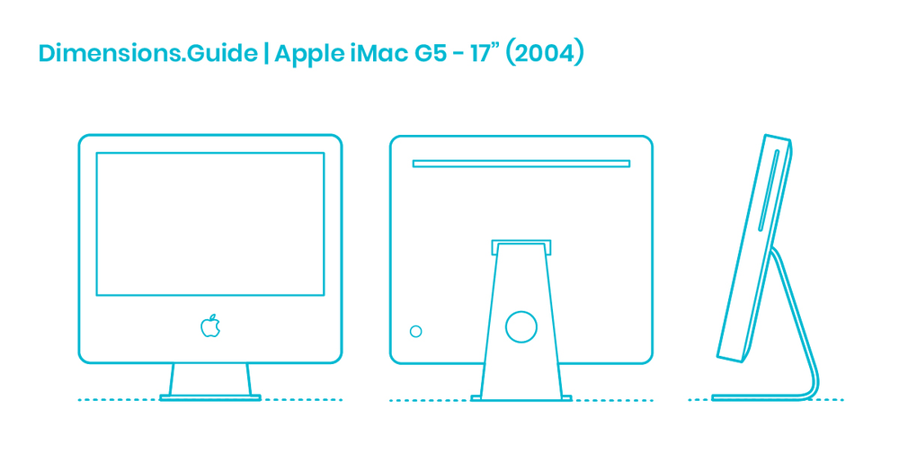

# IMAC G5 改造黑苹果
   

更换主板：安装一块支持 macOS 的 Mini-ITX 或 Micro-ATX 主板。
安装现代处理器和显卡：选择 Hackintosh 兼容的 Intel 或 AMD CPU 和显卡。
更换存储和内存：升级到 NVMe SSD 和现代内存模块。
调整屏幕连接：保留 iMac 原有的屏幕（如果可能），使用适配器连接到现代主板。

## 显示器改造
20英寸 屏幕分辨率1680*1050 LCD  
PowerPC G5 1.6 GHz 或 1.8 GHz 单核处理器
吸入式光驱

| **型号**                | **屏幕尺寸**       | **处理器**            | **内存**                  | **存储**                | **显卡**                      | **网络**                         | **操作系统**             |
|--------------------------|--------------------|-----------------------|---------------------------|-------------------------|-------------------------------|-----------------------------------|--------------------------|
| **iMac G5 第一代 (2004)** | 17" (1440x900)    | PowerPC G5 1.6/1.8GHz | 256MB DDR SDRAM (最大 2GB) | 80GB/160GB 7200RPM     | NVIDIA GeForce FX 5200 Ultra 64MB | 10/100BASE-T，以太网，802.11g 可选 | Mac OS X 10.3 Panther    |
|                          | 20" (1680x1050)   |                       |                           |                         |                               |                                   | (可升级至 10.5 Leopard)  |
| **iMac G5 第二代 (2005)** | 17" (1440x900)    | PowerPC G5 1.8/2.0GHz | 512MB DDR SDRAM (最大 2GB) | 160GB/250GB 7200RPM    | ATI Radeon 9600 128MB         | 10/100/1000BASE-T，802.11g, 蓝牙2.0 | Mac OS X 10.4 Tiger      |
|                          | 20" (1680x1050)   |                       |                           |                         |                               |                                   | (可升级至 10.5 Leopard)  |
| **iMac G5 带 iSight (2005)** | 17" (1440x900)    | PowerPC G5 1.9/2.1GHz | 512MB DDR2 SDRAM (最大 2.5GB) | 160GB/250GB 7200RPM    | ATI Radeon X600 Pro 128MB     | 10/100/1000BASE-T，802.11g, 蓝牙2.0 | Mac OS X 10.4 Tiger      |
|                          | 20" (1680x1050)   |                       |                           |                         |                               |                                   | (可升级至 10.5 Leopard)  |

