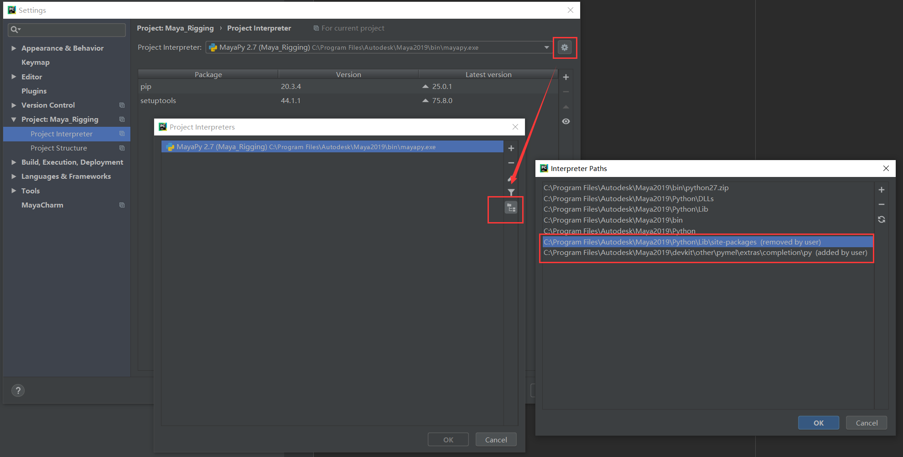

# Maya和Pycharm连接
配置新系统，装了新版本PyCharm（2020.3.5 ）。是能支持Mayachrm插件的最新版。  
折腾很久不能通信数据。换回PyCharm2018后正常。
## Mayachrm插件配置
- 在PyCharm2018中安装Mayacharm插件,并配置   
   
- 在maya2019的userSetup.py已经配置好了，无需修改。
> 此时一切正常的话，两者已经可以互相通信了。

## 代码补全
### 下载并安装devkit
下载地址：<https://www.autodesk.com/developer-network/platform-technologies/maya>   
 
- `cmake/`        # CMake 相关文件，帮助开发者使用 CMake 构建 Maya 插件
- `devkit/`       # Maya 开发工具包，包含示例代码、插件模板等
- `include/`      # 头文件目录，包含 Maya API（如 OpenMaya、MFn 等）的 C++ 头文件
- `lib/`          # 预编译的库文件（.lib/.so），用于链接 Maya API 以开发插件
- `mkspecs/`      # 编译器和平台相关的构建配置，适用于 Qt 及 Maya UI 相关开发
- `Autodesk_EULA.pdf`  # Autodesk 的最终用户许可协议（End User License Agreement）

在 Maya 2019 及更早版本中，并没有 devkitBase 文件夹，只有 devkit 文件夹。这是因为 Autodesk 在 Maya 2022 之后才引入 devkitBase 结构。   
在 Maya 2019 及之前，devkit 目录就是 Maya 开发工具包的根目录。    
解压后把文件覆盖到路径：C:\Program Files\Autodesk\Maya2019    

### 设置代码补全
路径：  
C:\Program Files\Autodesk\Maya2019\devkit\other\pymel\extras\completion\py   
需要添加一个路径，删掉默认路径  
   
测试。可以看到已经有代码自动补全了   
   

