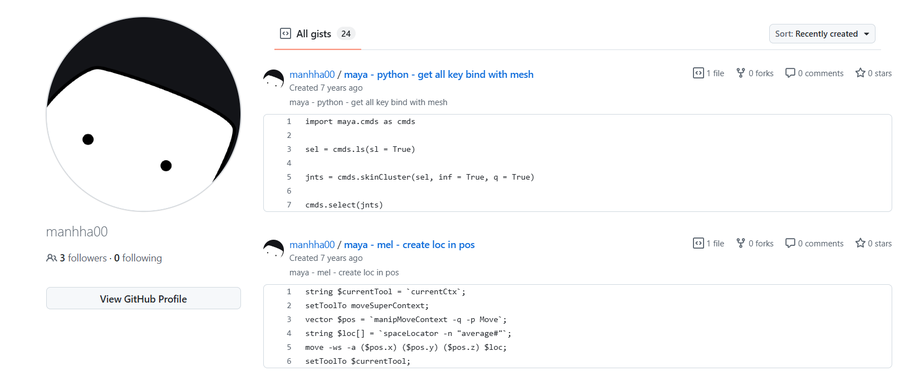

#  插件分类

[建模插件合集](./建模/建模插件.md)   

[绑定插件合集](./绑定/绑定资源.md)   

[Maya安装 **MS Tools** 工具时，**UserSetup** 配置文件的相关问题](./Maya_AutoLoad_Plugin/Plugin说明.md)

[动画资源及插件](./动画插件/动画资源插件.md)

## GitHub
   
[manhha00](https://gist.github.com/manhha00)