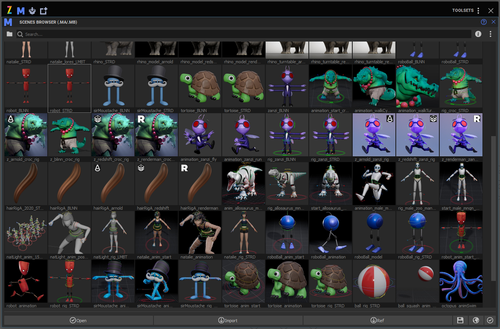

# Zoo Tools Pro 
[官网](https://create3dcharacters.com/zoo2/)   

## 环境配置
由于最新的Zoo Tools Pro并不兼容maya2019版本。一些新功能仅仅在高版本有。   
而maya2019在相当长的时间内是一个主力干活的版本。需要手动对版本做配置。  
已经一劳永逸同步在github版本控制里了。不赘述。   

需要注意的是在外部的预设文件，做了版本区分。   
> C:\Users\xjw\Documents\zoo_preferences    
   
加载预设文件后   
      
  
## 功能介绍 

### 选择集

### 中间帧工具  