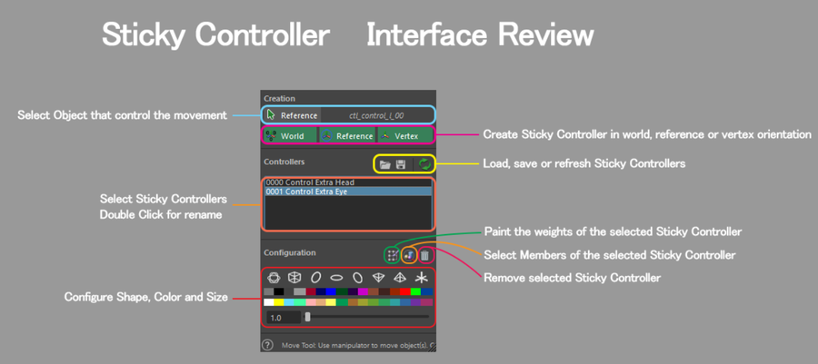

# Asset for Rigging
## AnimPolish
[AnimPolish](https://public-files.gumroad.com/)  

## Rigging Awesome Studios
[Rigging Awesome Studios](https://friggingawesome.gumroad.com/)  
这里有一些资源  
## Rigging Helpers
[Rigging Helpers](https://friggingawesome.gumroad.com/l/jsRiggingHelpers?layout=profile)  

> Note: This collection contains tools at various levels of stability and annotation, created between 2014-2018 without the goal of public distribution. I think you'll get a lot of use from them, but there is always the possibility that some of them may not work in all versions of Maya, or for every situation. They will likely have compatibility issues with Maya 2022+.
>
> 注意：此集合包含各种稳定性和注释级别的工具，这些工具是在 2014 年至 2018 年之间创建的，并未以公开分发为目标。我想您会从中得到很多用处，但总有可能其中一些可能无法在所有版本的 Maya 中或在所有情况下都起作用。他们可能会遇到与 Maya 2022+ 的兼容性问题。  

## ngSkinTools 
 [ngSkinTools](https://www.ngskintools.com/)  
 Different Way to Paint Skin Weights
There’s no magic bullet for perfect skin weights. ngSkinTools enables a flexible and artistic workflow, while providing all the necessary tools for precision.
  

## Model

## 绑定控制器
- [Sticky Controller](https://jmtejeda.gumroad.com/l/wAPzDg?layout=discover&recommended_by=search&_gl=1*bicyov*_ga*ODY1MzE2Njc0LjE3MTAyMTAwNDQ.*_ga_6LJN6D94N6*MTczMDI1NTk1Ny40OS4xLjE3MzAyNTY1MjIuMC4wLjA.)   
