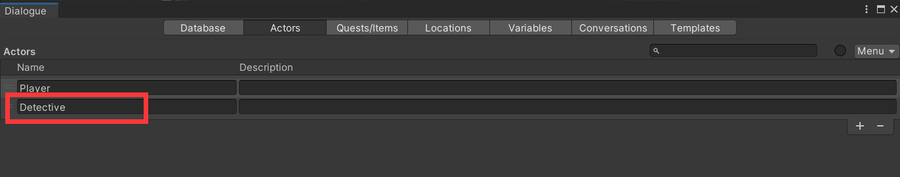
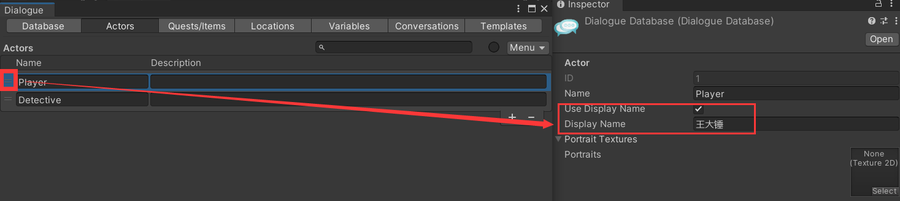
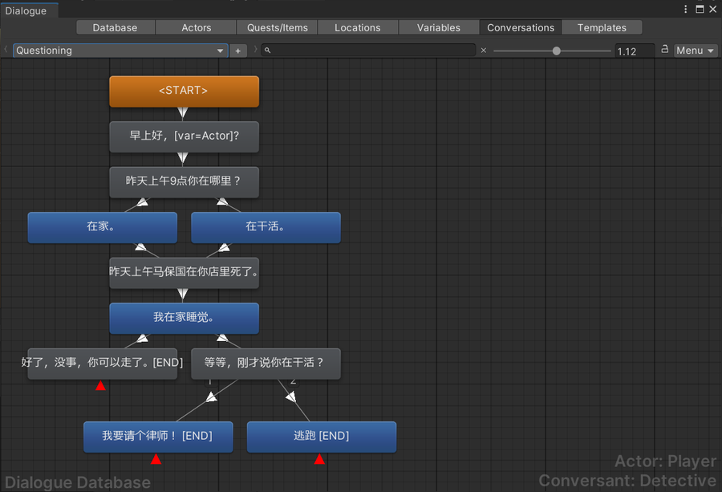

# Dialogue System for Unity

### [官方教程](https://www.pixelcrushers.com/dialogue-system/dialogue-system-tutorials/)  

### [Unity Asset Store](https://assetstore.unity.com/packages/tools/behavior-ai/dialogue-system-for-unity-11672)   
  
## 快速开始 Quick Start 
### 生成数据
生成数据的方法：
1. [Articy:Draft 3制作](/游戏设计/ArticyDraft3/ArticyDraft3.md)
2. [Twine制作](/游戏设计/Twine/Twine.md)
3. 手动填写。略有点蠢
### 配置
1. 配置交互对象   
2. 配置触发条件及模式   

### Conversation Conditions 对话条件
创建Actor角色   
   
修改玩家名字的变量    
   
创建变量   
   
创建Dialogue Database   
   
设置条件状态   
条件为假：    
   
条件为真：  
   