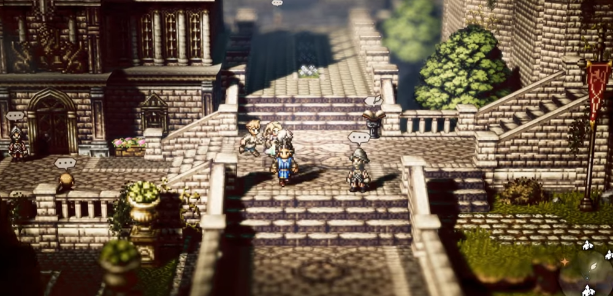
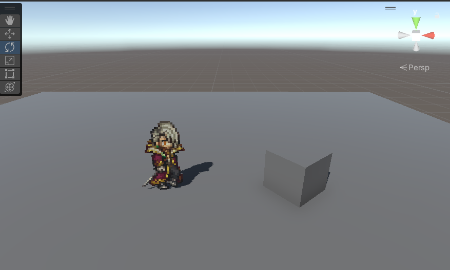
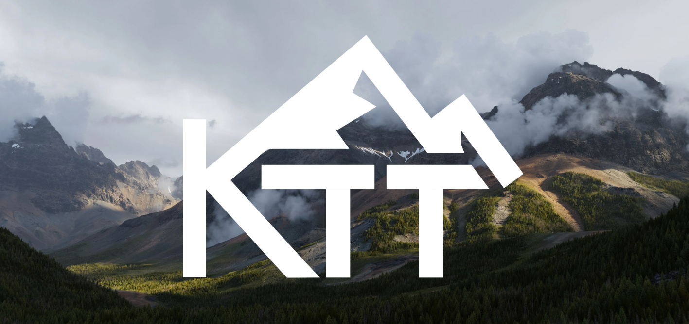

# HD2D  
默认unity的sprite是没有投影的。现在已经解决      
    

[Enhance a top-down game with URP 2D lights | Unity at GDC 2023](https://www.youtube.com/watch?v=YhrwKF_i-BI)     
制作像素贴图的方法   
[How I Make My Textures](https://www.youtube.com/watch?v=KDjOaVAWBVE)    

KTT (Kruger Terrain Tools) is a set of powerful terrain generation tools for Houdini 20.5+ that overhauls terrain generation in Houdini, combining the flexibility and control present in Houdini with the latest and greatest innovations in Heightfield terrain modeling.    
   
[KTT for Houdini](https://samk9632.gumroad.com/l/KTTforHoudini)   
