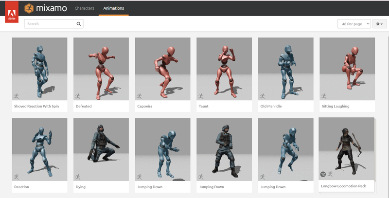
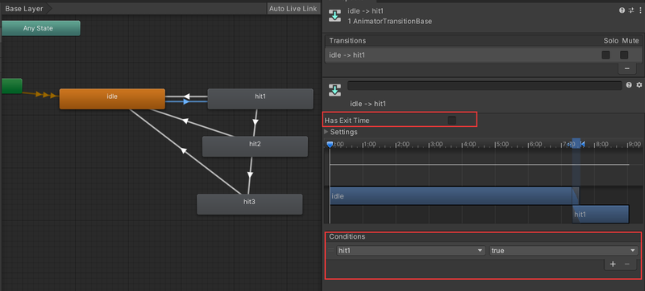
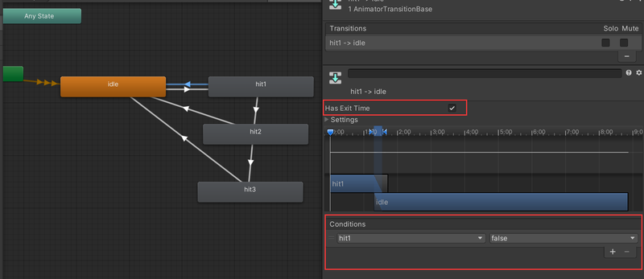

# 脚本控制的简易连招系统

## 准备工作
### 准备模型及动画


## 状态机设置
   
属性里创建三个布尔值   
   
返回设置   



## 脚本说明
以下是完整的代码：


```csharp
using UnityEngine;

public class Fighter : MonoBehaviour
{
    private Animator anim; // 角色的Animator组件
    public float cooldownTime = 2f; // 连招冷却时间
    private float nextFireTime = 0f; // 下一次可以攻击的时间
    public static int noOfClicks = 0; // 点击次数，用于判断连招
    float lastClickedTime = 0; // 上一次点击的时间
    float maxComboDelay = 1; // 连招的最大间隔时间

    void Start()
    {
        // 获取Animator组件
        anim = GetComponent<Animator>();
    }

    void Update()
    {
        // 检查并重置第一次攻击动画
        if(anim.GetCurrentAnimatorStateInfo(0).normalizedTime > 0.7f && anim.GetCurrentAnimatorStateInfo(0).IsName("hit1"))
        {
            anim.SetBool("hit1", false);
        }
        // 检查并重置第二次攻击动画
        if (anim.GetCurrentAnimatorStateInfo(0).normalizedTime > 0.7f && anim.GetCurrentAnimatorStateInfo(0).IsName("hit2"))
        {
            anim.SetBool("hit2", false);
        }
        // 检查并重置第三次攻击动画，同时重置点击次数
        if (anim.GetCurrentAnimatorStateInfo(0).normalizedTime > 0.7f && anim.GetCurrentAnimatorStateInfo(0).IsName("hit3"))
        {
            anim.SetBool("hit3", false);
            noOfClicks = 0;
        }

        // 如果超过最大连招间隔，重置点击次数
        if(Time.time - lastClickedTime > maxComboDelay)
        {
            noOfClicks = 0;
        }

        // 检查是否可以进行下一次攻击
        if(Time.time > nextFireTime)
        {
            // 检测鼠标点击
            if (Input.GetMouseButtonDown(0))
            {
                OnClick();
            }
        }
    }

    void OnClick()
    {
        // 记录点击时间
        lastClickedTime = Time.time;
        // 增加点击次数
        noOfClicks++;

        // 第一次点击，触发第一段攻击
        if(noOfClicks == 1)
        {
            anim.SetBool("hit1", true);
        }

        // 限制点击次数在0到3之间
        noOfClicks = Mathf.Clamp(noOfClicks, 0, 3);

        // 第二次点击，如果第一段攻击动画播放到70%以上，触发第二段攻击
        if(noOfClicks >= 2 && anim.GetCurrentAnimatorStateInfo(0).normalizedTime > 0.7f && anim.GetCurrentAnimatorStateInfo(0).IsName("hit1"))
        {
            anim.SetBool("hit1", false);
            anim.SetBool("hit2", true);
        }

        // 第三次点击，如果第二段攻击动画播放到70%以上，触发第三段攻击
        if(noOfClicks >= 3 && anim.GetCurrentAnimatorStateInfo(0).normalizedTime > 0.7f && anim.GetCurrentAnimatorStateInfo(0).IsName("hit2"))
        {
            anim.SetBool("hit2", false);
            anim.SetBool("hit3", true);
        }
    }
}
```

这个脚本实现了一个基本的三段连击系统。以下是对脚本的主要功能的解释：

1. 脚本定义了一个`Fighter`类，继承自`MonoBehaviour`，用于控制角色的攻击行为。

2. 在`Start()`方法中，获取了角色的`Animator`组件，用于控制动画。

3. `Update()`方法中主要做了以下几件事：
   >- 检查各个攻击动画的状态，并在适当的时候重置动画状态。
   >- 检查连招间隔时间，如果超过最大间隔，重置连击计数。
   >- 检测鼠标点击，触发攻击。

4. `OnClick()`方法处理每次点击的逻辑：
   - 更新最后点击时间和点击次数。
   - 根据点击次数和当前动画状态，触发相应的攻击动画。

5. 脚本使用了几个重要的变量来控制连招：
   - `noOfClicks`：记录连续点击次数。
   - `lastClickedTime`：记录上次点击时间，用于判断是否超出连招时间限制。
   - `maxComboDelay`：定义了连招的最大间隔时间。

6. 动画控制主要通过设置Animator的布尔参数（"hit1", "hit2", "hit3"）来实现。

要使用这个脚本，你需要：
1. 将此脚本附加到你的角色游戏对象上。
2. 确保角色有一个配置正确的Animator组件，包含"hit1"、"hit2"和"hit3"的动画状态和相应的布尔参数。
3. 根据需要调整`cooldownTime`和`maxComboDelay`的值。

这个系统允许玩家通过连续点击来执行最多三段的连续攻击，同时考虑了攻击的时间间隔和动画进度，以确保连招的流畅性。

## 知识点解释
### OnClick()函数
这个 **OnClick()** 函数是整个连击系统的核心，它处理每次玩家点击时的逻辑。以下是其主要功能：

1. 更新时间戳：   
**lastClickedTime = Time.time;**
记录最后一次点击的时间，用于后续判断连击是否超时。
2. 增加点击计数：   
**noOfClicks++;**
每次调用此递增操作时，增加点击次数，用于追踪玩家的连续点击。
3. 触发第一段攻击：   
如果这是第一次点击（noOfClicks == 1），立即触发第一段攻击动画。
4. 限制点击次数：   
noOfClicks = Mathf.Clamp(noOfClicks, 0, 3);
确保点击次数不会超过3次，这限制了连击的最大段数。
5. 触发第二段攻击：   
如果点击次数达到2次或以上，且第一段攻击动画已经播放到70%以上，则触发第二段攻击动画。
这里检查了三个条件：

>- 点击次数 >= 2
>- 当前动画播放进度 > 70%
>- 当前正在播放"hit1"动画


6. 触发第三段攻击：
类似于第二段攻击的逻辑，如果点击次数达到3次，且第二段攻击动画已播放到70%以上，则触发第三段攻击动画。

这个函数的设计允许玩家通过精确的时间点击来执行连击。它确保了：
>- 连击必须按顺序执行（hit1 -> hit2 -> hit3）
>- 每段攻击都有一个"窗口期"（动画播放到70%之后），在这个窗口期内点击才能触发下一段攻击
>- 连击最多只能到第三段

这种设计既给予了玩家执行连击的机会，又保证了游戏的平衡性和操作的技巧性。玩家需要在正确的时机点击才能成功执行完整的连击  

### noOfClicks++解释
noOfClicks++ 不是一个函数，而是一个操作符。这是C#（以及许多其他编程语言）中的递增操作符。

1. 操作符解释：
++ 是递增操作符。当它放在变量名后面时，表示将该变量的值增加1。
2. 等价表达：
noOfClicks++ 等价于 noOfClicks = noOfClicks + 1
3. 使用场景：
这种写法通常用于计数器，在这个脚本中，它用来记录玩家连续点击的次数。
4. 工作原理：

>- 当执行 noOfClicks++ 时，系统会先使用 noOfClicks 的当前值
>- 然后将 noOfClicks 的值增加1


5. 前置递增vs后置递增：

>- noOfClicks++ 是后置递增，先使用值，再增加
>- ++noOfClicks 是前置递增，先增加，再使用值
在这个上下文中，两者效果相同，因为我们只关心增加这个动作


6. 在这个脚本中的作用：
每次玩家点击时，noOfClicks 的值会增加1，这样就能追踪玩家已经连续点击了多少次，从而决定触发哪一段连击动画。

简而言之，noOfClicks++ 是一种简洁的写法，用于将 noOfClicks 变量的值增加1。这在编程中是一种非常常见的操作，特别是在需要计数或跟踪重复事件次数的场景中。

### 
鼠标点击被用来触发攻击和增加点击计数。
点击间隔不直接控制连击，但如果间隔太长（超过 maxComboDelay），连击会被重置。
连击的进行主要由点击次数（noOfClicks）和动画进度控制，而不是直接由点击间隔控制。
动画的进度（是否超过70%）决定了玩家能否继续连击。

这种设计给予了玩家一定的时间窗口来执行连击，同时也防止了点击过慢导致的无限连击。它要求玩家在适当的时机点击以继续连击，增加了游戏的技巧性。

### 还没有测试的脚本
```csharp
using UnityEngine;

public class PlayerAttackController : MonoBehaviour
{
    // 记录当前攻击动画
    private Animator animator;
    private string currentAttack = "Idle";

    // 动画状态
    public enum ActionState
    {
        Attack_0,
        Attack_1,
        None
    }

    // 记录当前动画标签
    private ActionState actionState = ActionState.None;

    void Awake()
    {
        // 获取Animator组件
        animator = GetComponent<Animator>();
    }

    void Start()
    {
        if (animator != null)
        {
            // 初始时设置为Idle动画
            animator.Play("Idle");
        }
    }

    // 攻击逻辑
    void AttackLogic()
    {
        if (Input.GetButtonDown("Fire1"))
        {
            if (actionState == ActionState.None)
            {
                actionState = ActionState.Attack_0;
            }
            else if (actionState == ActionState.Attack_0 && animator.GetCurrentAnimatorStateInfo(0).normalizedTime > 1.0f)
            {
                actionState = ActionState.Attack_1;
            }
        }
    }

    // 攻击套路选择
    void Attacks()
    {
        switch (actionState)
        {
            case ActionState.Attack_0:
                animator.CrossFade("Attack", 0.15f);
                currentAttack = "Attack";
                break;

            case ActionState.Attack_1:
                animator.CrossFade("Attack01", 0.15f);
                currentAttack = "Attack01";
                break;

            case ActionState.None:
                // Optional: Add logic for transitioning to idle or other states
                break;
        }

        // Switch to default if an animation is almost over
        if (animator.GetCurrentAnimatorStateInfo(0).normalizedTime >= 1.0f)
        {
            actionState = ActionState.None;
            animator.Play("Idle");
            currentAttack = "Idle";
        }
    }

    void Update()
    {
        if (animator != null)
        {
            AttackLogic();
            Attacks();
        }
    }
}
```