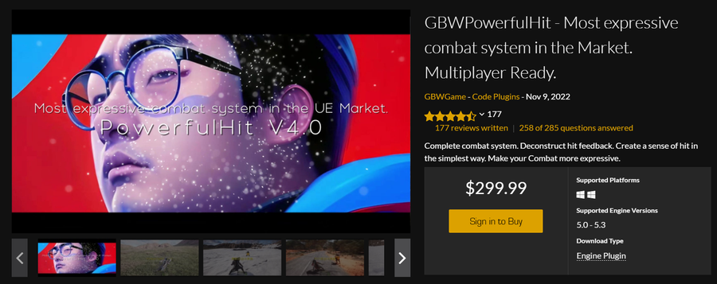

# GBWPowerfulHit 
   
[中文官方文档](https://xqrkyxv79bf.feishu.cn/wiki/UUpqwZ7adiuhP7kGZfAcc6IrnAc)
#### Features:
- A complete combat system.
- High-performance network replication, can be used for multiplayer games.
- The impact effect of Out Of The Box.
- Built-in Movement system, unified 3C and combat.
- Attribute system that supports mathematical expressions.
- Weapon equipment system.
- Asymmetric camp system.
- State System.
- And More Coming Soon...

#### Code Modules:
- GBWPowerfulHit
- GBWPowerfulEffect
- GBWPowerfulEffectEditor
- GBWFlowMove
- GBWRMS
- GBWAnim
- GBWAnimEditor
- GBWFootIK
- GBWFootIKEditor
- GBWPowerfulPerception
- GBWPowerfulState
- GBWPowerfulTools
- GBWPowerfulToolsEditor
***
### 理解后摇与前摇  
在动作游戏中，让Dash（冲刺或瞬移等快速移动技能）能够取消Attack（攻击）的后摇，是实现更流畅、更动感游戏手感的有效手段之一。   
- 后摇：是指英雄在施法或攻击完成后，进行的一段无意义的后续动作。这段时间内，英雄无法进行其他操作，导致游戏节奏变慢。  
- 前摇：则是施法或攻击开始前的准备动作。虽然前摇不能通过Dash直接取消，但理解其概念有助于整体设计的平衡。
#### 实现取消后摇
技能优先级：在游戏引擎中设置Dash技能的优先级高于Attack的后摇，确保当Dash技能被触发时，能够立即中断Attack的后摇。

#### 案例分析
在许多成功的动作游戏中，如《鬼泣》、《猎天使魔女》等，玩家可以通过快速移动技能（如闪避、瞬移等）来取消攻击后摇，实现更流畅的战斗体验。

<https://www.youtube.com/watch?v=P6JyUbkAWgQ&list=PLCZ0WflcfPv4ETvNj4IsnDJU9Aws04cUn&index=4>