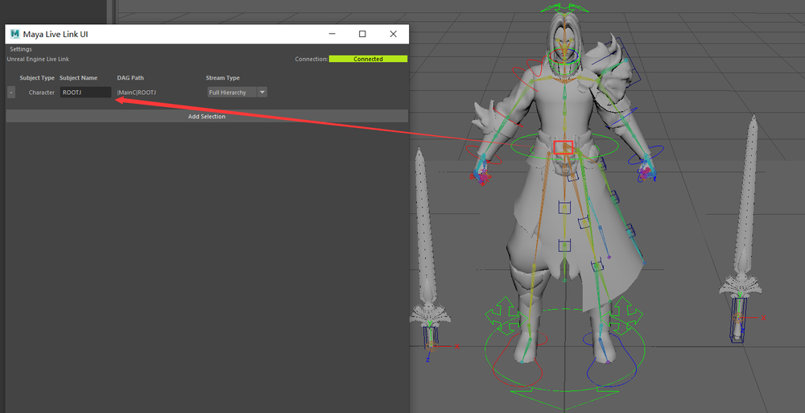
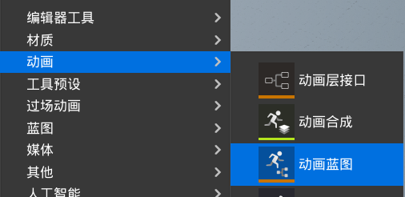
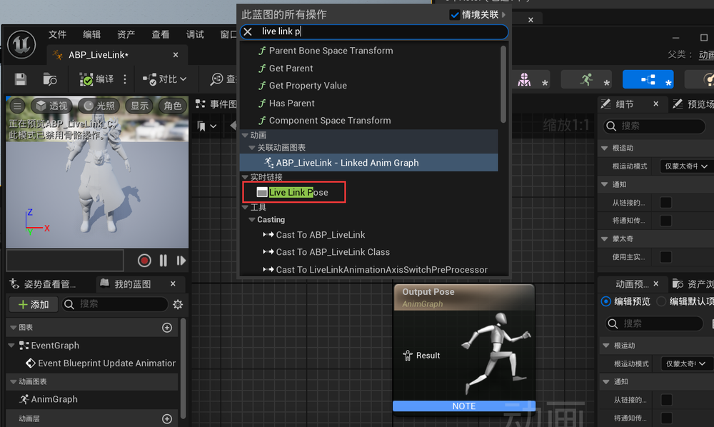
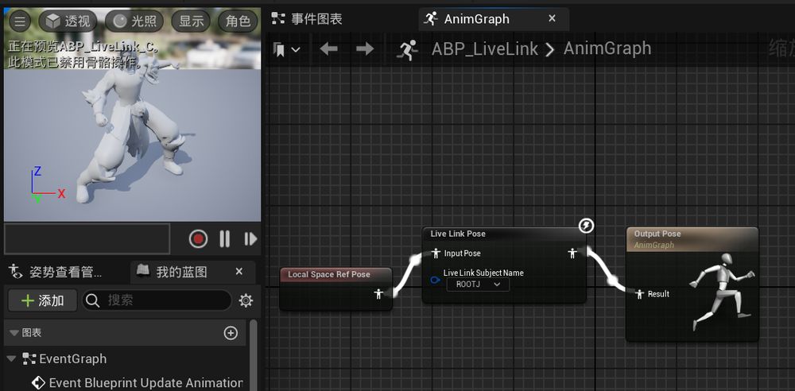
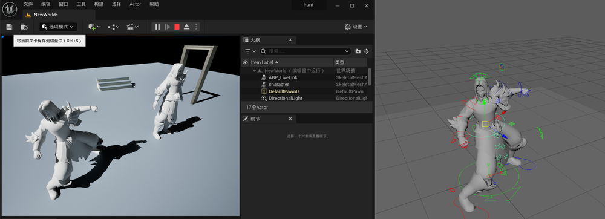

# UE和Maya互通动画数据  
<https://www.youtube.com/watch?v=Gj4QoDp3R34>   
## UE内启用live link
貌似不用单独下载了，在引擎内就可以启用   
    
重启生效   
   
## Maya安装plug-ins   
从如下路径找到插件文件   
C:\Program Files\Epic Games\UE_4.25\Engine\Plugins\Marketplace\MayaLiveLink   
拷贝插件文件到Maya安装路径下：   
C:\Program Files\Autodesk\Maya2019\bin\plug-ins   
在Maya内启动插件      
    
## 连接通信  
在UE内启动live link，可以看到已经识别出了Maya link   
    
点击后   
   
maya内启动插件，可以看到已经显示连接  
   
## 资产数据同步 
Maya内添加同步的根骨骼   
   
UE内导入纯绑定骨骼和模型（不带控制器和辅助节点）  
   
测试同步。目前只是成功在预览器中同步   
   
现在在关卡中设置同步。需要创建一个蓝图资源ABP_LiveLink   
   
   
编译并保存   
    
再添加一个暂停打断的节点。最后编译保存   
   
把ABP_LiveLink放入关卡。运行模式下可以看见动画已经同步了      
