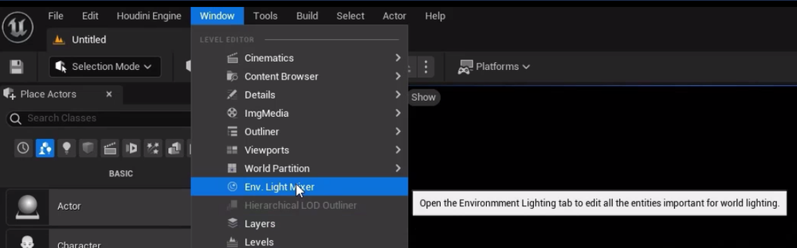

# UE5 PCG结合Houdini PCG系统教程入门篇
### 基础篇
#### 第1章：Unreal PCG 和 Houdini节点详解
- 002: UE5 新功能介绍 
UE中开启PCG插件   
     
创建空开放世界关卡，创建灯光    
   
- 003: PCG 数据框架
- 004: PCG 节点详解：Sample 类
- 006: PCG 节点详解：density 相关
- 007: PCG 节点详解：Filter 相关
- 008: PCG 节点详解：Spatial 类
- 009: PCG 节点详解：UEPCG 属性相关
- 010: PCG 节点详解：Houdini 属性相关
- 011: PCG 节点详解：Houdini 剩余常用节点

#### 第2章：PCG 流程化 和 Houdini Gaea 地形
- 012: PCG 节点打包
- 013: 简单的植被撒点案例
- 014: 自定义蓝图节点详解（从底层上了解 UnrealPCG）
- 015: Houdini 地形入门
- 016: Gaea 地形入门
- 017: Houdini 结合 Gaea 结合 UEPCG 地形流程
- 018: 个人美术经验分享：如何做出唯美的自然环境

### 案例篇
#### 第3章：森林案例之地形
- 001: 案例简介
- 002: Gaea 地形制作
- 003: Houdini 草地悬崖路面初始化
- 004: Houdini 草地悬崖路面精修
- 005: 山体悬崖 Layer
- 006: HDA 打包
- 007: UE 地形材质初始化
- 008: 地形材质
- 009: 修改地形中存在的 BUG

#### 第4章：森林案例之撒点
- 010: 树木 Grass 撒点
- 011: 伴生植被撒点
- 012: 大岩石撒点
- 013: 道路系统撒点
- 014: 树林石头和高山上的树撒点
- 015: 灯光和后期
