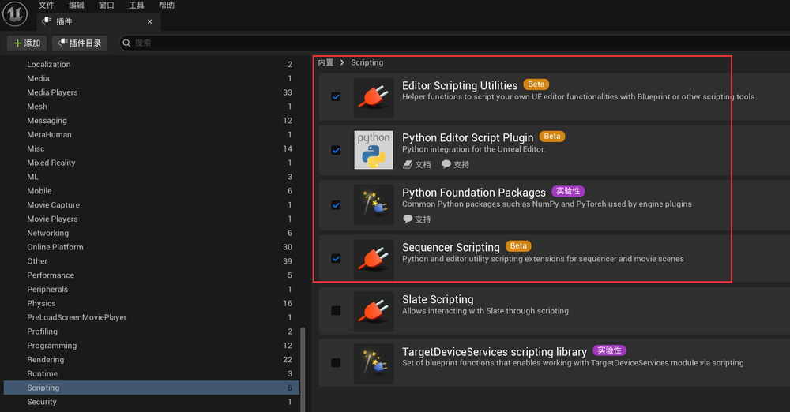
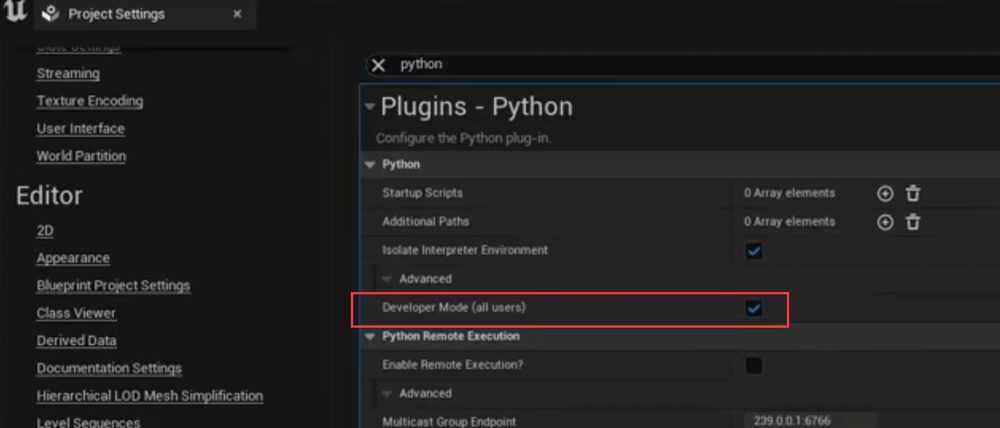
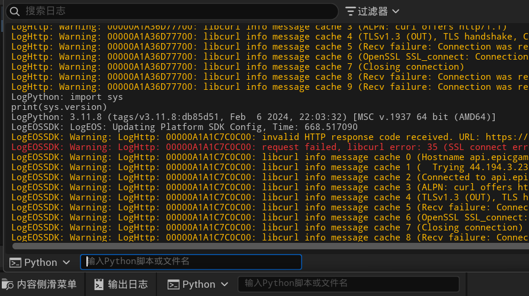
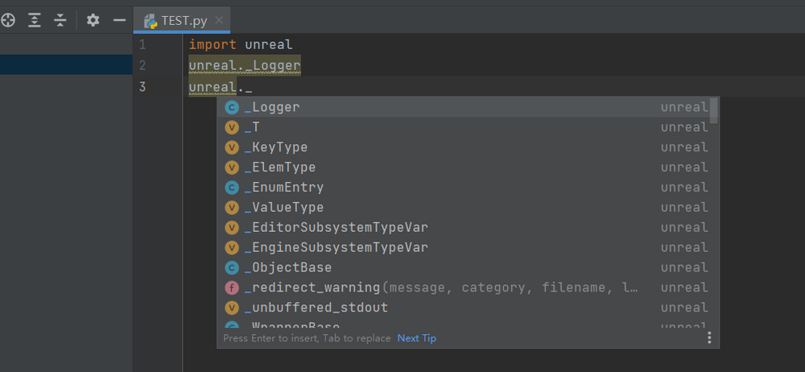

# Python in Unreal Engine 
它是“编辑器脚本语言”，不是“游戏脚本语言”。    
用 Python 做 资产流水线 / 自动化工具 / UE 编辑器插件，是非常合适的选择。   
<https://dev.epicgames.com/community/learning/courses/wk4/utilizing-python-for-editor-scripting-in-unreal-engine>      

<https://dev.epicgames.com/documentation/en-us/unreal-engine/scripting-the-unreal-editor-using-python?application_version=5.6>   

UE Python API 基本是 C++ / Blueprint API 的 Python 映射：
- unreal.Actor
- unreal.StaticMesh
- unreal.EditorAssetLibrary
- unreal.EditorLevelLibrary
- unreal.MaterialEditingLibrary
- unreal.AssetToolsHelpers  

## 启用插件   
    
重启后打开项目设置中Python开发者模式，再重启    
     
重启后，在项目**PROJECT_DIRECTORY/Intermediate/PythonStub**文件夹可以找到**unreal.py**文件    
    
## PyCharm设置    
先确认UE的Python版本   
```
import sys
print(sys.version)
```
    
PyCharm中打开“设置”窗口，导航至“项目”>“Python 解释器”，然后单击齿轮图标并选择“显示全部”。在“Python 解释器”窗口中，您可以单击“路径”按钮，然后单击“+”添加存根文件的位置。   
    
还需要提高 Intellisense 文件的最大大小，方法是转到“帮助”>“编辑自定义属性”，然后添加以下内容：
```
	idea.max.intellisense.filesize = 25000

```
重启 PyCharm 后，您将能够在自动完成菜单中看到来自 UE API 的函数
   
