# 唯美古风场景 

## 镜头
50mm 镜头和人眼个观感类似   
    
镜头越大，焦距越近   

## LUMEN设置
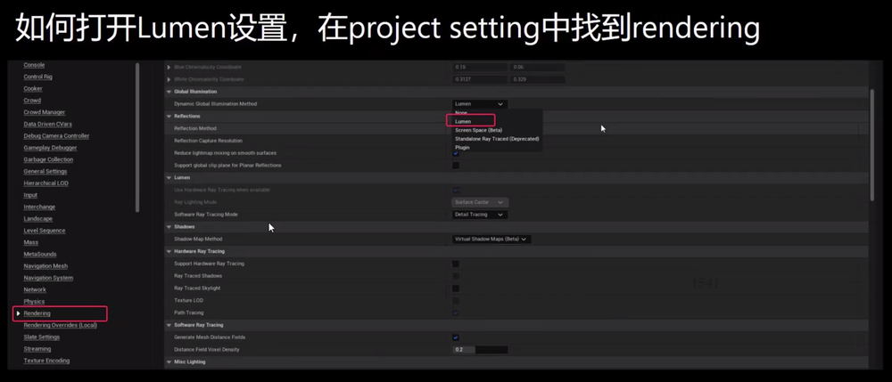   
开启相关选项,并重启生效      
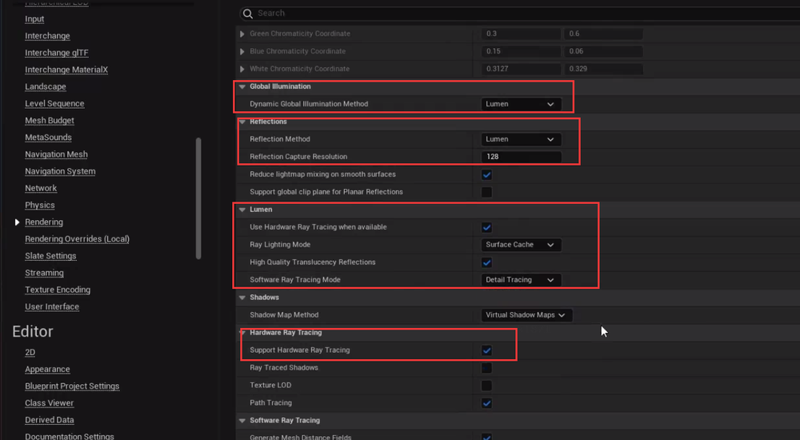    
设置post,lumen的效果必须搭配    
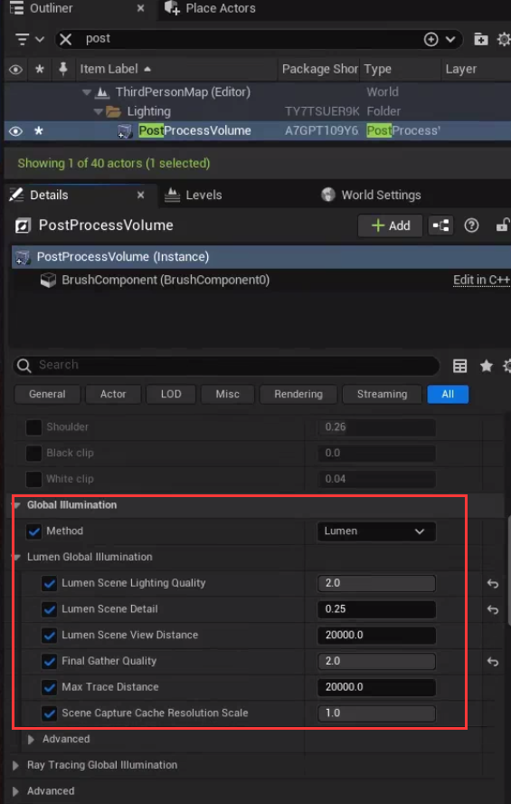   
   
## 创建白模  
创建灯光，需要是动态    
   
可以用标准人来作为白模参考   
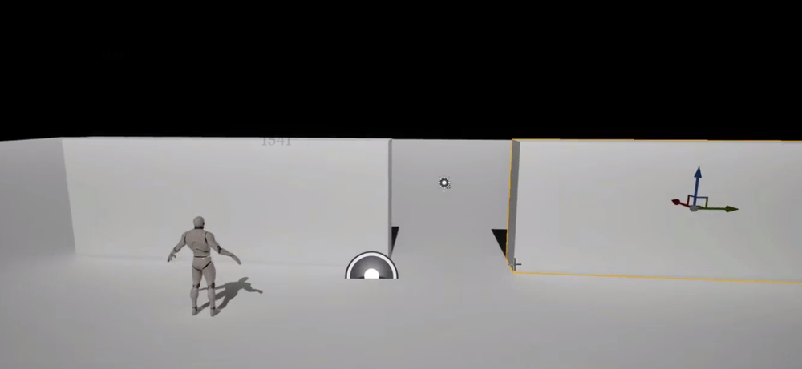   
不断调整及丰富结构   
   
## 替换资源  
    
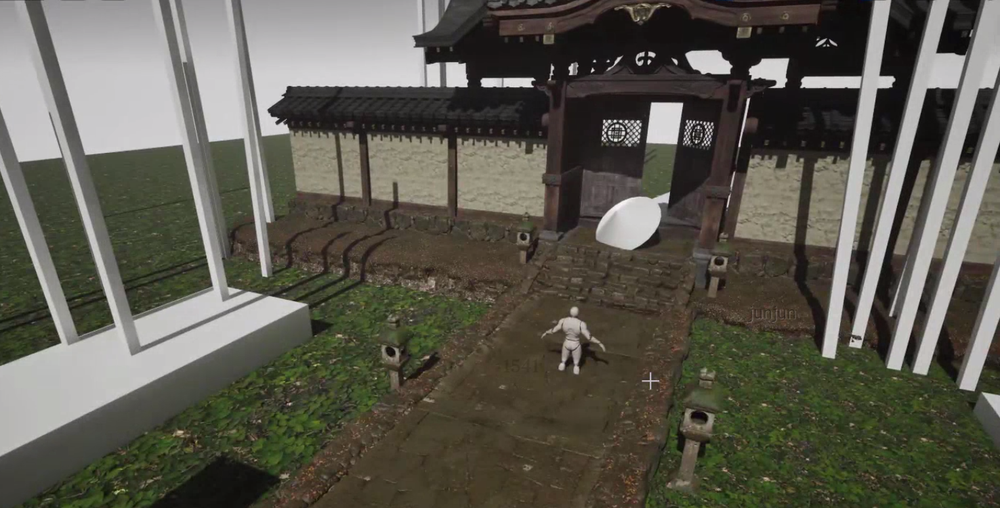   
### BP制作  
   
   
### 创建母材质  

## 完善堆资产 
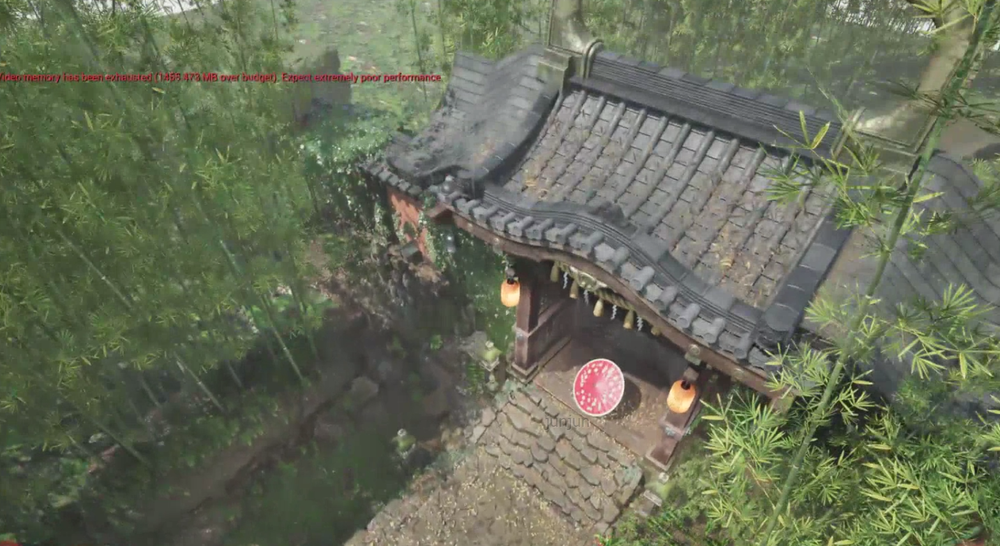   
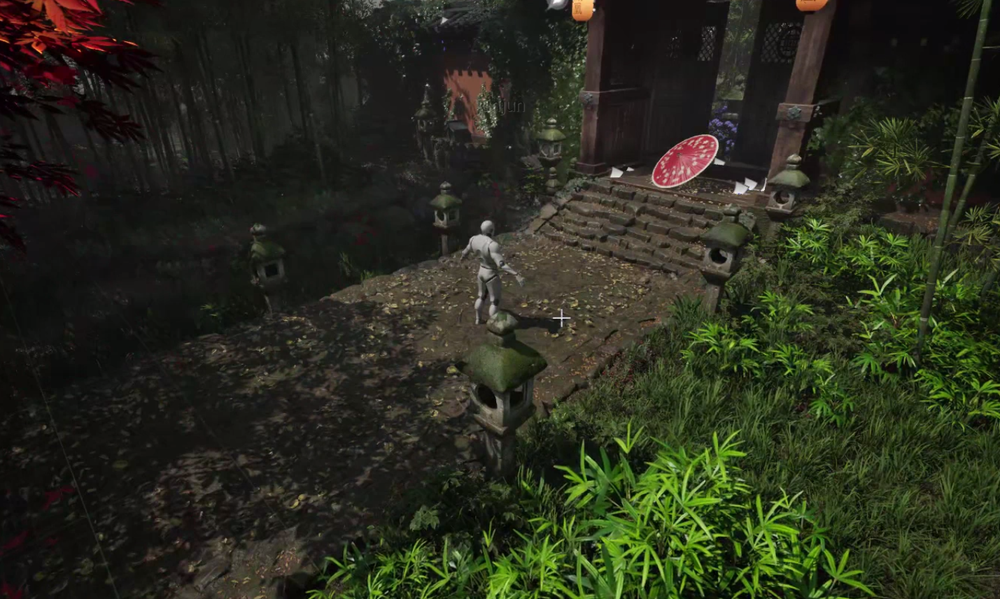   
性能堪忧   

## 场景氛围和灯光处理  
添加天空盒模型及材质，调整光的角度和强度等   
   
添加点光源   
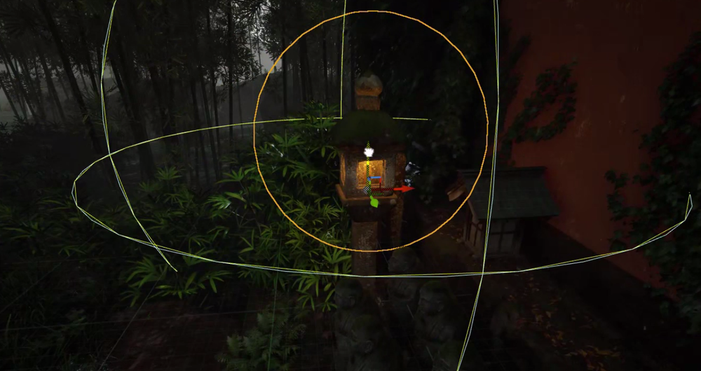   
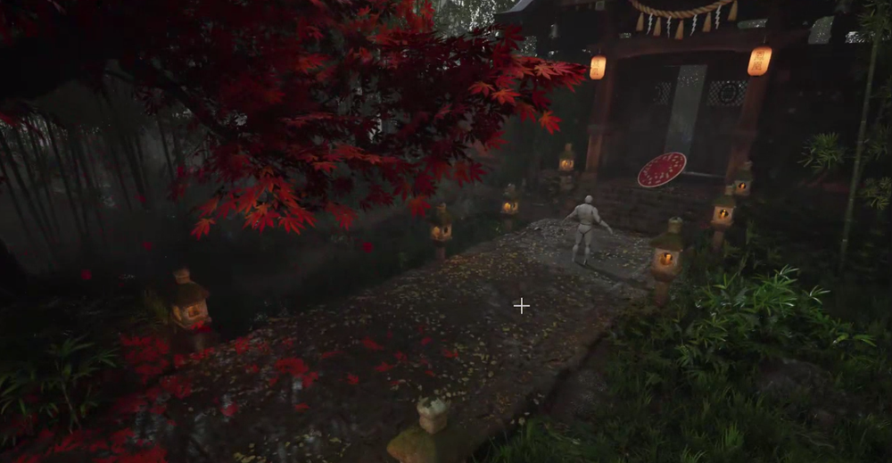    

## 雾效和画面整体氛围   
ExponentialHeightFog   
高度指数雾  
   
光线的体积光强度影响雾气辉光    
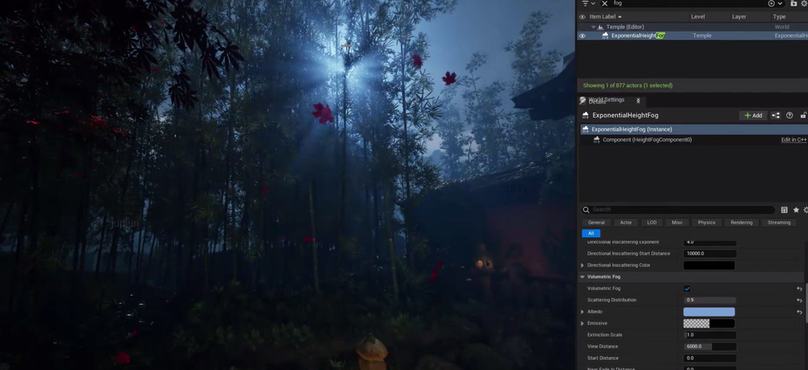    
要注意哪些补光是不需要体积光散色的，不然会凭空发光   
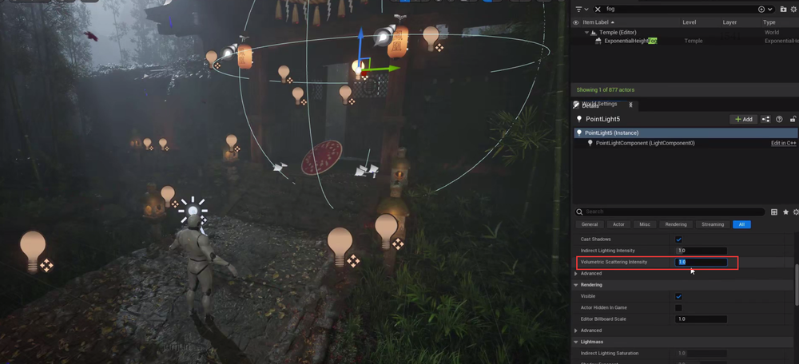   
添加后处理效果  
勾选Unbound之后，影响是全局的    
   
固定全局曝光参数 
锁定最大值和最小值之后，调整曝光强度就可以    
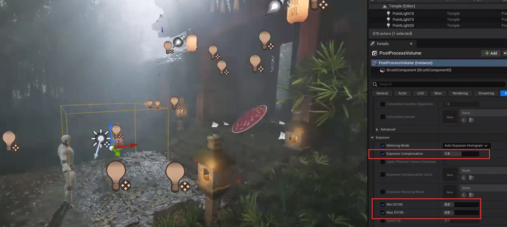    
调整全局辉光强度   
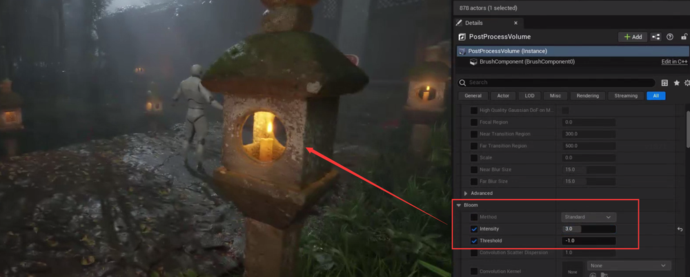      
## Unreal引擎中的LUT（查找表）作用详解

### 1. 核心作用
#### ​**颜色校正与分级**
- ​**统一视觉风格**：调整场景色调（如冷/暖色调、赛博朋克风格）。
- ​**修复颜色偏差**：校正不同显示设备或光照导致的色彩不一致。
- ​**模拟艺术效果**：实现电影胶片、复古风格或环境氛围（水下、夜晚）。

#### ​**非破坏性工作流程**
- 不修改原始材质或光源，通过后处理快速试验颜色方案。
- 支持跨场景/项目复用`.cube`或`.png`格式LUT文件。

#### ​**性能优化**
- 基于预计算的3D纹理映射，比实时计算更高效。
- 支持运行时动态切换（如角色受伤时画面泛红）。

---

### 2. LUT类型
| 类型      | 特点                                                                 |
|-----------|----------------------------------------------------------------------|
| ​**3D LUT** | 三维颜色空间映射，支持复杂色彩变换（色相/饱和度/亮度联动调整）         |
| ​**1D LUT** | 仅调整单通道（R/G/B），适用于简单对比度/亮度调整                      |

---

### 3. 使用场景
- ​**电影化渲染**：模拟电影胶片色彩响应曲线。
- ​**环境控制**：晴天/阴雨、白天/黄昏等不同时间段切换LUT。
- ​**状态反馈**：角色隐身时降低饱和度，中毒时画面扭曲+偏色。
- ​**跨平台一致性**：确保不同设备显示效果统一。

---

### 4. 注意事项
- ​**校准依赖**：需在**中性色调基础画面**上设计LUT，避免叠加后处理失真。
- ​**纹理精度**：3D LUT分辨率（如32x32x32）需权衡效果与性能。
- ​**HDR支持**：结合Tone Mapping处理高动态范围场景。

---

### 5. 在Unreal中应用LUT
#### ​**步骤**
1. ​**导入LUT文件**  
   - 支持格式：`.cube`（影视标准）或`.png`（Unreal兼容）。  
   - 路径：右键点击内容浏览器 ➔ ​**Import to /Game**，选择文件。

2. ​**配置后处理体积**  
   - 在场景中添加或选择已有的 ​**Post Process Volume**。  
   - 在Volume属性中导航至：  
     ```cpp
     Rendering Features ➔ Color Grading ➔ Color Grading LUT
     ```  
   - 点击下拉菜单，选择已导入的LUT文件。

3. ​**调整混合强度**  
   - 在同一属性面板中，找到 ​**LUT Intensity** 参数：  
     - `0.0`：完全使用原始颜色。  
     - `1.0`：完全应用LUT效果。  
   - 根据需求调整数值（例如 `0.5` 表示混合50%的LUT效果）。

4. ​**动态切换示例**  
   - 在蓝图中通过事件触发LUT切换：  
     ```cpp
     // 蓝图节点示例：
     Set Color Grading LUT ➔ 输入目标LUT纹理和混合强度
     ```  
   - 应用场景：  
     - 角色进入毒气区域时切换为绿色调LUT。  
     - 角色受伤时切换为红色调LUT。

---

### 6. 最佳实践
- ​**从影视工具导入**  
  - 使用专业调色软件（如 ​**DaVinci Resolve**、**Photoshop**）生成LUT文件，确保影视级色彩精度。  

- ​**分层叠加**  
  - 通过多个 ​**Post Process Volume** 分层应用不同LUT：  
    - 全局LUT：整体风格化（如冷色调）。  
    - 局部LUT：特定区域加强效果（如室内暖光）。  

- ​**测试多设备**  
  - 在开发中测试不同显示器、手机或电视的LUT表现，避免色彩偏差。  
  - 使用 ​**sRGB** 校准确保跨平台一致性。

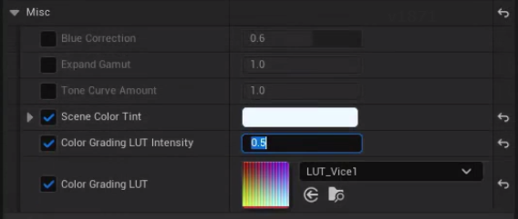   
完成调试  
    
添加局部雾效   
   
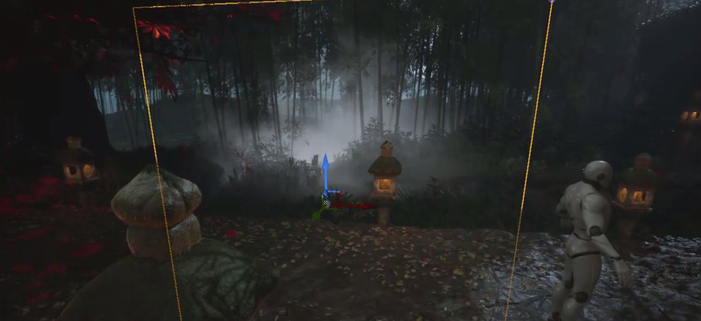    
调整层次和不透明度  
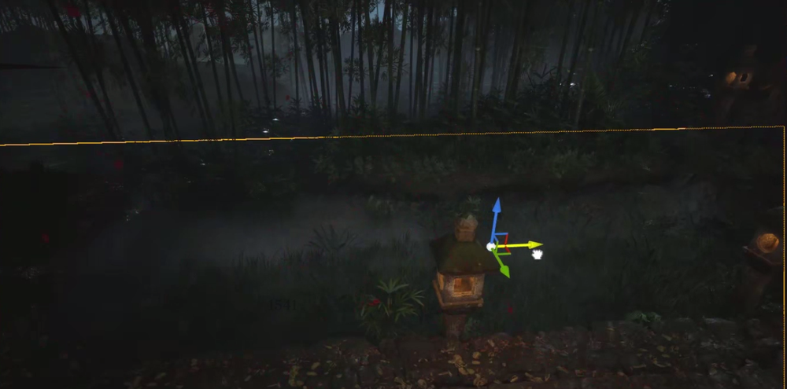   
制作sequence及剪辑   
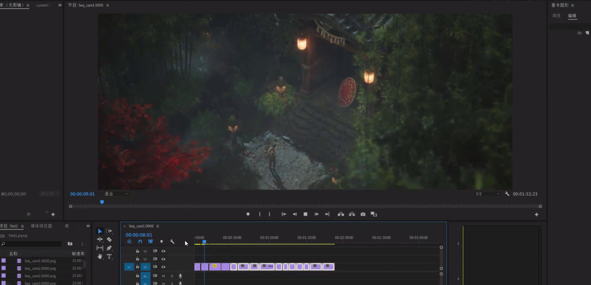   
## 达芬奇调色  
