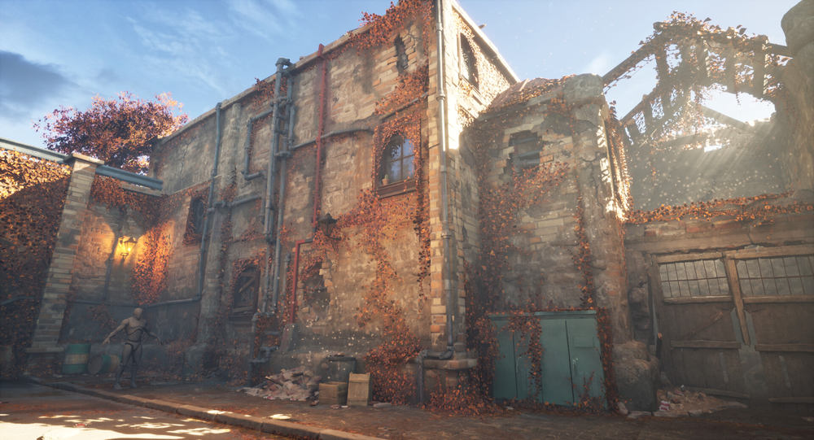
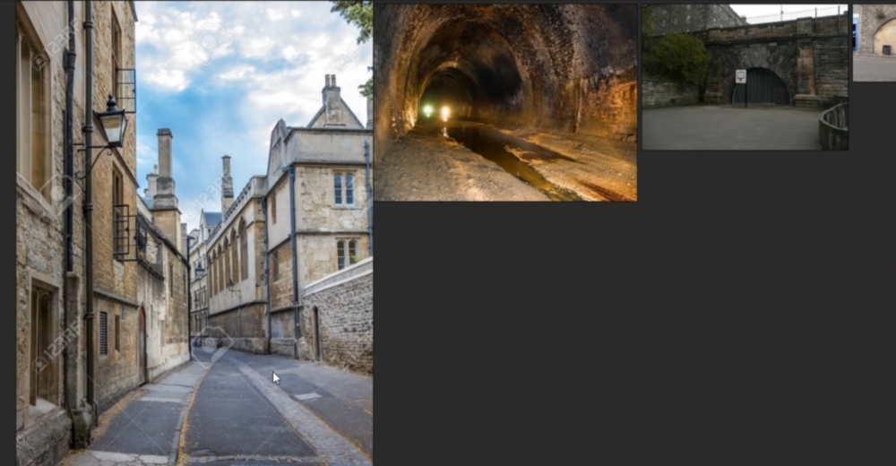
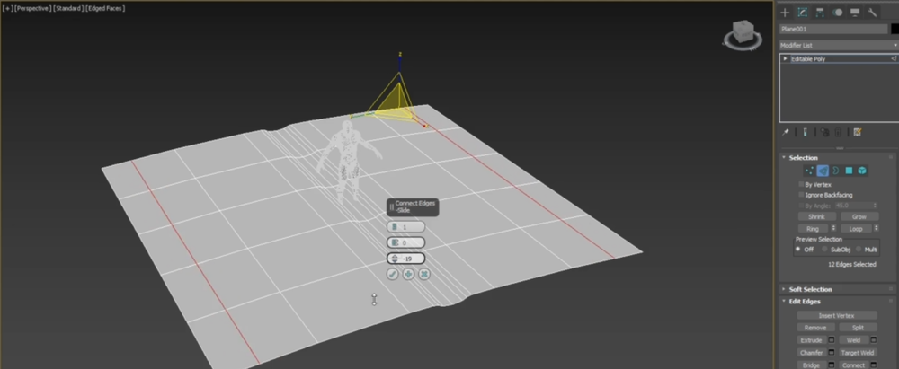
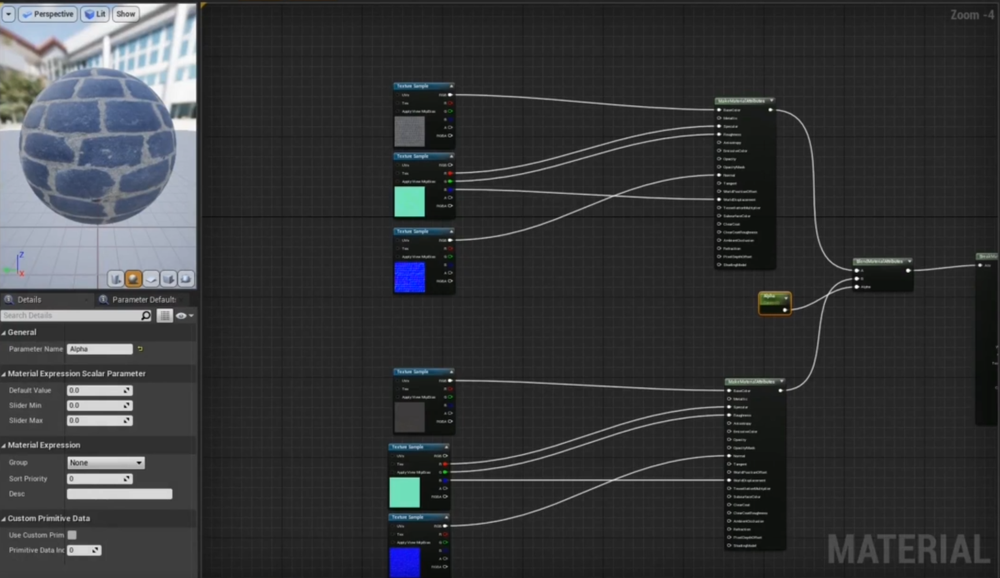
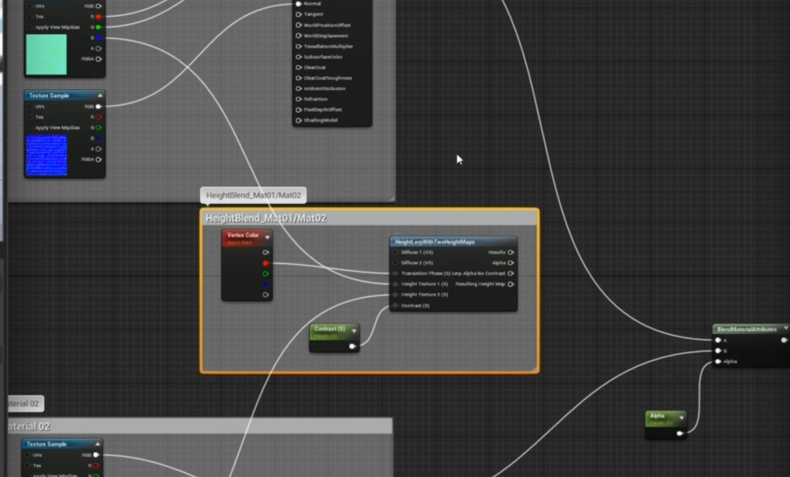
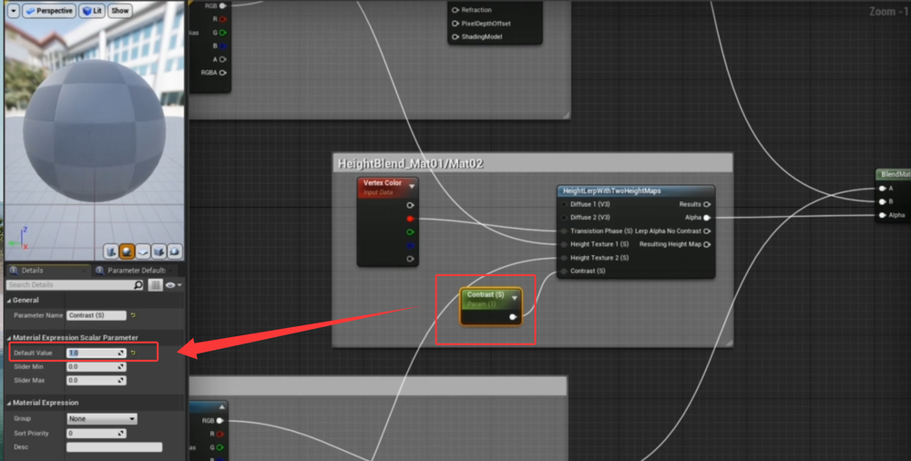
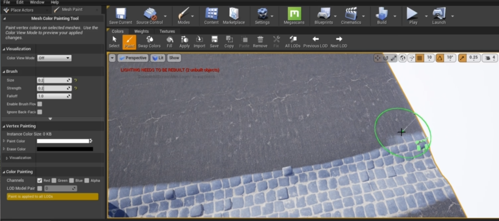

# Unreal Engine Game Environment design MasterClass  
    
    
     
参考   
    
路面建模   
    
    
导入UE并设置材质  
设置基础材质        
 
混合      
     
分解   
    
连接   
    
进入mesh paint模式    
     
添加高度混合节点   
   
    
绘制地形融合     
    
