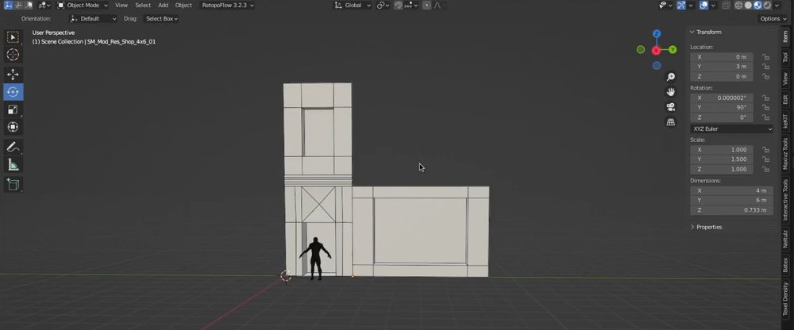
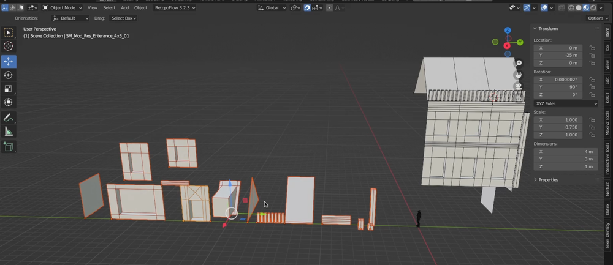
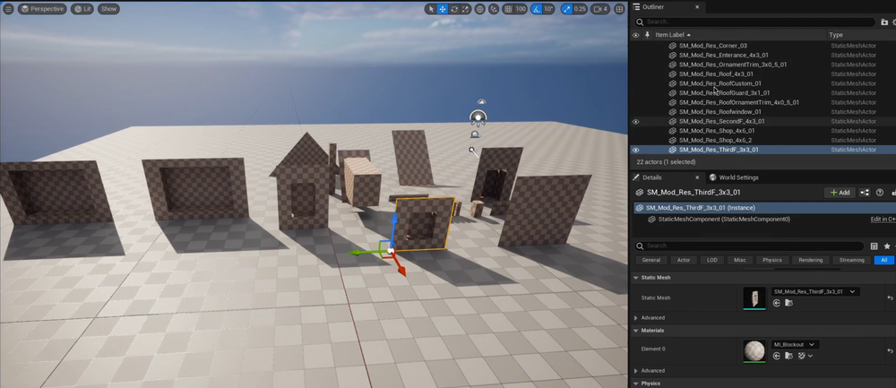
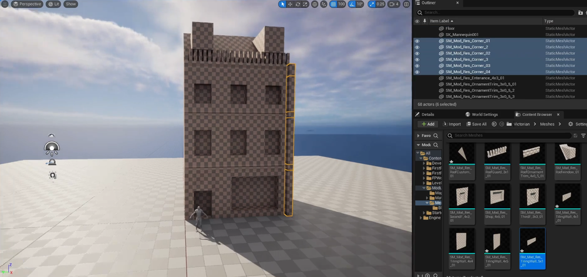
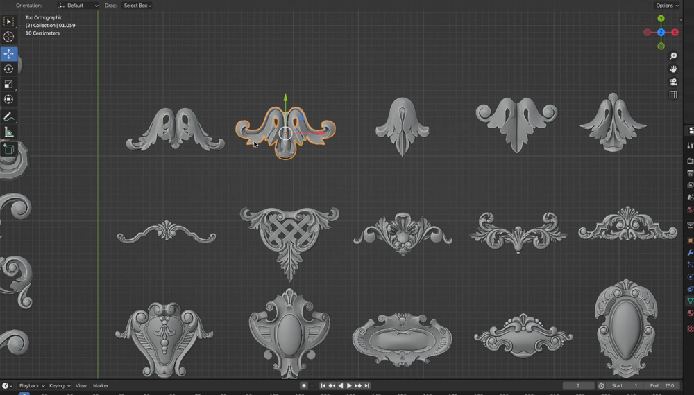
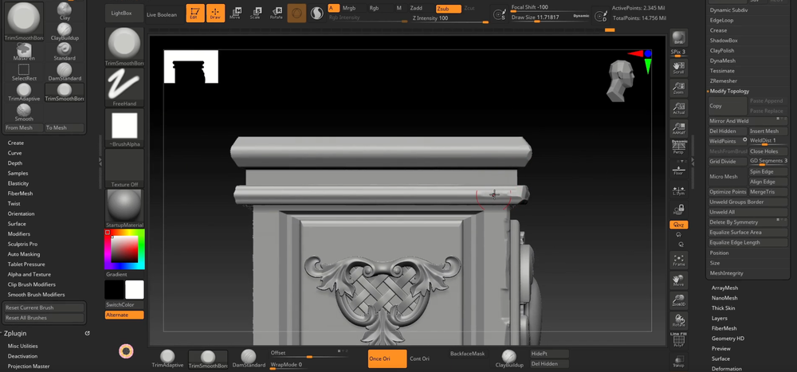
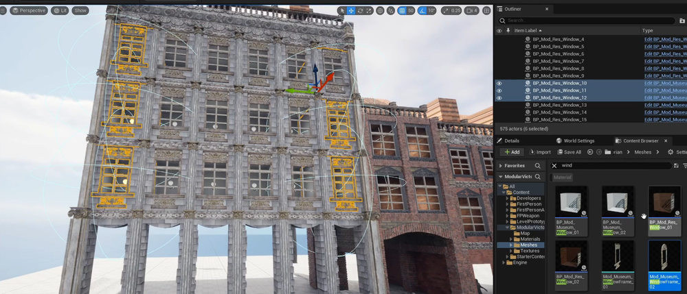
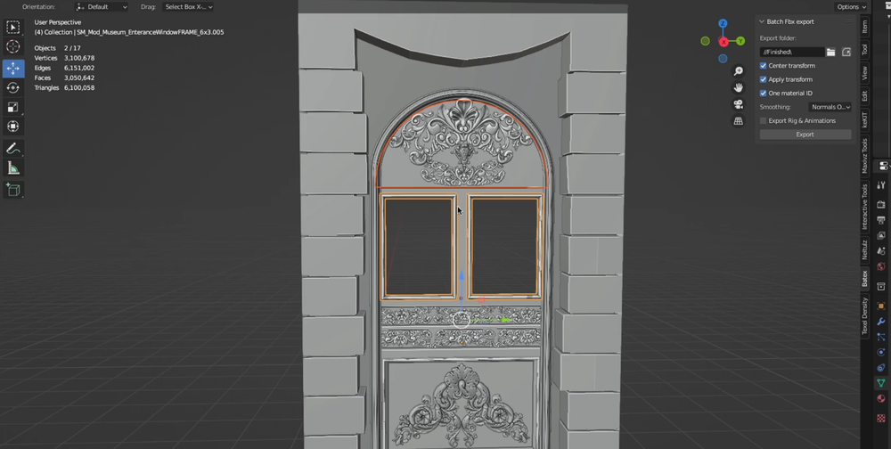
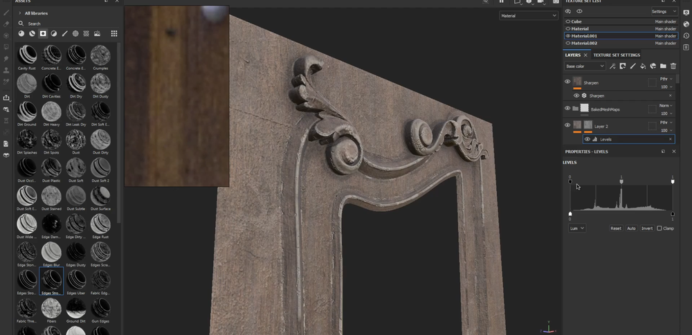

# Wingfox - Complete Modular Environments in Unreal Engine 5    
参考   
   
拆解  
    
制作模块   
    
      
导入UE   
     
    
高模制作   
      
     
    
ZB雕刻  
     
减面低模后进入UE，做建筑BP部件组合   
     
进入SP中制作贴图   
     
窗户等制作   
     
替换更新到UE   
     
其它复杂的部件制作   
       
    
    
SP中制作贴图   
     
