# Udemy - Learn to Make Stylised Environments in Blender & UE5    

ZB 笔刷资源   
<https://orb.gumroad.com/l/nOkHw>    
<https://www.dropbox.com/s/96pmfmjhzfgydfj/AJ%20BRUSHES.rar?dl=0>   

<https://cubebrush.co/luisarmstrong3d/products/w3g3zq/wood-brushes>    
<https://cubebrush.co/luisarmstrong3d/products/zywuhq/rocks-cracks-brushes>     

## 模块
原画  
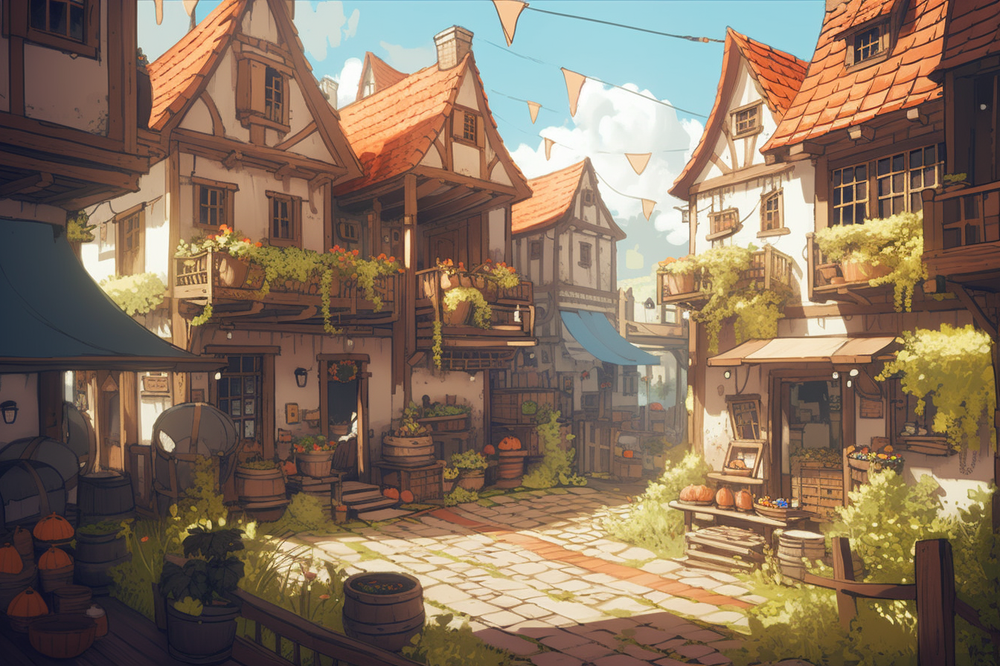   
分解参考   
     
自建天空球，材质设置    
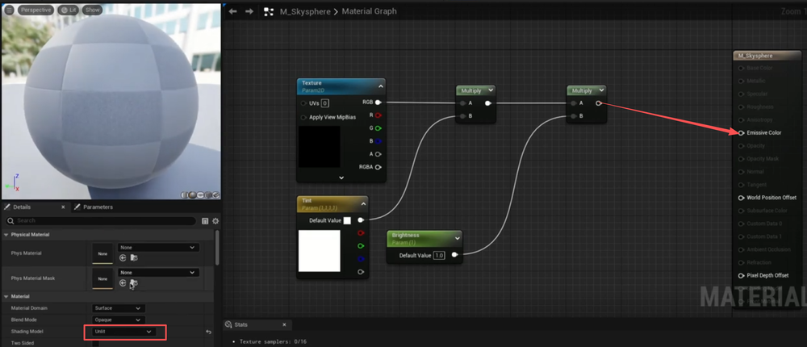     
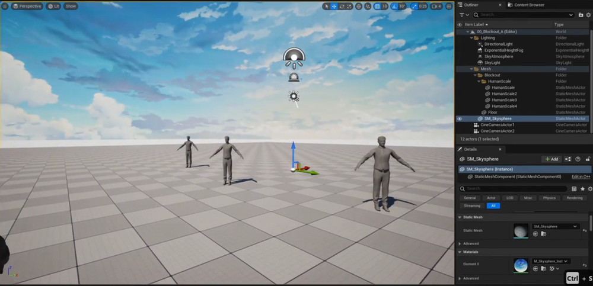     
后处理体积的无限边界开启，曝光最大最小值修改为1    
    
添加高度指数雾，并调整数值        
简历模块模型并在UE里进行初步拼合   
    

## 物件   
建模。雕刻。烘焙等。没啥好说的   
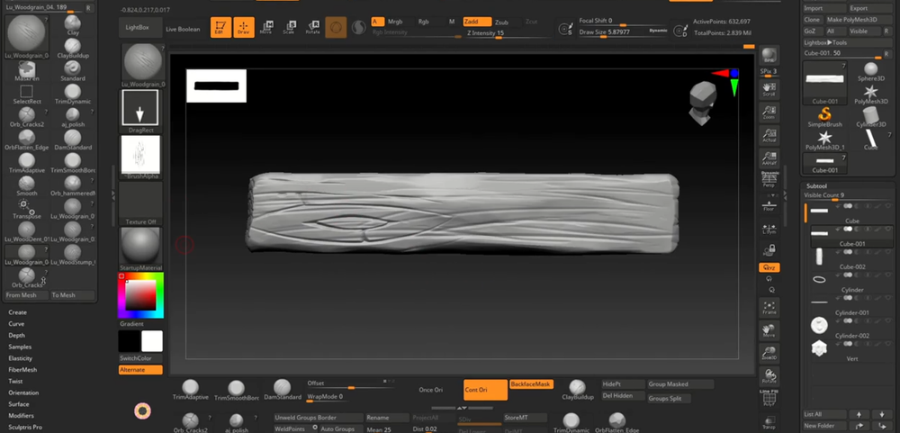    
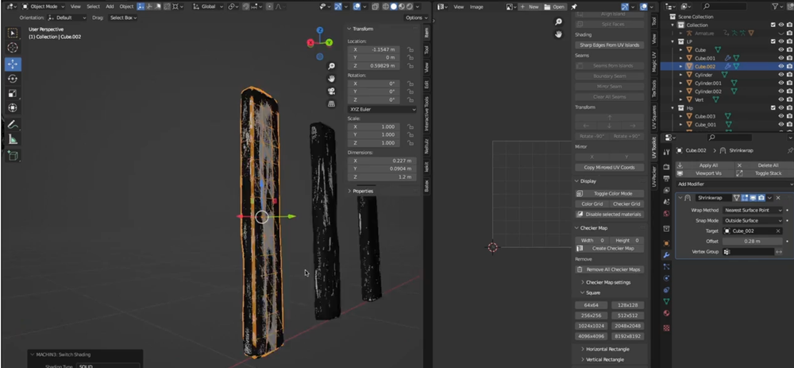    
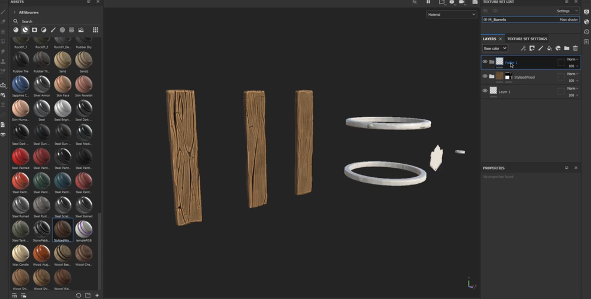    
    
    
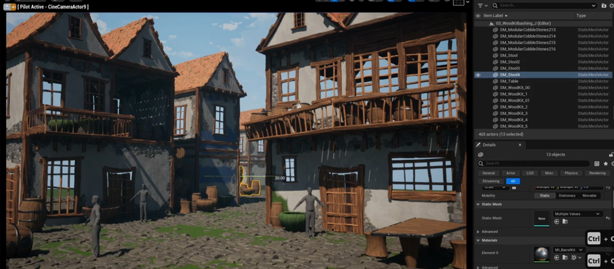    
     
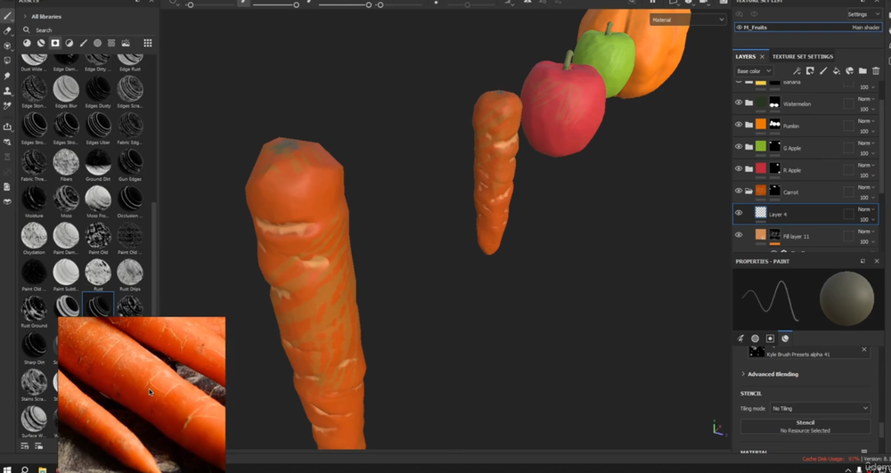    
    
SP中可以添加透贴通道   
    
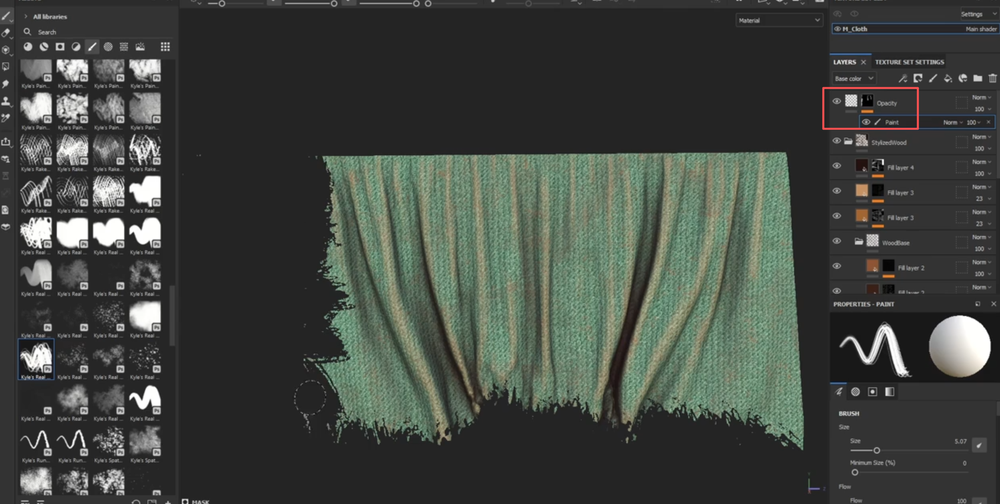    
## 植物  
建模，雕刻，烘焙  
    
     
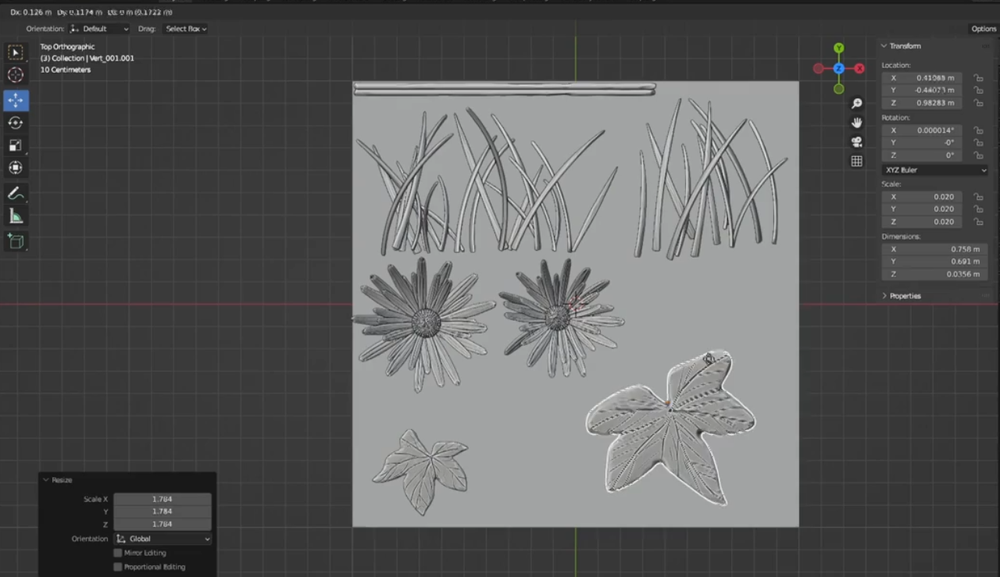     
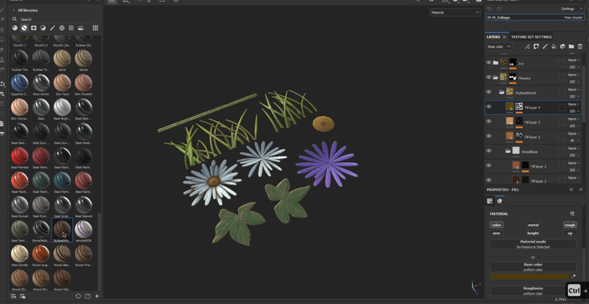     
    
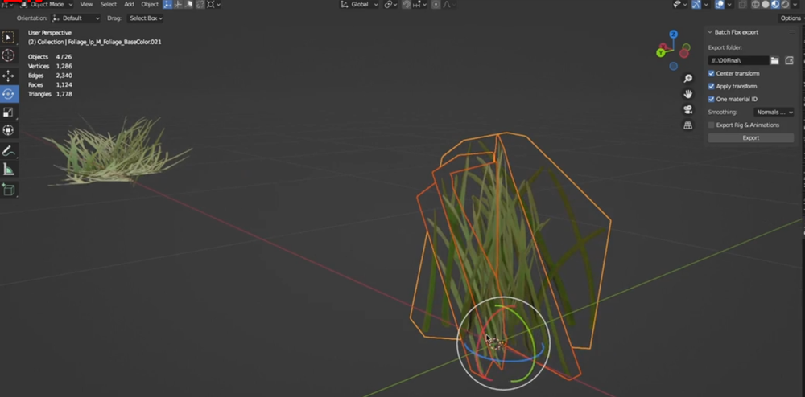   
    

## 灯光  
调整灯光和后处理体积   

