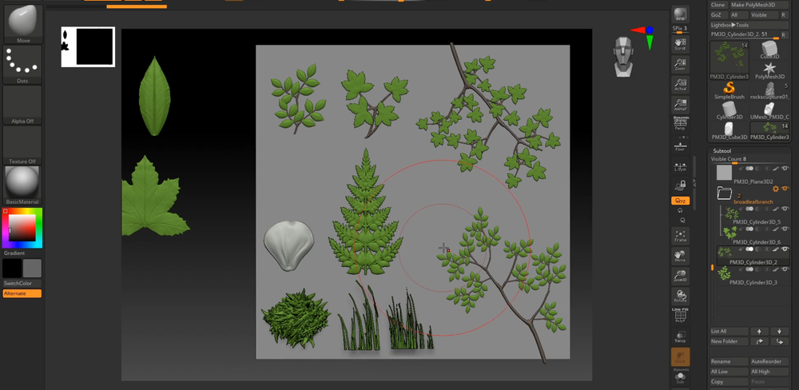

# Stylized Environments in Unreal with Tyler Smith
      
##  创建树叶   
ZB制作  
    
雕刻    
   
摆放  
    
重建细分并雕刻   
    
Z球树枝制作   

组合   
     
     
高低模烘焙，获取法线和AO等         
     
    
制作植物片等    
    
插片制作   
     
    
   
UE 导入   
石头材质    
color的连法不常见。权当一个案例了解          
      
朝上面积雪的效果   
颜色连接到B    
     
     
树木风吹动效果    
风权重那张图要看看怎么做    
     
连接到材质这里    
     
    
地编灯光等，没啥好说的   
     
    
Swapping Textures    
