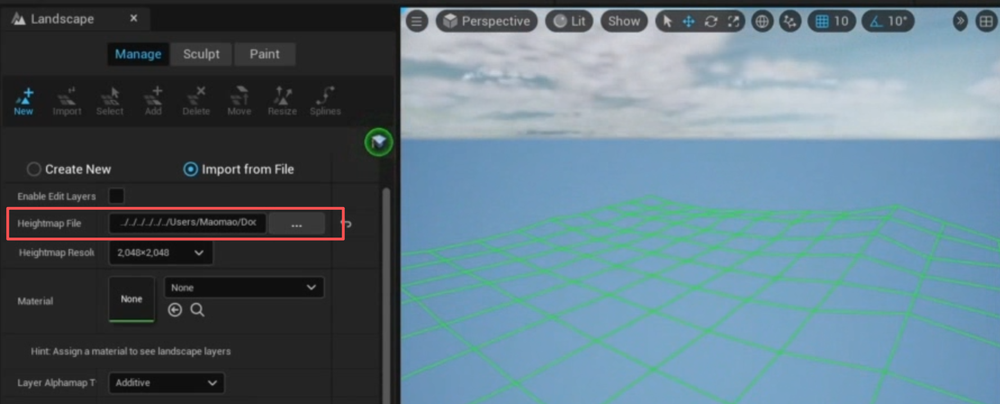
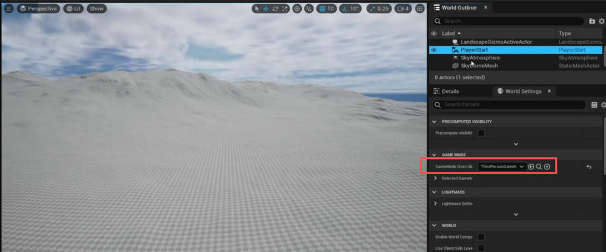
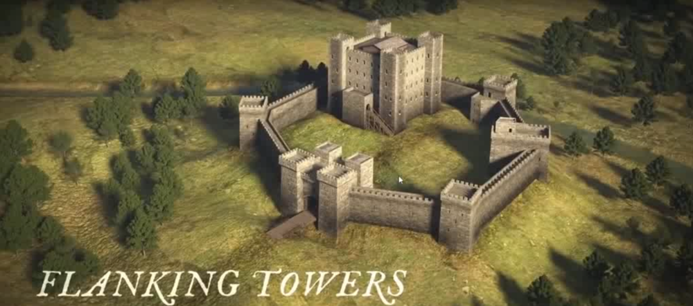
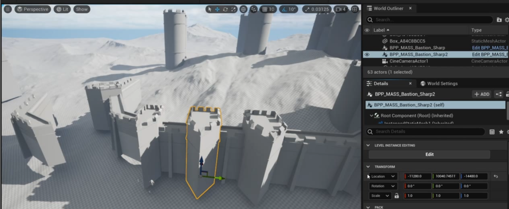
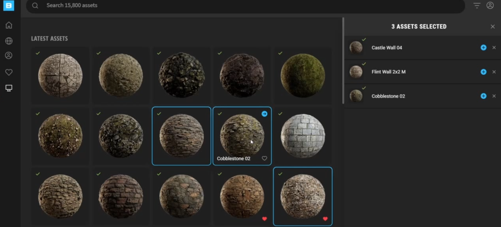
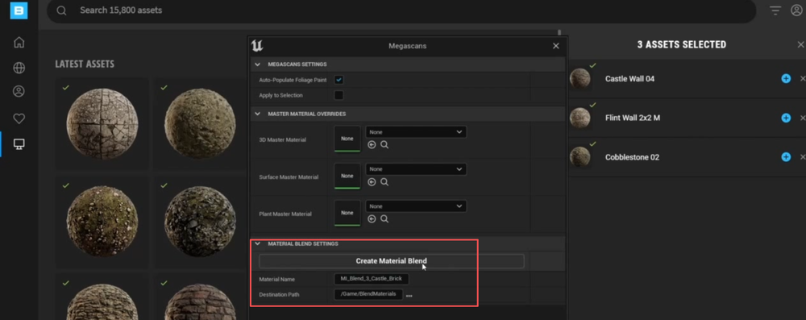

# chengbao   
## Blocking   
制作地形      
    
导入地形图生成地形    
    
设置第三人称角色   
    
参考   
    
     
模型搭建    
    
    
设置高度指数雾    
    
      
对重复性很高的模块制作BP  
并细化各个模块     
    
## Landscape Automatic Material  

## Texturing the Castle 
制作混合材质  
    
     
顶点绘制  
   

## World Building    
细化调整    
     
石头摆放等  
    
### Rock Master Material 
