# 魔灯风格化
    
    
## 白盒  
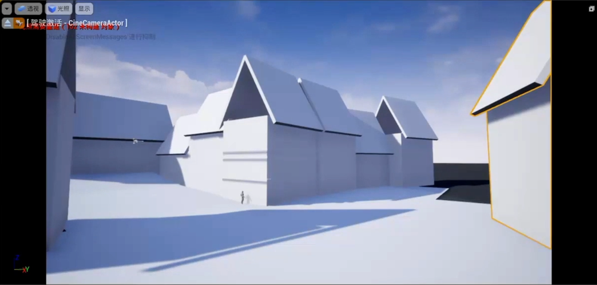    
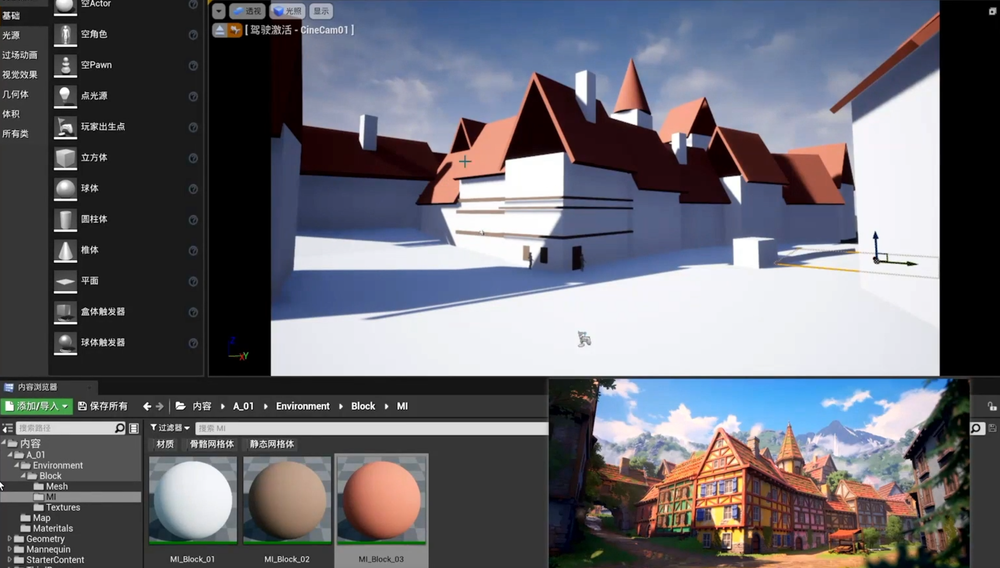    
制作模型UCX_可以在导入UE时，识别为碰撞体    
   
几种碰撞体制作方式  
    
白盒导出后，制作具体的模型部件   
    
调整地形，添加物件等   
进一步细化   
    
山石摆放   
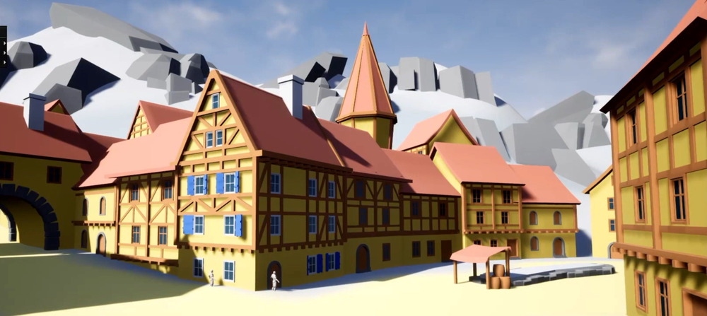     

## 粗模粗贴    
做一个大致规划   
    
正式化一点的贴图  
   
部件拆分细化制作   
    
建筑BP拼合  
    
制作完所有建筑BP   
   

## 高模雕刻  
规划贴图，并创建模型   
    
中模导入ZB，并雕刻   
     
高低模对位，烘焙前的准备   
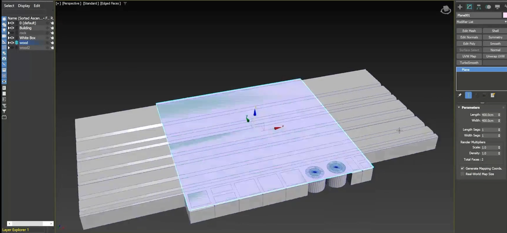    
八猴烘焙   
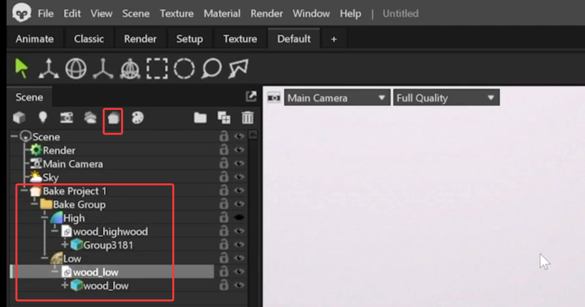     
SP中绘制贴图   
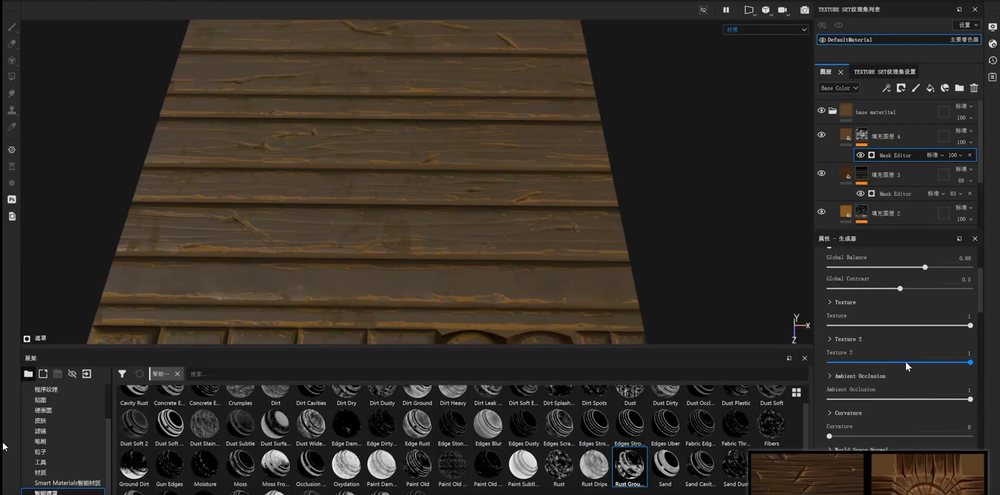     
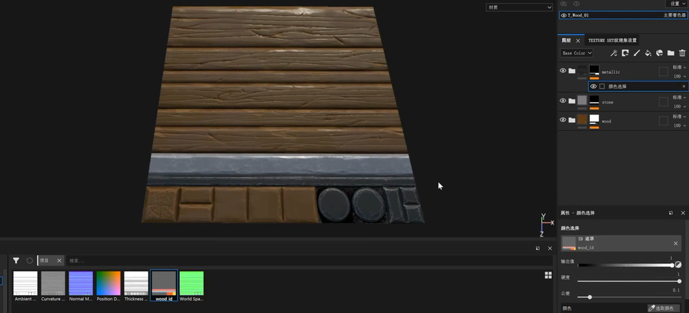     
导出贴图     
    
设置UE材质   
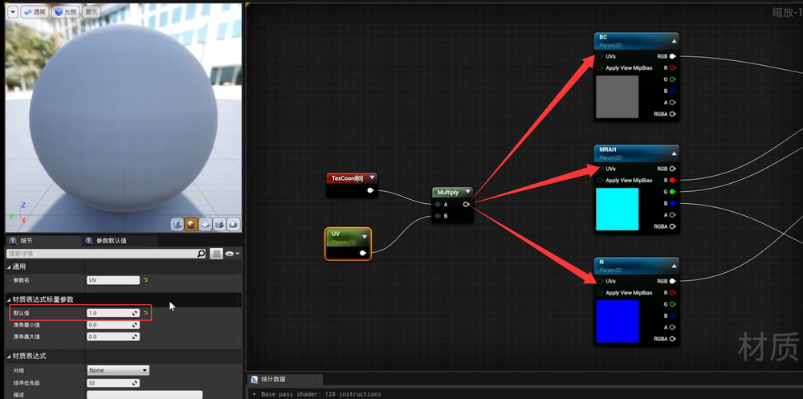     
低模拆UV匹配贴图   
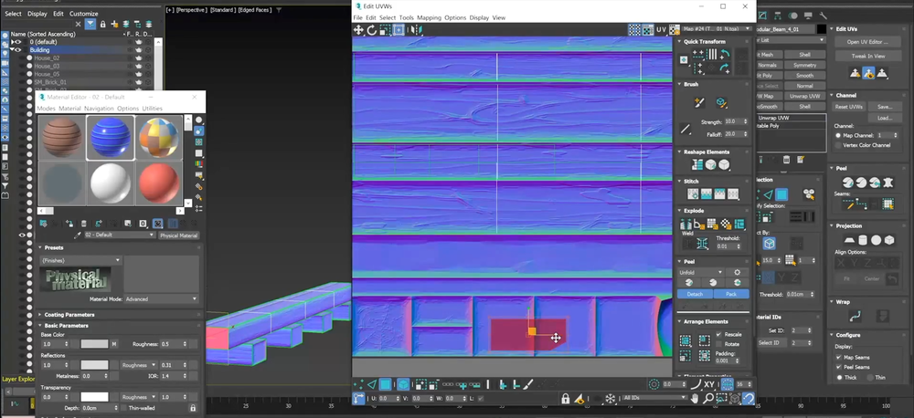     
材质去色变色节点   
    
木头部分不需要变色。把遮罩贴图单独导出    
    
做Alpha融合颜色贴图    
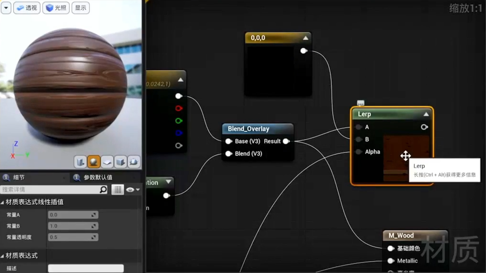     
变色实现   
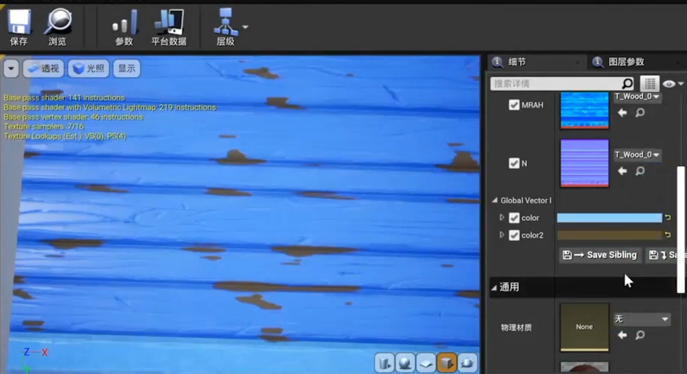     
其它部分UV   
    

## SD 
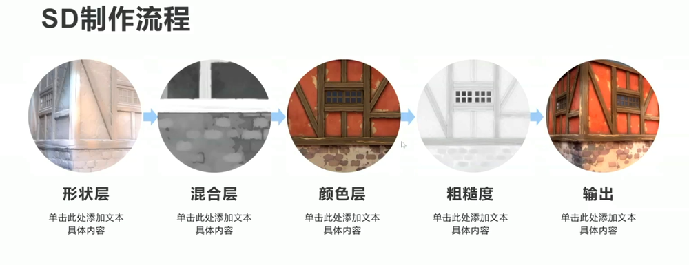     

## 山石   
石头雕刻 烘焙      
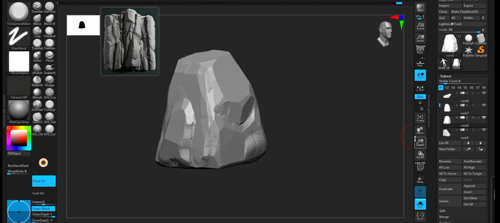    
高模建面    
    
SP里做贴图     
    
## UE材质  

## 植物   

## 灌木   

## 地形  

## 地编   

## 昼夜天气   
