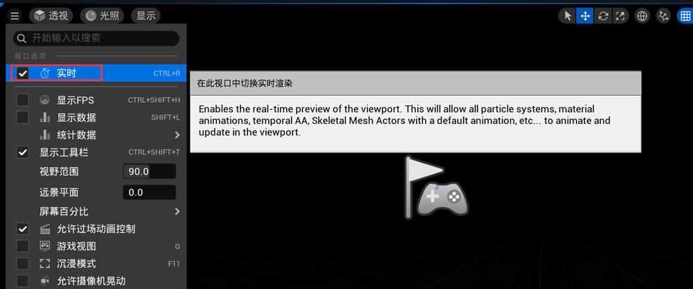
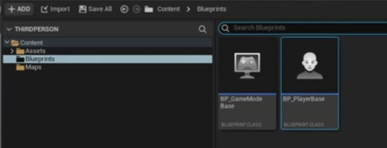
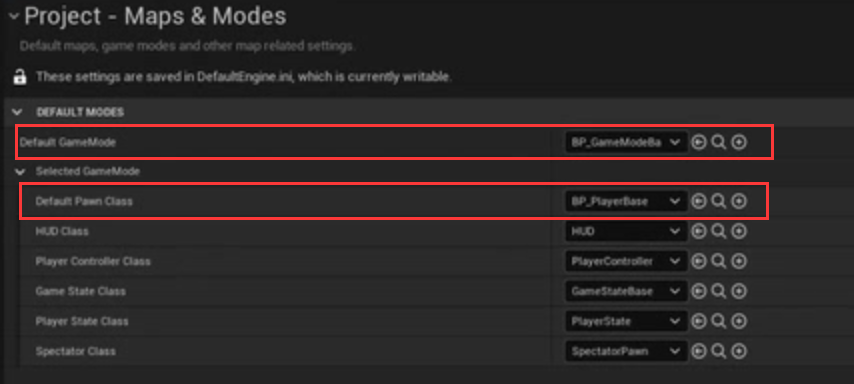
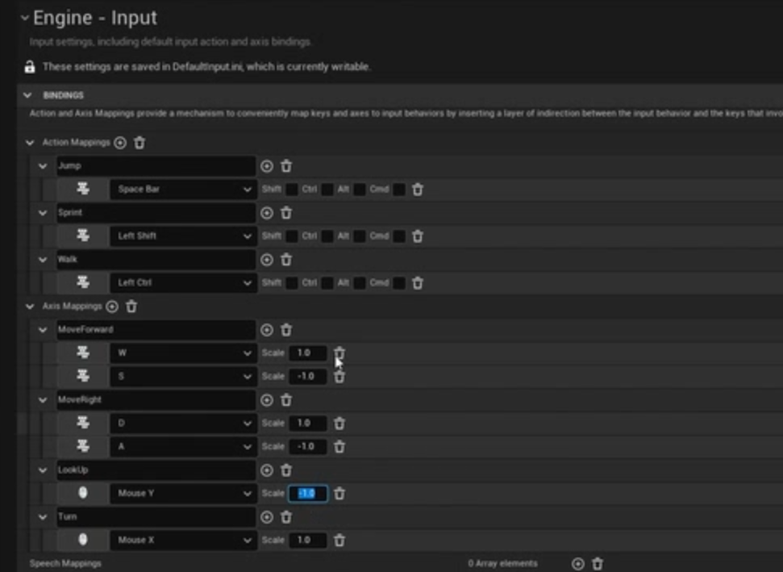

# Demo 通用角色 
## 项目设置
迁移案例项目    
项目设置开启手动曝光，也是可以去掉曝光的自动变化   
    
编辑的时候可以关掉实时，让性能更好一些    
    
创建game mode和character的BP   
       
更新替换项目的game mode和character的BP    
 

## Basic Movement and Input Bindings
设置mesh    
      
设置摄像机    
SpringArm + Camera    
     
Input设置    

character的BP操作实现   
