# 摩灯写实室外  

## 贴图类型 
### Trimsheet贴图   
二方连续为主，制作方式:分先做贴图，后做低模，对UV、导入引擎   
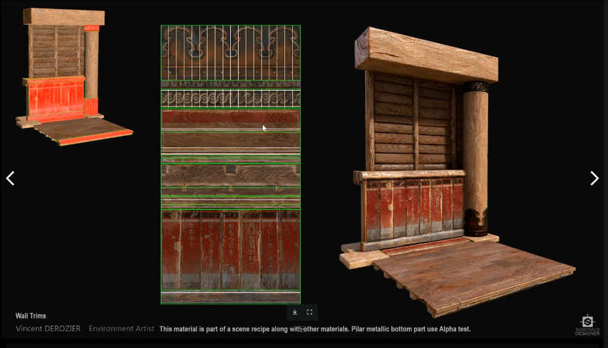   
### Tileable贴图 
四方连续贴图，制作方式:先做贴图，后做低模，对UV、导入引擎   
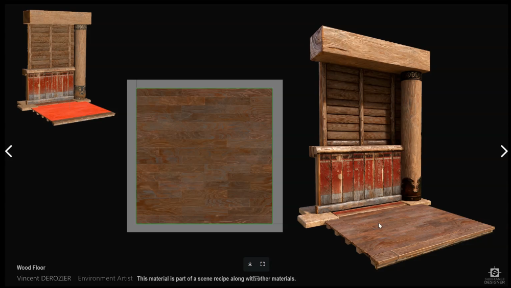   
### 普通物件
物件制作方式:中模、高模、拓扑低模、烘培贴图、制作材质贴图、导入引擎    

贴图精度   
   
两种法线，G通道是相反的，只需要翻转绿通道    
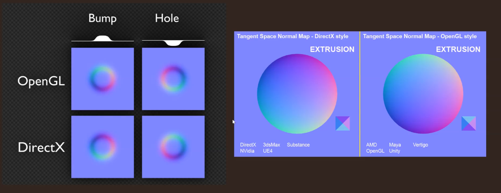   

## UE资产命名规范

## Lumen设置  
启用lumen,如果是UE5的项目，自动启用lumen,但还是有一些设置需要注意勾选   
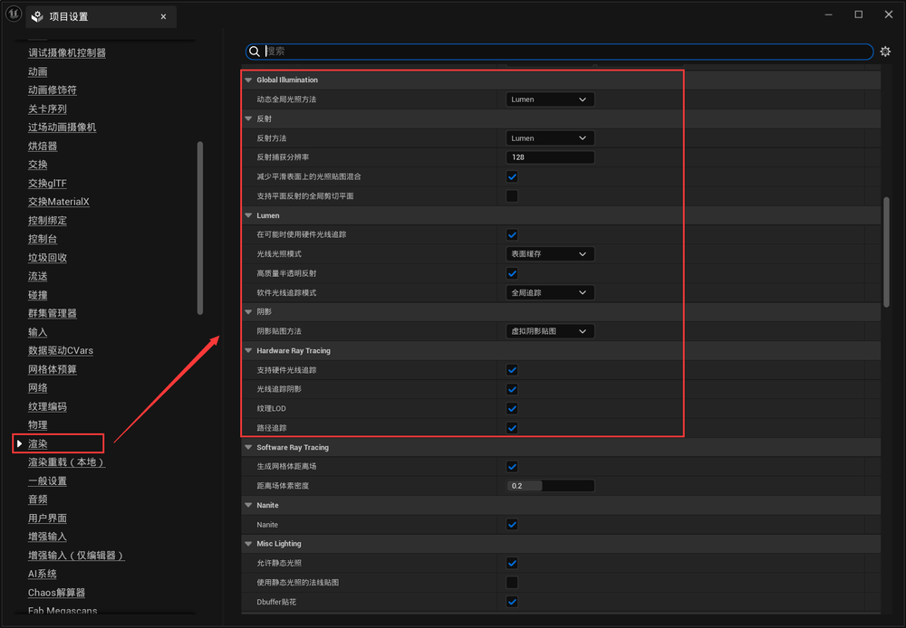    
   
创建后处理盒子，勾选无限范围   
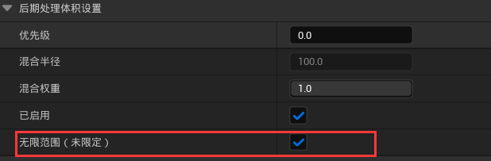   
间接反射强度和次数   
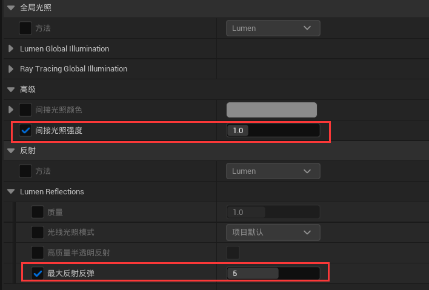   
曝光设置。如果勾选游戏设置，使用后期处理盒的曝光设置。默认是有个变化范围，不是定值。  
在室内室外切换的时候，光线曝光会变化    
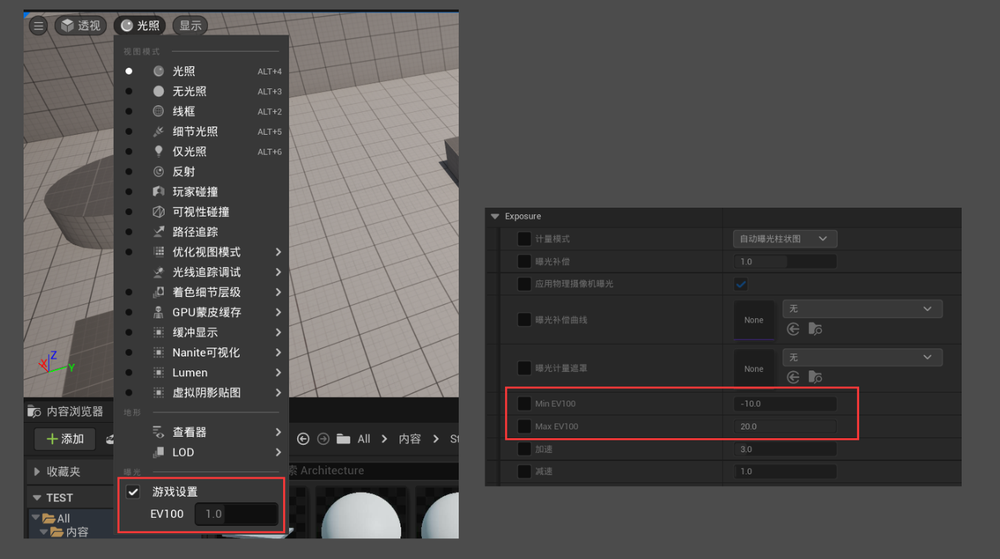   
更改后   
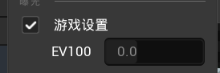   
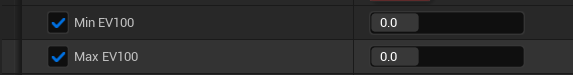   
此时可以更改主光源参数等，可以获得一个稳定的结果   
   
### Lumen参数  
lumen的显示   
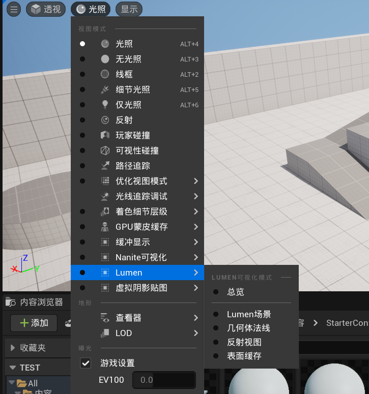   
控制lumen影响物体反射的远近   
lumen场景视图距离，影响范围     
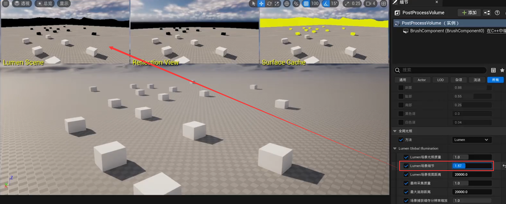   
## UE5灯光类型 
直接光随着角度变化会改变色温，和现实世界对应  
如果要关掉，选择关闭大气太阳光     
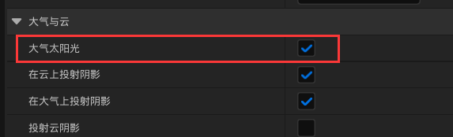   
天空大气删掉，也可以不受色温变化影响   
   
室外的灯光颜色，使用色温比较准确    
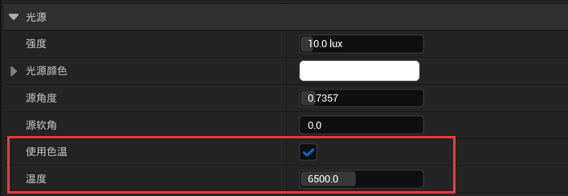   
体积散射强度，在有体积雾打开的时候生效。默认是关闭的   
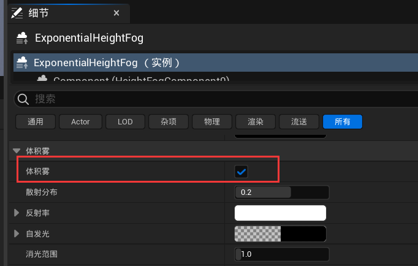    
调整体积散射强度，可以看到效果   
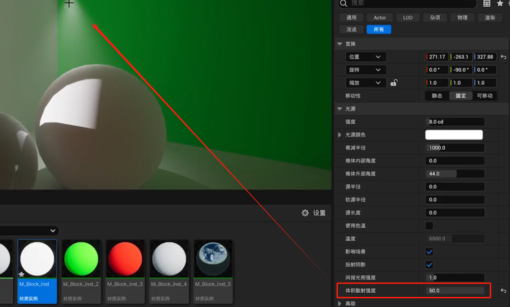   
