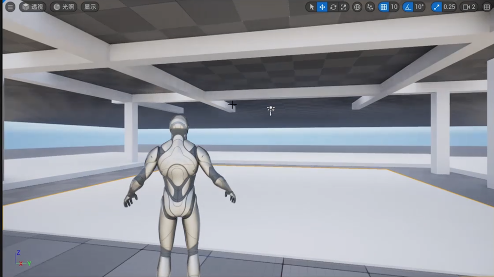
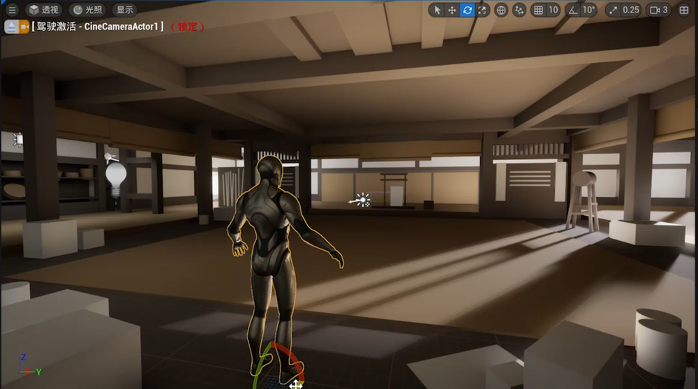
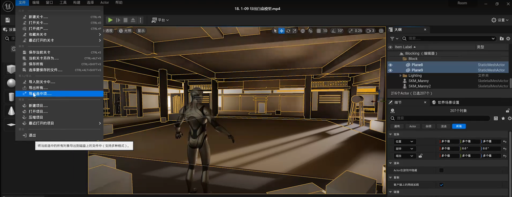
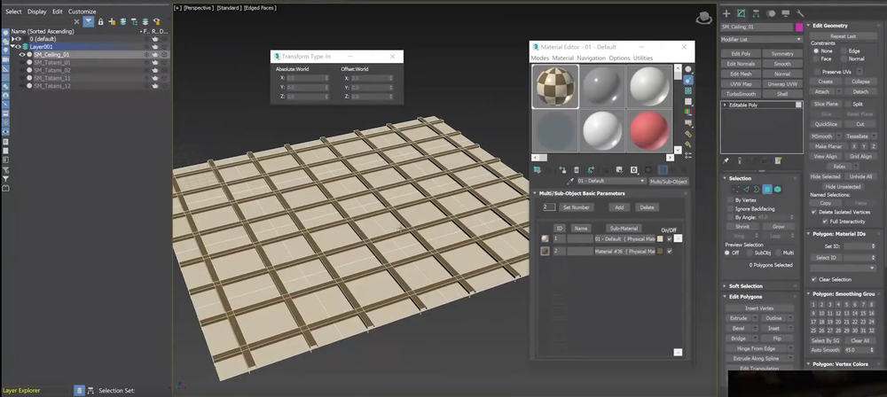
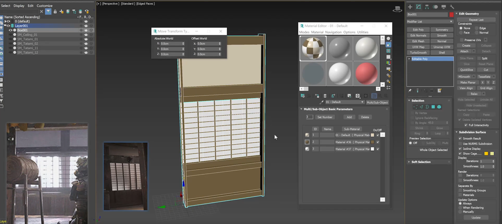
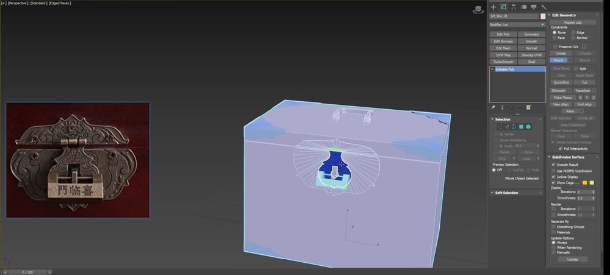
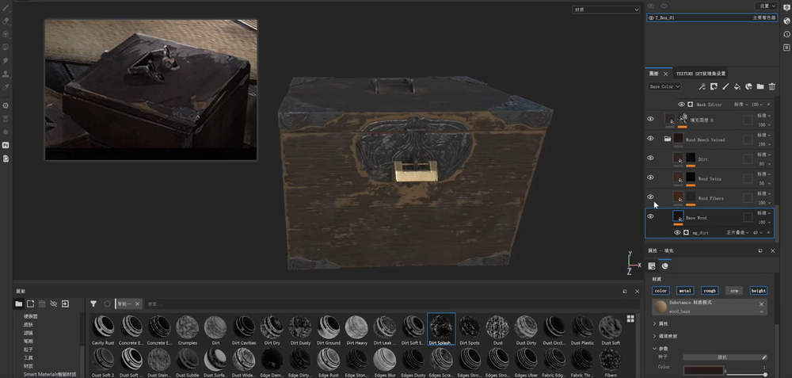
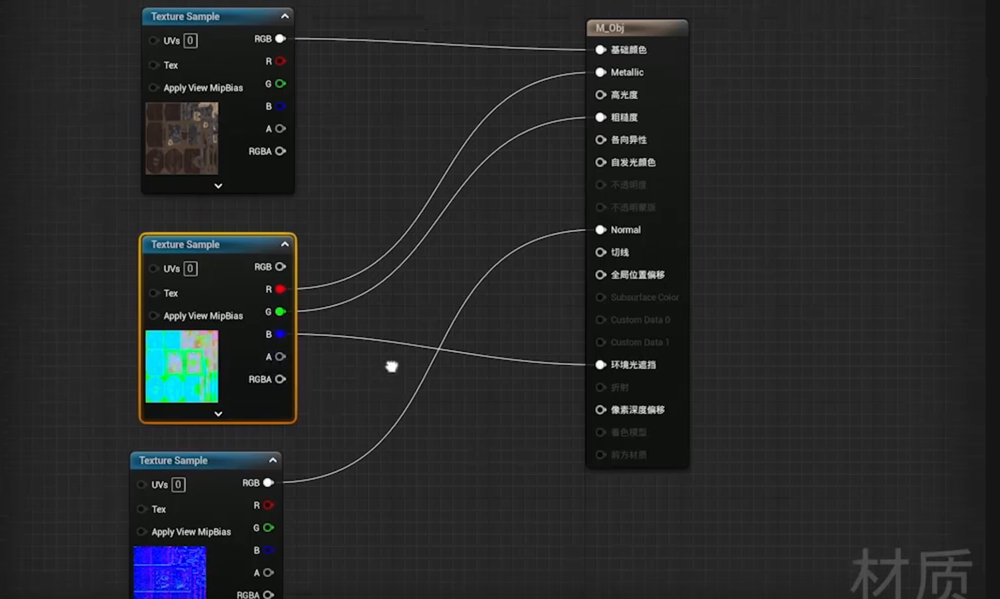
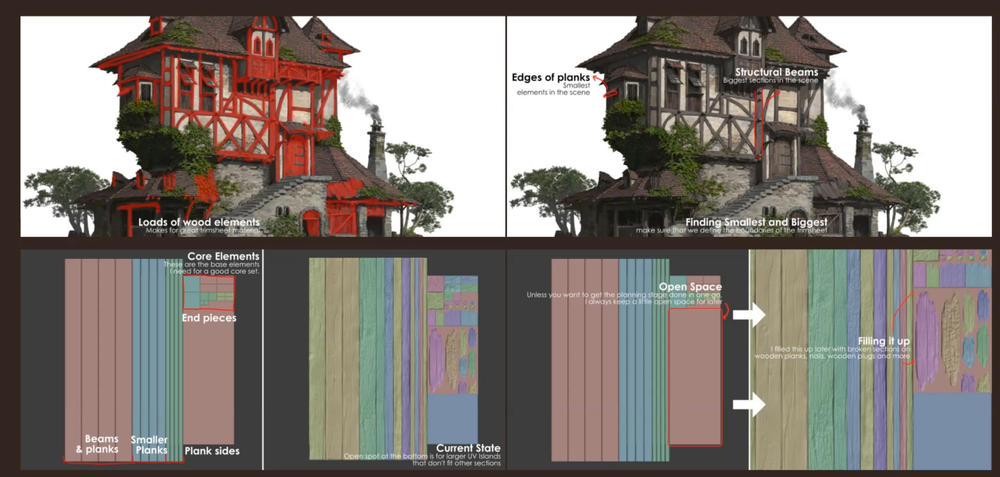
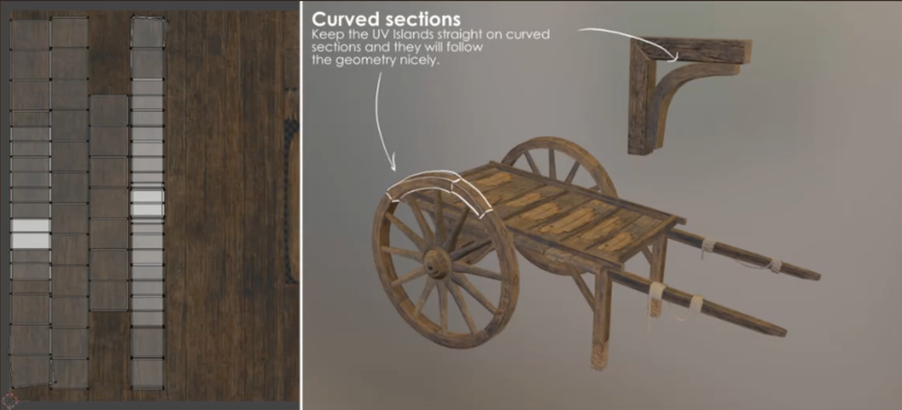

# 摩灯室内  

制作流程    
   
## 白盒  
原画  
    
开始搭建     
     
   
    
灯光也同步调整   
    
     
全选白盒并导出    
     

## 模型制作    
导入到3D软件进行进一步制作     
     
新部件导入UE进行拼接   
    
其它部件  
    
    
   
    
    

## 物件制作  
    
    

## ZB+SP 物件   
没啥好说的，正常次时代物件制作    
    
    
    
SP里加工   
      
    
SP的输出设置，R+G=B 可以的模式可以加载那张混合信息   
    
在UE中就可以这样连。每个项目会有自己的一套混合贴图的规则   
    
其它物件类似制作   

## trim贴图   
      
    
## Trimsheet贴图  
    
贴花部分  
      
弧形部分的UV打直   
    
