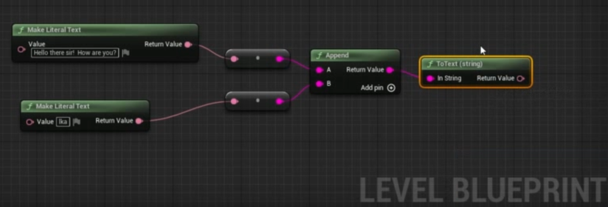
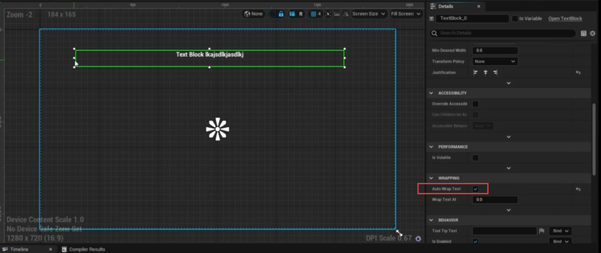
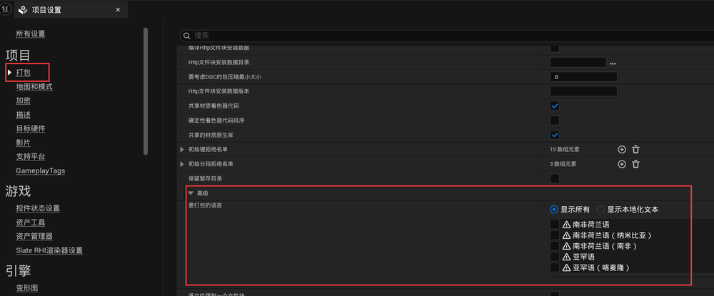
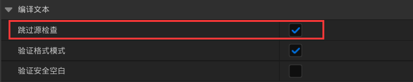
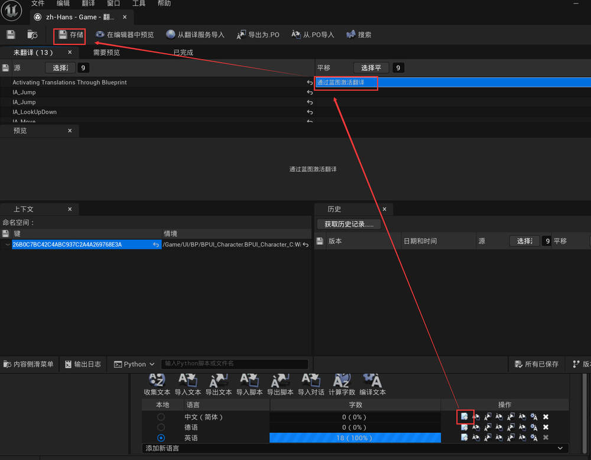
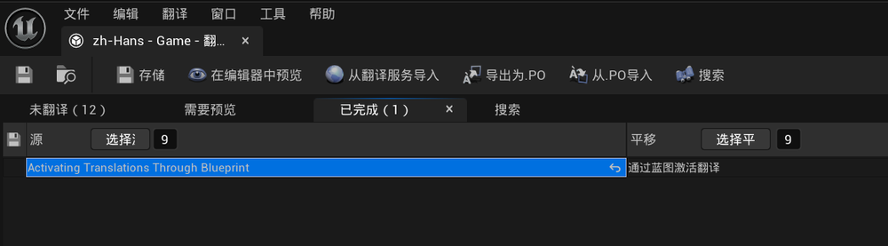
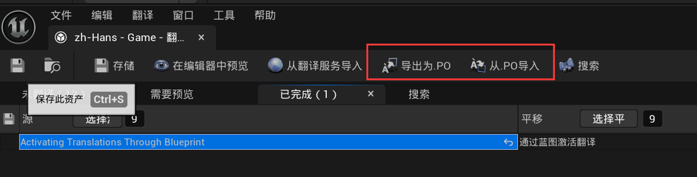
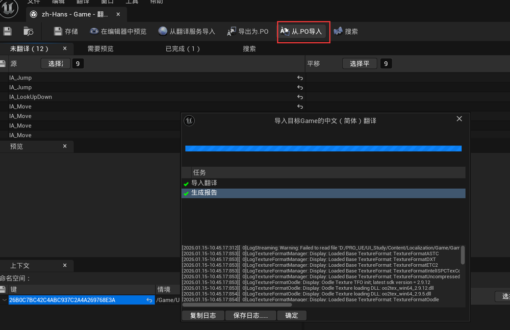
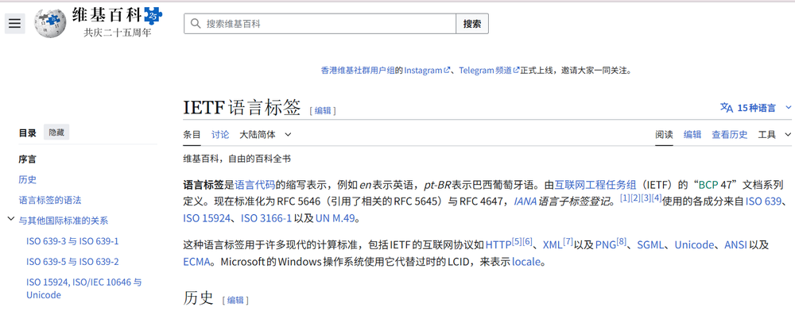
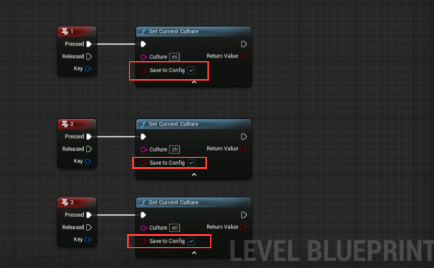

# 本地化翻译  
## 一些说明和设置    
        
无法在引擎预览，需要通过打包，一个简易方式是standardone game     
    
只有文本类型的`对象objects`或`变量varsiables`才可以被翻译    
localization dashboard只从特定文件夹收集 **Text文本类型** 的变量进行翻译    
**string** 类型是不会被翻译的    
    
可以控制哪些text变量不被翻译    
    
UI界面，字幕等确保是可以被翻译的    
## 文本类型值  
Make Literal Text 是蓝图专属的文本构造节点，核心作用：创建一个固定不变的文本常量，也就是我们常说的字符串文本。   
    
Make Literal Text 输出的是Text 类型，不是 String 类型    
这是 UE 官方强推荐的文本类型，因为 Text 原生支持 多语言本地化翻译，是 UE 为「游戏内展示给玩家的文字」专门设计的类型。   
UE 的蓝图中，文本相关有两个核心类型：Text（本地化文本，推荐使用） 和 String（普通字符串，无本地化）   
### 字符的转换和拼接   
to string→append       
   
### 文本翻译的显示长短   
不同语言显示同意涵的长短是不同的     
勾选自动包装文本,确保有个最差的保底       
   
## 设置 
### 项目设置   
项目设置里选择要翻译的目标语言   
可以看到同一个语言有不同子类别，子类别有俚语的差异   
一般来说选择父类的         
    
国际化支持可以选择全部   
    
### localization dashboard设置
目录的选择,也可以添加排除     
大多数游戏可以不勾选从文本获取   
但所有放在游戏包里的需要           
    
勾选跳过源检查   
这里要查一下，没理解到     
    
设置完成后，在最下面添加语言，就可以开始收集文本      
  

## 翻译  
通过编辑并存储   
    
但这样比较慢    
可以选择所有文字，复制到Excel   
   
翻译完成可以粘贴到另一列。可以全选翻译的粘贴回。   
**如果有单元格没有内容，会导致引擎崩溃**   
可以在已完成里看到完成的翻译    
    
如果是第三方翻译公司，可以用PO文件交互    
   
打开PO文件，只需要把翻译添加最后一行里的字符串就可以      
    
    

## 编译翻译  
    

## 蓝图激活翻译  
在关卡蓝图里。设置IETF语言标签 
比如中文的标签是 `zh`       
  
**Set Current Culture**  是核心节点    
测试可以设置1,2,3按键来切换显示     
culture里设置对应的IETF语言标签     
    
启动查看   
    
勾选 **save to fig** 的话，一旦切换语言，下一次还是会从这个语言加载。建议都勾上    
    
实际开发中，不可能每个语言设置一个按键。实际上只需要当前选择语言为默认语言就可以   
核心节点是 `get default locale`    
   