# Unreal Engine Ultimate Survival Horror Course   
    
## 设置 Setting Up 
新建第三人称项目，创建后处理体积，设置曝光恒定，并勾选无限范围   
    
### 游戏实例 GameInstance
gameinstance蓝图。  
游戏开始时生成，游戏结束时被删除   
是跨越关卡间的，不会被重置    
存储全局数据            
命名为`HG_GameInstance`     
    
设置里设置游戏实例    
     
### 游戏模式 Game Mode     
game mode存储关卡信息    
例如pawn controller,game state,HUD class     
当一个关卡被打开时，游戏模式game mode会被生成    
当一个关卡被关闭时，游戏模式game mode会被移除     
多人游戏时，只有服务器可以访问游戏模式。单人模式则不然   
单人游戏，大部分信息可以保存在游戏模式game mode中      
     
命名为`L1_GameMode`    
需要把这个分配给关卡     
    
下面是游戏模式更具体的内容   
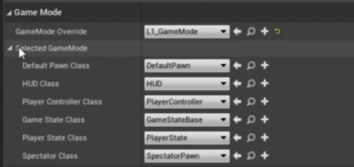    
每个关卡都需要附加一个游戏模式   
如果为none则用默认的gamemode    
    
### 游戏状态 Game states
不同于游戏模式，游戏状态是服务器和客户端都可以访问   
包含关卡信息，如世界时间或者关卡当前目标   
创建 Game states base    
     
命名`L1_GameState`   
双击`L1_GameMode` 指定 `L1_GameState`       

### 玩家状态 Player states    
一个关卡有一个游戏状态，但每个玩家都有一个玩家状态    
用于储存玩家名称，得分，血条等    
    
命名`L1_PlayerState`    
    
同样添加到游戏模式Game Mode中     
     
HUD已经被淘汰，更多用于调试。    
现在用UMG    
     
命名`L1_HUD`，并分配给GameMode        
### 玩家控制器 Player Controller 
每个关卡都有相同的控制器，在关卡目录外创建玩家控制器       
    
命名`HG_PlayerController`    
添加进关卡gameMode里    
     
添加了玩家角色后，还需要这里进行一些设置    
创建角色类    
    
命名`L1_Character`    
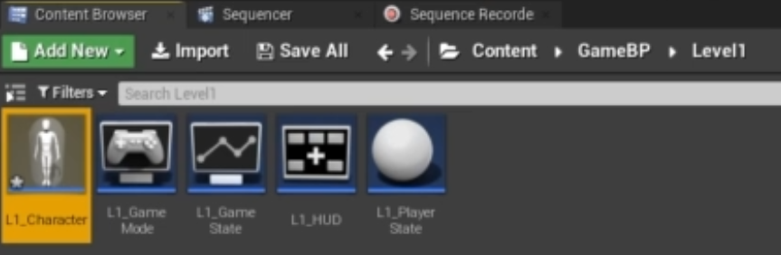    
进入内部创建摄像机    
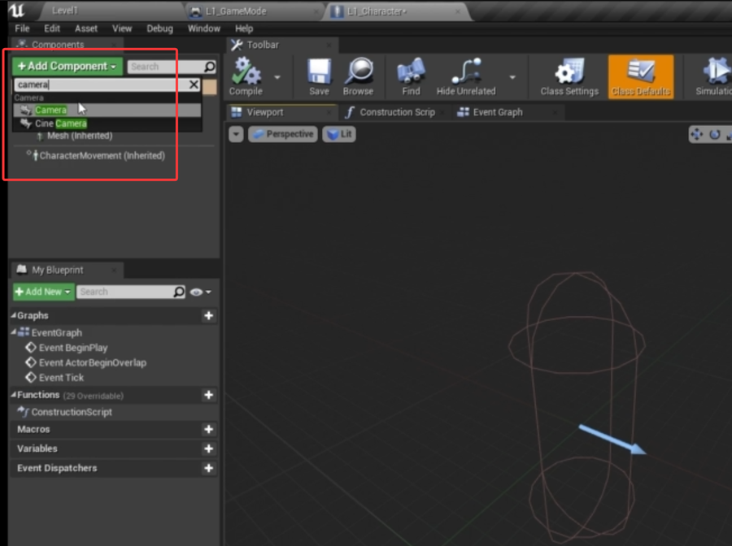     
调整摄像机到第一人称头部位置    
     
添加到游戏模式 Game Mode    
    
## 角色控制 Character Controller   
### 摄像机运动 Camera Movement
玩家控制器 Player Controller中添加鼠标控制镜头移动    
设置input里添加`LookUp`,`LookRight`    
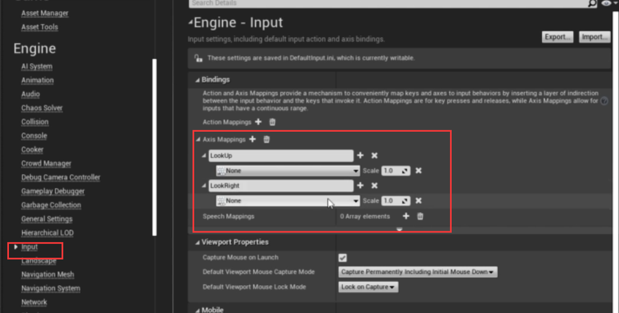      
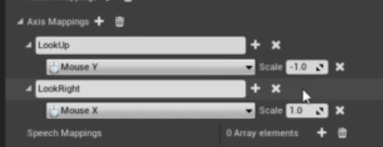      
角色` L1_Character `里的摄像机勾选pawn control    
    
Player Controller 中添加输入     
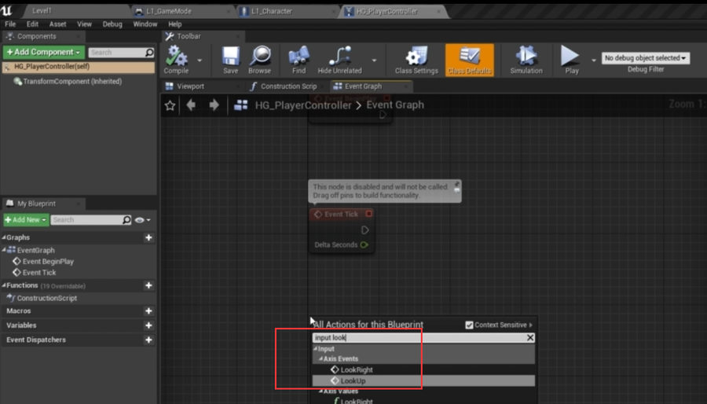    
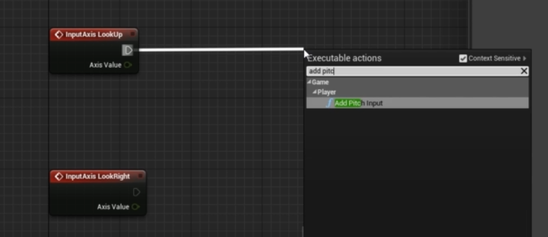    
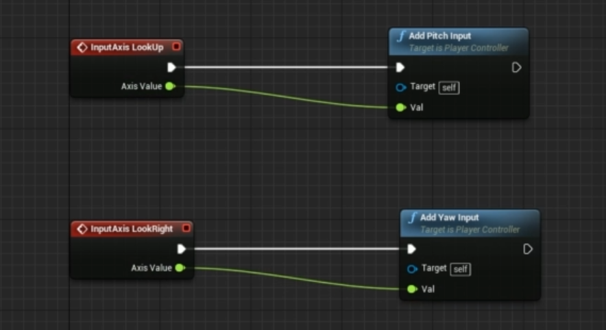    
现在运行，鼠标可以控制在视图里的转动了    
太还是太过灵敏，需要添加灵敏度变量`LookSensitivty`,浮点类型        
   
先给默认值0.4，创建并连接浮点值节点  
用一个浮点数乘以一个浮点数       
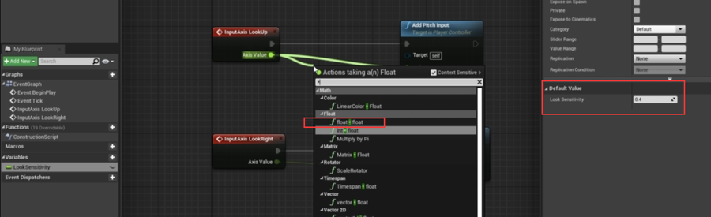     
    
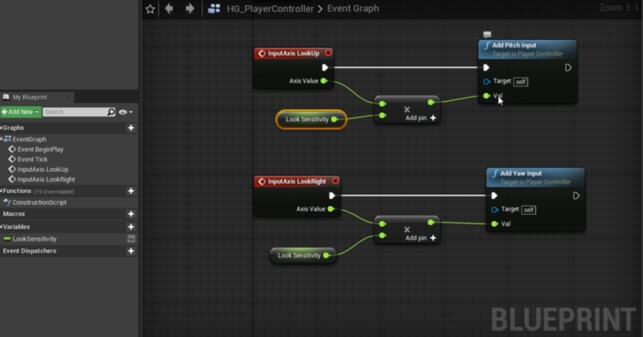    
### WASD运动 WASD Movement
添加控制映射    
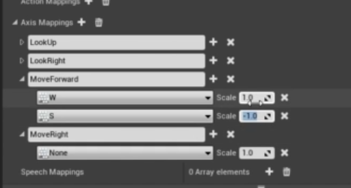    
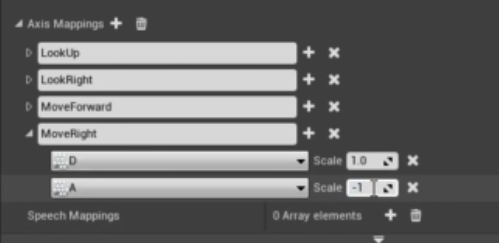   
角色` L1_Character `里添加        
   
    
可以更改行走速度   
     
### 跳 Jumping    
添加控制   
     
角色` L1_Character `里设置    
    
如果要改变跳高，修改值    
   

## Horror Basics 
### Interaction
添加交互按键       
     
添加目录结构和interface蓝图        
命名为`BPL_Interaction`    
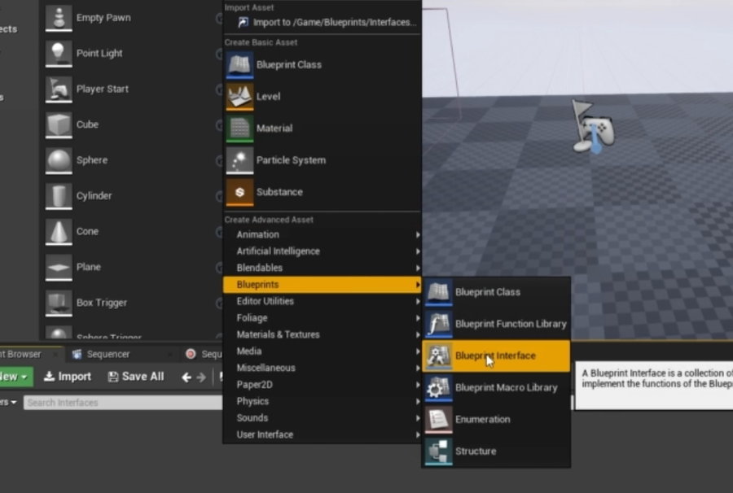    
创建重命名一个函数`interact`      
    
在角色控制 Character Controller中添加一个`射线检测 line trace`函数    
添加一个Length的输入    
    
从游戏摄像机画面中心发出一条射线，如果碰到了BP交互，就可以识别出来          

### 交互 Interaction  