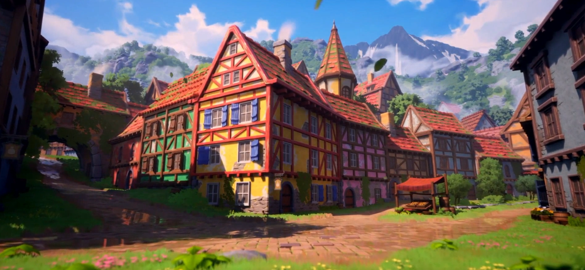
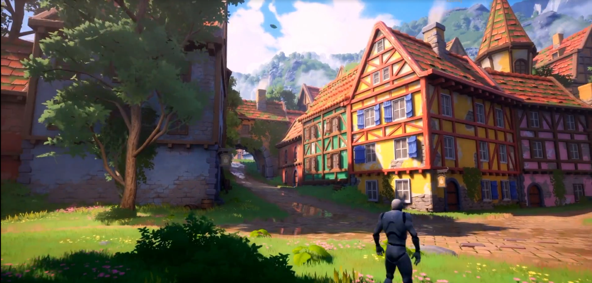
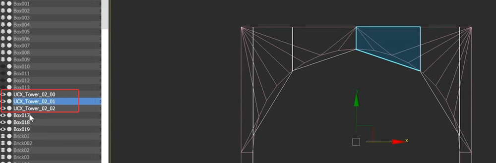
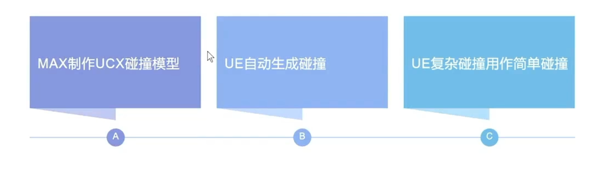
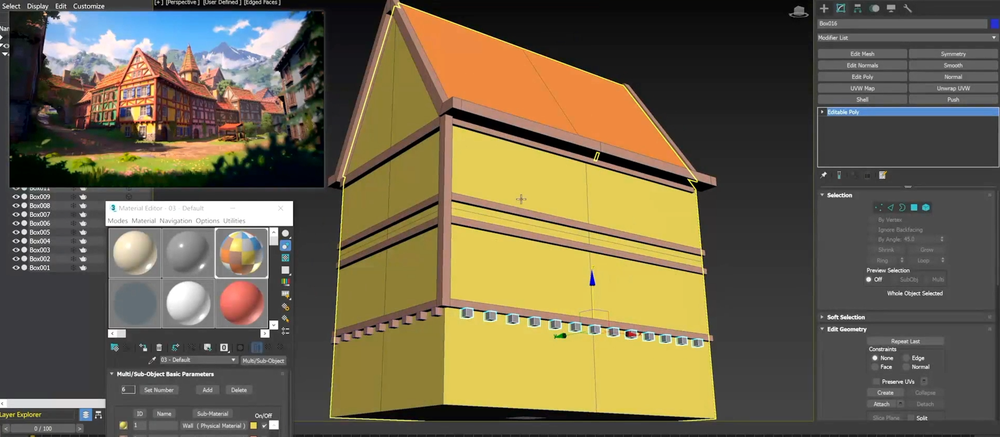
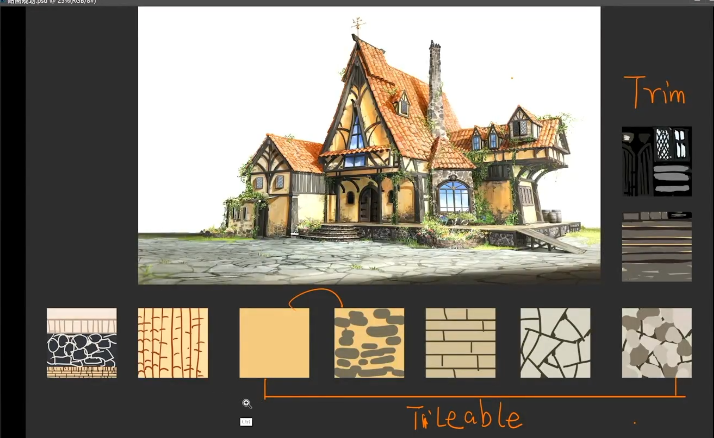
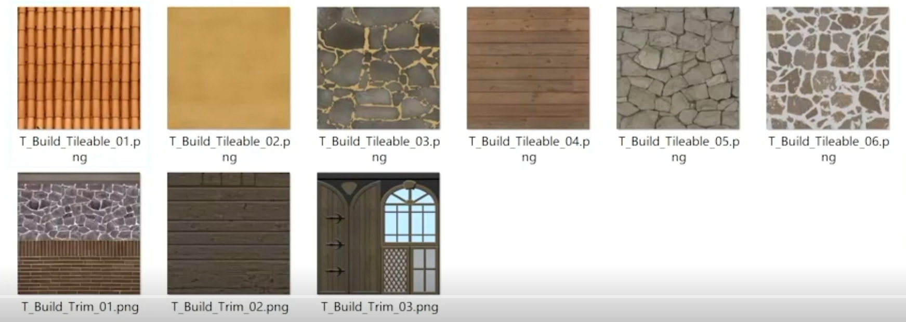
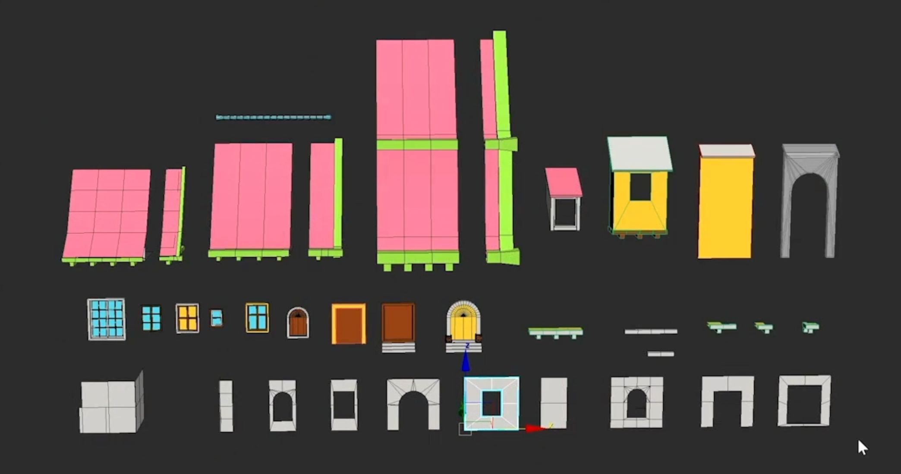

# 魔灯风格化
    
    
## 白盒  
    
    
制作模型UCX_可以在导入UE时，识别为碰撞体    
   
几种碰撞体制作方式  
    
白盒导出后，制作具体的模型部件   
    
调整地形，添加物件等   
进一步细化   
    
山石摆放   
     

## 粗模粗贴    
做一个大致规划   
    
正式化一点的贴图  
   
部件拆分细化制作   
    
建筑BP拼合  
    
制作完所有建筑BP   
    