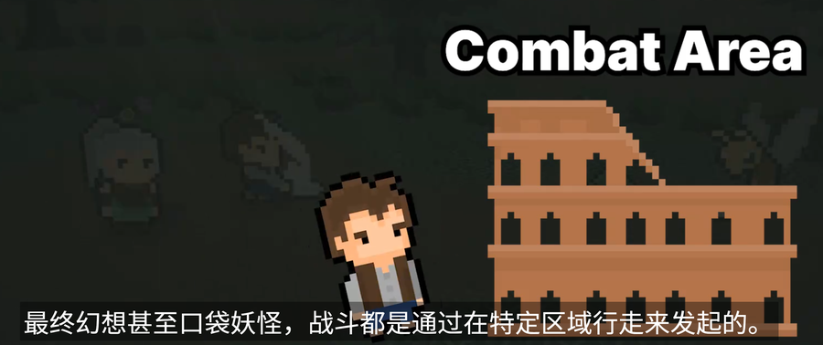

# Unity 2.5D JRPG Course

> 本文作者：君君


## 资料
  
[Unity 2.5D Turn-Based RPG - EARLY ACCESS](https://old.gamedev.tv/p/unity-2-5d-turn-based-combat)   
[Unity 2.5D JRPG Course](https://gitlab.com/GameDevTV/unity-jrpg/unity-2.5d-jrpg-course)   

## 输入控制Input Systerm 
### 像素动画设置
   
### 状态机设置   
   
    

### 玩家行走控制脚本   
>  在Windows中，vscode格式化代码快捷键是“Shift+Alt+F”    
```csharp
using System;
using System.Collections;
using System.Collections.Generic;
using UnityEngine;

public class PlayerController : MonoBehaviour
{
    [SerializeField] private int speed;
    [SerializeField] private Animator anim;
    [SerializeField] private SpriteRenderer playerSprite;

    private PlayerControls playerControls;
    private Rigidbody rb;
    private Vector3 movement;
    private const string IS_WALK_PARAM = "IsWalk";

    private void Awake()
    {
        playerControls = new PlayerControls();
    }
    private void OnEnable()
    {
        playerControls.Enable();
    }

    private void Start()
    {
        rb = gameObject.GetComponent<Rigidbody>();
    }

    // Update is called once per frame
    void Update()
    {
        float x = playerControls.Player.Move.ReadValue<Vector2>().x;
        float z = playerControls.Player.Move.ReadValue<Vector2>().y;
       
        movement = new Vector3(x, 0, z).normalized;

        anim.SetBool(IS_WALK_PARAM,movement != Vector3.zero);
        if(x!= 0 && x<0)
        {
            playerSprite.flipX = true;
        }
         if(x!= 0 && x>0)
        {
            playerSprite.flipX = false;
        }
    }
    private void FixedUpdate()
    {
        rb.MovePosition(transform.position + movement * speed * Time.fixedDeltaTime);
    }
}
```


## 遭遇系统
进入特定区域后，使用计步器，进入特定区域后开始计步，生成遭遇战，进入战斗，切换场景。  


## 战斗系统  

### 数据构建

### 玩家队列类

### 敌人队列类

### 战斗管理，计算类