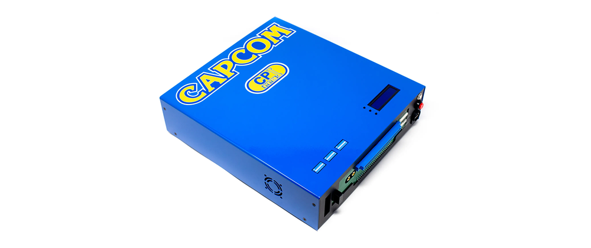
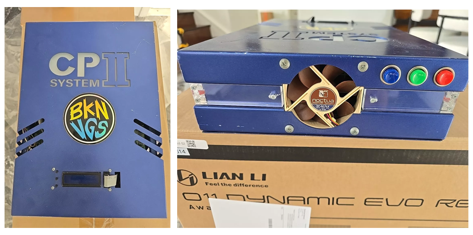
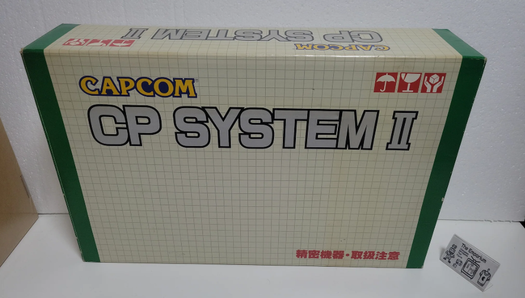
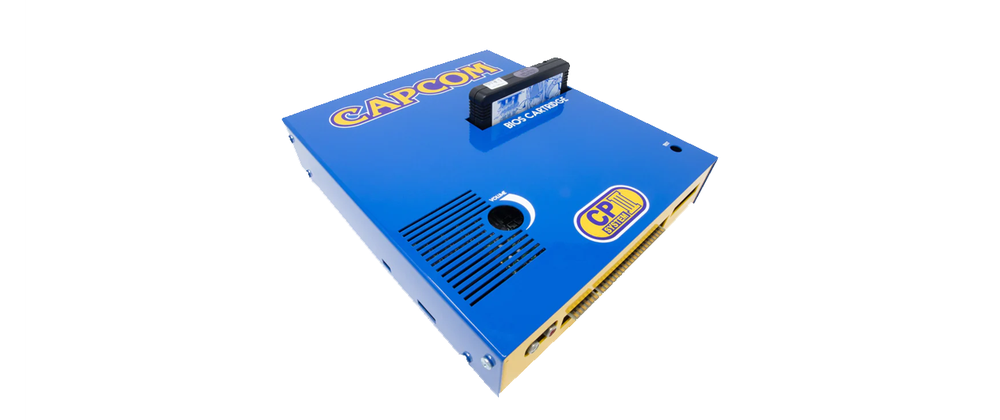
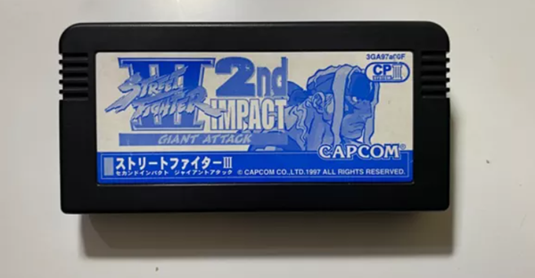

# 复古游戏博物馆-CPS
## CPS1
   
‌CPS1‌是CAPCOM由Capcom公司于1988年推出的街机硬件系统，支持了许多经典的街机游戏。全称为‌Capcom Play System 1。   
它不是一个游戏机，而是一个街机基板，这个基板使用了摩托罗拉16位元CPU X68000
 

### CPS1 游戏时间线与类型列表

| 序号 | 发布年份 | 英文名                                     | 中文名                    | 主ROM名        | 类型          |
| ---- | -------- | ------------------------------------------ | ------------------------- | -------------- | ------------- |
| 1    | 1988     | Forgotten Worlds                           | 失落的世界                | forgottn       | 射击          |
| 2    | 1988     | Ghouls'n Ghosts                             | 大魔界村                  | ghouls         | 动作          |
| 3    | 1989     | Dynasty Wars                               | 吞食天地                  | dynwar         | 清版动作      |
| 4    | 1989     | Final Fight                                | 快打旋风                  | ffight         | 清版动作      |
| 5    | 1989     | Strider                                    | 出击飞龙                  | strider        | 动作          |
| 6    | 1989     | U.N. Squadron（日版为Area 88）            | 战区88                    | unsquad        | 射击          |
| 7    | 1989     | Willow                                     | 威洛                      | willow         | 动作          |
| 8    | 1990     | 1941: Counter Attack                       | 1941 - 反击战             | 1941           | 射击          |
| 9    | 1990     | Carrier Air Wing（日版为U.S. Navy）       | 美国海军                  | cawing         | 射击          |
| 10   | 1990     | Magic Sword: Heroic Fantasy                | 魔法剑：英雄的幻想        | msword         | 动作          |
| 11   | 1990     | Mega Twins（日版为Chiki Chiki Boy）       | 双辫儿                    | mtwins         | 平台跳跃      |
| 12   | 1990     | Mercs                                      | 战场之狼2                 | mercs          | 射击          |
| 13   | 1990     | Nemo                                       | 梦幻冒险                  | nemo           | 动作          |
| 14   | 1991     | Captain Commando                           | 名将                      | captcomm       | 清版动作      |
| 15   | 1991     | King of Dragons                            | 龙王战士                  | kod            | 清版动作      |
| 16   | 1991     | Knights of the Round                       | 圆桌骑士                  | knights        | 清版动作      |
| 17   | 1991     | Street Fighter II: World Warrior          | 街头霸王II：天下斗士      | sf2            | 格斗          |
| 18   | 1991     | Three Wonders（日版为Wonder 3）           | 奇迹3                     | 3wonders        |多类型 
| 19   | 1992     | Adventure Quiz Capcom World 2             | 卡普空世界冒险问答2       | cworld2        | 益智          |
| 20   | 1992     | Quiz & Dragons: Capcom Quiz Game          | 履龙问答                  | qad            | 益智          |
| 21   | 1992     | Street Fighter II': Champion Edition      | 街头霸王II：四大天王      | sf2ce          | 格斗          |
| 22   | 1992     | Street Fighter II': Hyper Fighting        | 街头霸王II：战斗宣言      | sf2hf          | 格斗          |
| 23   | 1992     | Varth: Operation Thunderstorm             | 威虎战机                  | varth          | 射击          |
| 24   | 1992     | Warriors of Fate                           | 吞食天地II：赤壁之战      | wof            | 清版动作      |
| 25   | 1993     | Cadillacs and Dinosaurs                    | 凯迪拉克：恐龙新世纪      | dino           | 清版动作      |
| 26   | 1993     | Muscle Bomber Duo: Ultimate Team Battle   | 摔跤霸王：最终之战        | mbombrd        | 格斗          |
| 27   | 1993     | Punisher                                   | 惩罚者                    | punisher       | 清版动作      |
| 28   | 1993     | Saturday Night Slam Masters（日版为Muscle Bomber） | 摔角霸王              | slammast       | 格斗          |
| 29   | 1994     | Pnickies                                   | 魔法方块                  | pnickj         | 益智          |
| 30   | 1995     | Mega Man: the Power Battle（日版为Rockman: the） | 洛克人：力量对决        | megaman        | 格斗          |
| 31   | 1995     | Pang! 3（美版为Buster Buddies）           | 射气泡3：怪盗们的华丽午后 | pang3          | 益智          |
| 32   | 1995     | Quiz Tonosama no Yabou 2: Zenkoku-ban     | 城主的野心问答2全国版     | qtono2         | 益智          |
---

### 游戏类型分类统计

| 类型          | 游戏数量 | 占比       |
| ------------- | -------- | ---------- |
| 射击 Shooter       | 9        | 28.13%     |
| 清版动作  Beat 'em Up   | 8        | 25.00%     |
| 格斗 Fighting      | 7        | 21.88%     |
| 益智 Puzzle        | 5        | 15.63%     |
| 动作 Action        | 4        | 12.50%     |
| 平台跳跃 Platformer    | 1        | 3.13%      |
| 多类型 Multi-Genre   | 1        | 3.13%      |
### 分类说明
- 射击：如《失落的世界》《战区88》等横版或纵版射击类游戏。
- 清版动作：以打斗推进关卡为主的游戏，如《快打旋风》《名将》。
- 格斗：以1对1或多人对战为主要玩法的格斗类游戏，如《街头霸王II》《摔跤霸王》。
- 益智：如《卡普空世界冒险问答2》《魔法方块》等问答或解谜类游戏。
- 动作：具有动作冒险元素的游戏，如《大魔界村》《威洛》。
- 平台跳跃：以跳跃闯关为核心玩法，如《双辫儿》。
- 多类型：多种游戏玩法结合的游戏，如《奇迹3》。
---
## CPS2
  
CPS2‌是CAPCOM开发的一种新型基板，全称是Capcom Play System 2。CPS2以其强大的硬件功能和独特的游戏表现形式而闻名于世。这一平台于1993年首次推出，CPS2采用纵向扫描线技术，在清晰度和精度上都有着较高的表现。CPS2的游戏玩法独具特色，主要以动作、格斗、冒险游戏为主。CPS2平台独有的Q-Sound音效系统，能够将3D声音降至2D，大幅提升游戏的音效效果。CPS2还拥有复杂的加密系统，使玩家只能从官方购买卡带或使用模拟器进行游玩，限制了非法盗版游戏的存在，下面为游戏名单。  

### CPS2 游戏时间线与类型列表

| 序号 | 发布年份 | 英文名                                     | 中文名                    | 类型          |
| ---- | -------- | ------------------------------------------ | ------------------------- | ------------- |
| 1    | 1993     | Dungeons & Dragons: Tower of Doom         | 龙与地下城：毁灭之塔      | 清版动作      |
| 2    | 1993     | Eco Fighters                              | 生态战士                  | 射击          |
| 3    | 1993     | Super Street Fighter II: The New Challengers | 超级街头霸王II：新的挑战者 | 格斗          |
| 4    | 1994     | Alien vs. Predator                        | 异形大战铁血战士          | 清版动作      |
| 5    | 1994     | Armored Warriors                          | 装甲勇士                  | 清版动作      |
| 6    | 1994     | Darkstalkers: The Night Warriors          | 恶魔战士：午夜斗士        | 格斗          |
| 7    | 1994     | Ring of Destruction: Slam Masters II      | 超级摔跤霸王2             | 格斗          |
| 8    | 1994     | Super Street Fighter II Turbo             | 超级街头霸王II X          | 格斗          |
| 9    | 1995     | X-Men: Children of the Atom               | X战警：磁场原子人         | 格斗          |
| 10   | 1995     | 19XX: The War Against Destiny             | 19XX命运之战              | 射击          |
| 11   | 1995     | Cyberbots: Fullmetal Madness              | 机甲战士：全金属狂潮      | 格斗          |
| 12   | 1995     | Marvel Super Heroes                       | 超级漫画英雄              | 格斗          |
| 13   | 1995     | Mega Man: The Power Fighters              | 洛克人力量对决            | 格斗          |
| 14   | 1995     | Night Warriors: Darkstalkers' Revenge     | 恶魔战士2：恶魔的复仇     | 格斗          |
| 15   | 1995     | Street Fighter Alpha: Warrior's Dreams    | 少年街霸：斗士之梦        | 格斗          |
| 16   | 1996     | Dungeons & Dragons: Shadow over Mystara   | 龙与地下城：暗黑秘影      | 清版动作      |
| 17   | 1996     | Mega Man 2: The Power Fighters            | 洛克人2力量对决           | 格斗          |
| 18   | 1996     | Quiz Nanairo Dreams: Nijiiro no Kiseki    | 七彩梦：虹色的奇迹        | 益智          |
| 19   | 1996     | Street Fighter Alpha 2                    | 少年街霸2                 | 格斗          |
| 20   | 1996     | Super Puzzle Fighter II Turbo             | 超级街霸方块              | 益智          |
| 21   | 1996     | X-Men vs. Street Fighter                  | X战警VS街霸               | 格斗          |
| 22   | 1997     | Battle Circuit                            | 战斗回路                  | 清版动作      |
| 23   | 1997     | Capcom Sports Club                        | 卡普空运动俱乐部          | 益智          |
| 24   | 1997     | Marvel Super Heroes vs. Street Fighter    | 超级漫画英雄对街霸        | 格斗          |
| 25   | 1997     | Super Gem Fighter: Mini Mix               | Q版街霸/口袋战士          | 格斗          |
| 26   | 1997     | Vampire Hunter 2: Darkstalkers Revenge    | 恶魔猎人2：恶魔的复仇     | 格斗          |
| 27   | 1997     | Vampire Savior: The Lord of Vampire       | 恶魔战士：恶魔救世主      | 格斗          |
| 28   | 1998     | Marvel vs. Capcom: Clash of Super Heroes  | 超级英雄大战卡普空         | 格斗          |
| 29   | 1998     | Street Fighter Alpha 3                    | 少年街霸3                 | 格斗          |
| 30   | 1998     | Vampire Savior 2: The Lord of Vampire     | 恶魔战士2：恶魔救世主     | 格斗          |
| 31   | 1999     | Giga Wing                                 | 雷鸟之翼                  | 射击          |
| 32   | 1999     | Jyangokushi: Haoh no Saihai               | 雀国志：霸王的采牌        | 益智          |
| 33   | 2000     | 1944: The Loop Master                     | 1944：征服世界            | 射击          |
| 34   | 2000     | Dimahoo                                   | 超级魔法大作战            | 射击          |
| 35   | 2000     | Mars Matrix                               | 火星矩阵                  | 射击          |
| 36   | 2001     | Janpai Puzzle Choukou                     | 益智麻将将牌              | 益智          |
| 37   | 2001     | Progear                                   | 能源之战                  | 射击          |
| 38   | 2001     | Puzz Loop 2                               | 旋转泡泡2                 | 益智          |
| 39   | 2002     | Hyper Street Fighter II                   | 街霸II十五周年纪念版      | 格斗          |

### CPS2 游戏类型分类统计

| 类型        | 游戏数量 | 占比       |
| ----------- | -------- | ---------- |
| 格斗        | 18       | 46.15%     |
| 清版动作    | 6        | 15.38%     |
| 射击        | 8        | 20.51%     |
| 益智        | 7        | 17.95%     |

## CPS3
    
CPS3是CAPCOM开发的一种新型基板，全称是Capcom Play System 3，采用了主频为25MHz的日立SH2芯片，是九十年代2D性能最强的街机游戏基板，由于CPS3基板有一块用电池供电的解密芯片，维护使用成本高导致普及低，最终CAPCOM只在CPS3上开发了6款游戏。  
    
  
### CPS3 游戏时间线与类型列表

| 序号 | 发布年份 | 英文名                                     | 中文名                    | 类型          |
| ---- | -------- | ------------------------------------------ | ------------------------- | ------------- |
| 1    | 1996     | Red Earth                                 | 赤色大地                  | 格斗          |
| 2    | 1997     | Street Fighter III: New Generation        | 街霸III：新纪元           | 格斗          |
| 3    | 1998     | Street Fighter III: 2nd Impact            | 街霸III：二度冲击         | 格斗          |
| 4    | 1998     | JoJo's Adventure                          | JOJO的奇妙冒险            | 格斗          |
| 5    | 1999     | Street Fighter III: 3rd Strike            | 街霸III：三度冲击         | 格斗          |
| 6    | 1999     | JoJo's Bizarre Adventure                  | JOJO的奇妙冒险：未来遗产 | 格斗          |