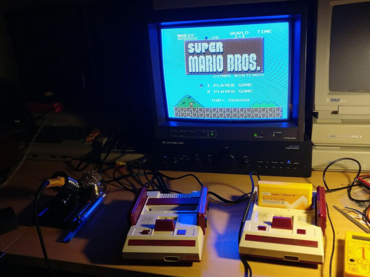
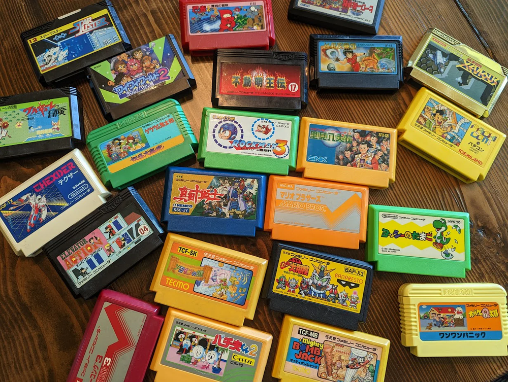

# 复古游戏博物馆-FC
Famicom，即任天堂红白机   

> 以下是根据Wikipedia上的红白机游戏列表的汇总，包含了更多经典FC游戏的信息。  
> 由于红白机（Famicom）游戏数量庞大，以下清单会尽量覆盖重要的游戏，并进行分类。  
  
   
  
## NES 游戏模拟器
用NES模拟器（如 FCEUX 或 Nestopia），很多模拟器自带全平台清单（包括各地区版本）

## FC 平台经典游戏系列与制作人

| 游戏系列           | 代表作品                        | 英文名                                  | 制作人/开发团队            | 首发年份 |
| ------------------ | ------------------------------- | --------------------------------------- | -------------------------- | -------- |
| 马里奥系列         | 《超级马里奥兄弟》              | *Super Mario Bros.*                    | 宫本茂（Shigeru Miyamoto） | 1985     |
| 塞尔达传说系列     | 《塞尔达传说》                  | *The Legend of Zelda*                  | 宫本茂（Shigeru Miyamoto） | 1986     |
| 洛克人系列         | 《洛克人》                      | *Mega Man*                             | 稻船敬二（Keiji Inafune）  | 1987     |
| 火焰之纹章系列     | 《火焰之纹章 暗黑龙与光之剑》   | *Fire Emblem: Shadow Dragon and the Blade of Light* | 加贺昭三（Shouzou Kaga）   | 1990     |
| 最终幻想系列       | 《最终幻想》                    | *Final Fantasy*                        | 坂口博信（Hironobu Sakaguchi） | 1987     |
| 勇者斗恶龙系列     | 《勇者斗恶龙》                  | *Dragon Quest*                         | 堀井雄二（Yuji Horii）     | 1986     |
| 忍者龙剑传系列     | 《忍者龙剑传》                  | *Ninja Gaiden*                         | 堀井雄二（Yuji Horii）     | 1988     |
| 双截龙系列         | 《双截龙》                      | *Double Dragon*                        | 吉田尚记（Yoshihisa Kishimoto） | 1987     |
| 魂斗罗系列         | 《魂斗罗》                      | *Contra*                               | 小岛秀夫（Hideo Kojima）   | 1988     |
| 银河战士系列       | 《银河战士》                    | *Metroid*                              | 坂本贺勇（Yoshio Sakamoto）| 1986     |
| 194X系列           | 《1942》                        | *1942*                                 | CAPCOM                      | 1984     |
| 忍者神龟系列       | 《忍者神龟》                    | *Teenage Mutant Ninja Turtles*         | Ultra Games（Konami子公司）| 1989     |
| 恶魔城系列         | 《恶魔城》                      | *Castlevania*                          | 细谷英树（Hitoshi Akamatsu）| 1986     |
| 小精灵系列         | 《吃豆人》                      | *Pac-Man*                              | 岩谷彻（Toru Iwatani）     | 1983     |
| 马戏团系列         | 《马戏团》                      | *Circus Charlie*                       | Konami                     | 1984     |
| 气球大战系列       | 《气球大战》                    | *Balloon Fight*                        | 宫本茂（Shigeru Miyamoto） | 1984     |
| 唐老鸭系列         | 《唐老鸭梦冒险》                | *DuckTales*                            | CAPCOM                      | 1989     |
| 星之卡比系列       | 《星之卡比 梦之泉物语》         | *Kirby's Adventure*                    | 桑田幸一（Masahiro Sakurai）| 1993     |
| 炸弹人系列         | 《炸弹人》                      | *Bomberman*                            | HUDSON SOFT                 | 1983     |
| 俄罗斯方块系列     | 《俄罗斯方块》                  | *Tetris*                               | 阿列克谢·帕基特诺夫（Alexey Pajitnov） | 1984     |
| 沙罗曼蛇系列       | 《沙罗曼蛇》                    | *Salamander*                           | Konami                     | 1986     |
| 快打旋风系列       | 《快打旋风》                    | *Final Fight*                          | CAPCOM                      | 1987     |
| 战斗之魂系列       | 《战斗之魂》                    | *Battle City*                          | 南梦宫（Namco）            | 1984     |
| 高桥名人冒险岛系列 | 《高桥名人冒险岛》              | *Adventure Island*                     | HUDSON SOFT                 | 1986     |
| 热血系列           | 《热血硬派》                    | *Kunio-kun*                            | Technos Japan               | 1986     |
| 高尔夫系列         | 《高尔夫》                      | *Golf*                                 | 宫本茂（Shigeru Miyamoto） | 1984     |
