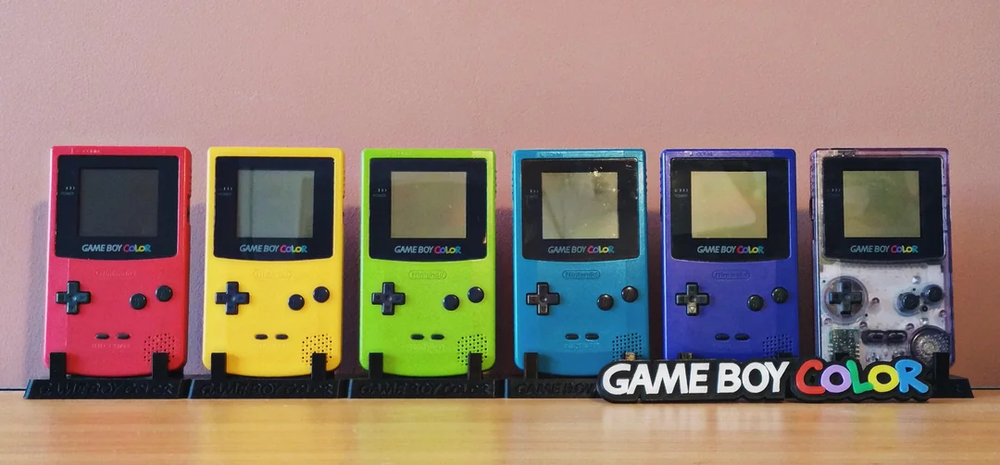
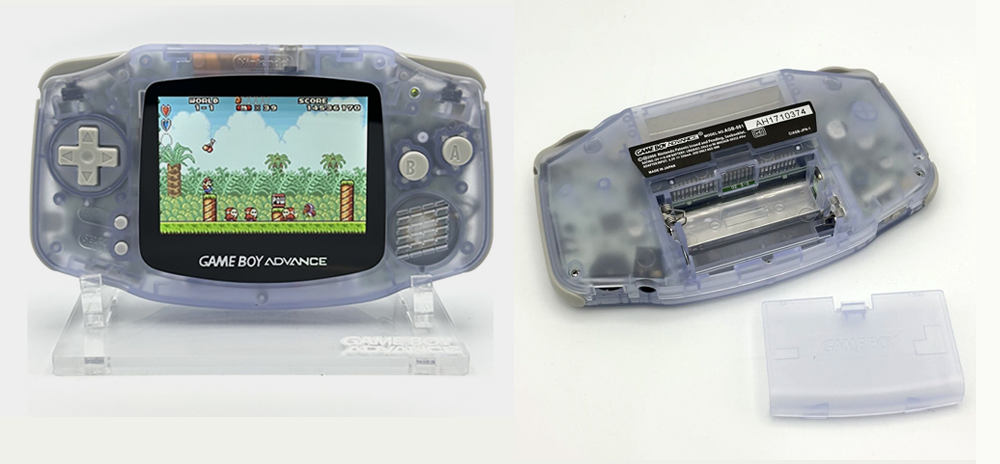
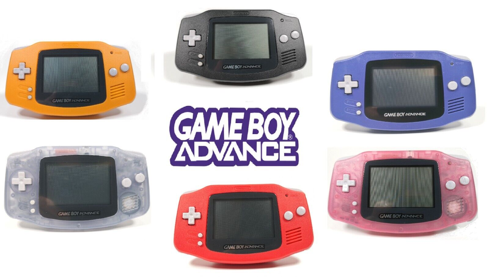

# Game Boy
Game Boy 是任天堂于 1989 年 4 月 21 日推出的一款便携式游戏机，它以耐用性、长续航以及丰富的游戏阵容而著称。

## 1. Game Boy (GB)
   
- **发布时间**: 1989 年 4 月 21 日（日本），7 月 31 日（北美），1990 年 9 月 28 日（欧洲）
- **屏幕**: 2.6 英寸单色液晶屏，分辨率 160x144。
- **特色**:
  - 首款便携式游戏机，使用 4 节 AA 电池，续航时间可达 15 小时。
  - 丰富的游戏阵容，支持经典 8 位像素图形。
- **代表作品**:
  - *Tetris*（《俄罗斯方块》）
  - *Pokémon Red/Blue*（《宝可梦 红/蓝》）
  - *The Legend of Zelda: Link's Awakening*（《塞尔达传说：梦见岛》）

---

## 2. Game Boy Color (GBC)
  
  
- **发布时间**: 1998 年 10 月 21 日（日本），11 月 18 日（北美），11 月 23 日（欧洲）
- **屏幕**: 2.3 英寸彩色液晶屏，分辨率与 GB 相同。
- **特色**:
  - 支持彩色游戏画面，可向下兼容 GB 游戏。
  - 增加了红外通信功能。
- **代表作品**:
  - *Pokémon Gold/Silver*（《宝可梦 金/银》）
  - *The Legend of Zelda: Oracle of Ages/Seasons*（《塞尔达传说：时光之章/大地之章》）
  - *Wario Land 3*（《瓦里奥乐园3》）

---

## 3. Game Boy Advance (GBA)   
   
   
  
- **发布时间**: 2001 年 3 月 21 日（日本），6 月 11 日（北美），6 月 22 日（欧洲）
- **屏幕**: 2.9 英寸彩色 TFT 屏幕，分辨率 240x160。
- **特色**:
  - 横向设计，更强大的性能，支持 32 位游戏。
  - 向下兼容 GB 和 GBC 游戏。
- **代表作品**:
  - *Pokémon Ruby/Sapphire/Emerald*（《宝可梦 红宝石/蓝宝石/绿宝石》）
  - *The Legend of Zelda: The Minish Cap*（《塞尔达传说：缩小帽》）  
  
  - *Mario Kart: Super Circuit*（《马里奥赛车：超级巡回赛》）

---

## 4. Game Boy Advance SP (GBA SP)

- **发布时间**: 2003 年 2 月 14 日（日本），3 月 23 日（北美），3 月 28 日（欧洲）
- **屏幕**: 与 GBA 相同，但增加了前光（初期版本）或背光（后期版本）。
- **特色**:
  - 折叠式设计，提升了便携性与屏幕保护。
  - 内置可充电锂电池。
- **代表作品**:
  - *Fire Emblem*（《火焰纹章 烈火之剑》）
  - *Metroid Fusion*（《银河战士 融合》）
  - *Advance Wars*（《高级战争》）

---

## 5. Game Boy Micro (GBM)
- **发布时间**: 2005 年 9 月 13 日（日本），9 月 19 日（北美），11 月 4 日（欧洲）
- **屏幕**: 2 英寸背光屏幕，分辨率与 GBA 相同。
- **特色**:
  - 超小型设计，仅支持 GBA 游戏。
  - 可更换外壳，提供更多个性化选择。
- **代表作品**:
  - *Mario & Luigi: Superstar Saga*（《马里奥与路易：超级明星传说》）
  - *Pokémon FireRed/LeafGreen*（《宝可梦 火红/叶绿》）
  - *Final Fantasy Tactics Advance*（《最终幻想 战略版》）
