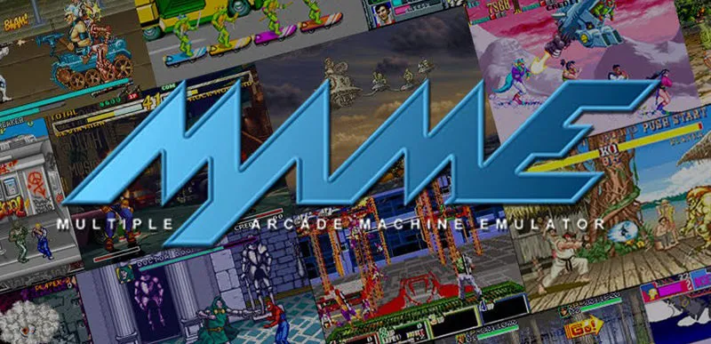

# MAME  
MAME(Multiple Arcade Machine Emulator) 是模拟器历史上最优秀的多机种的**街机模拟器**之一，同时也是生命力最旺盛的街机模拟器。   
从 1998 年发布第一个版本起，MAME 已经经历了数年的开发，同时也经历了各种版本及多个开发者的变迁。作为功能最强大的**街机模拟器**，覆盖面涵盖许多我们熟悉的街机机板，    
同时也支持各种不同的 PC 操作平台，并针对不同的 CPU 处理器开发了对应的优化版本。   
   
[中文MAME](https://boneash.oldgame.tw/MAME/mame.html)

1.  **性质与目标**  
    - 开源多平台**街机模拟器**，核心使命是**保存电子游戏历史遗产**（精确模拟硬件防消失）。
    - 优先追求**硬件模拟准确性**，而非运行速度。

2.  **起源与发展**  
    - 1997年由 Nicola Salmoria 创建，最初为模拟《Punch-Out!!》硬件。
    - **全球开发者协作**开源项目，持续更新至今（每月发布新版）。

3.  **支持范围**  
    - 覆盖**数百家厂商**的街机基板（如 Capcom CPS、SNK Neo Geo、Sega System 16等）。  
    - 兼容游戏**超7000款**，类型涵盖动作、格斗、射击、益智等。

4.  **硬件绑定？**  
    - ❌ **不依赖原始硬件**：纯软件模拟器，可运行于 PC（Windows/macOS/Linux）等设备。  
    - 💻 **依赖现代设备性能**：模拟效果取决于电脑 CPU/GPU 算力（越新3D游戏要求越高）。

5.  **ROM 运行机制**  
    - ✅ **需要提供 ROM 文件**：必须拥有游戏的正确 ROM 数据包（含程序、图形、声音等文件）。  

6.  **核心流程**  
    > MAME 程序 + 目标基板模拟代码 + 完整 ROM 文件 + 达标硬件性能 → 运行游戏  

