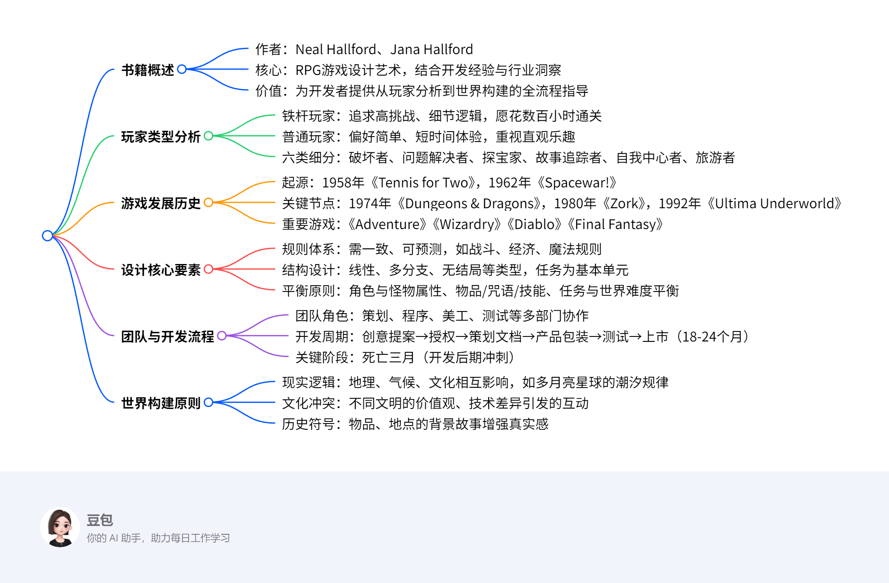

# 剑与电-角色扮演游戏设计艺术   

   

## **书籍概述**
- 作者：Neal Hallford、Jana Hallford
- 核心：RPG游戏设计艺术，结合开发经验与行业洞察
- 价值：为开发者提供从玩家分析到世界构建的全流程指导
## **玩家类型分析**
- 铁杆玩家：追求高挑战、细节逻辑，愿花数百小时通关
- 普通玩家：偏好简单、短时间体验，重视直观乐趣
- 六类细分：破坏者、问题解决者、探宝家、故事追踪者、自我中心者、旅游者
## **游戏发展历史**
- 起源：1958年《Tennis for Two》，1962年《Spacewar!》
- 关键节点：1974年《Dungeons & Dragons》，1980年《Zork》，1992年《Ultima Underworld》
- 重要游戏：《Adventure》《Wizardry》《Diablo》《Final Fantasy》
## **设计核心要素**
- 规则体系：需一致、可预测，如战斗、经济、魔法规则
- 结构设计：线性、多分支、无结局等类型，任务为基本单元
- 平衡原则：角色与怪物属性、物品/咒语/技能、任务与世界难度平衡
## **团队与开发流程**
- 团队角色：策划、程序、美工、测试等多部门协作
- 开发周期：创意提案→授权→策划文档→产品包装→测试→上市（18-24个月）
- 关键阶段：死亡三月（开发后期冲刺）
## **世界构建原则**
- 现实逻辑：地理、气候、文化相互影响，如多月亮星球的潮汐规律
- 文化冲突：不同文明的价值观、技术差异引发的互动
- 历史符号：物品、地点的背景故事增强真实感   

RPG 为何需要兼顾多种玩家需求？—— 从 “玩家类型细分” 说起
书中明确将玩家分为6 大核心类型（破坏者、问题解决者、探宝家、故事追踪者、自我中心者、旅游者），而优秀的 RPG 设计必然需要覆盖至少 2-3 类玩家的核心诉求。这并非 “必须满足所有需求”，而是基于市场受众多样性和游戏体验丰富性的策略选择：
单一需求的局限性：若仅聚焦某一类玩家（如仅满足 “硬核战斗需求”），会导致其他玩家群体流失。例如，纯战斗向 RPG 可能让 “故事追踪者” 失去兴趣，反之纯剧情向 RPG 也会让 “破坏者” 感到乏味。
玩家行为的复合性：多数玩家并非绝对属于某一类型，而是兼具多种需求。如 “探宝家” 可能同时享受剧情，“故事追踪者” 也可能为收集隐藏物品探索迷宫。
游戏机制的联动性：不同需求的机制可相互强化。例如，地下迷宫的高难度战斗（满足破坏者）可与隐藏宝箱（满足探宝家）、支线剧情（满足故事追踪者）结合，形成整体体验。  

总结：“普适性需求” 与 “类型侧重” 的本质是 “体验层次设计”
RPG 的核心魅力在于通过多元机制让不同玩家找到乐趣支点，而非 “必须满足所有需求”。书中强调的 “玩家需求分析”，本质是帮助开发者：
避免因机制单一导致玩家流失；
通过需求联动提升游戏深度；
在资源有限的情况下，优先满足目标群体的核心诉求，同时用基础要素覆盖更多玩家。