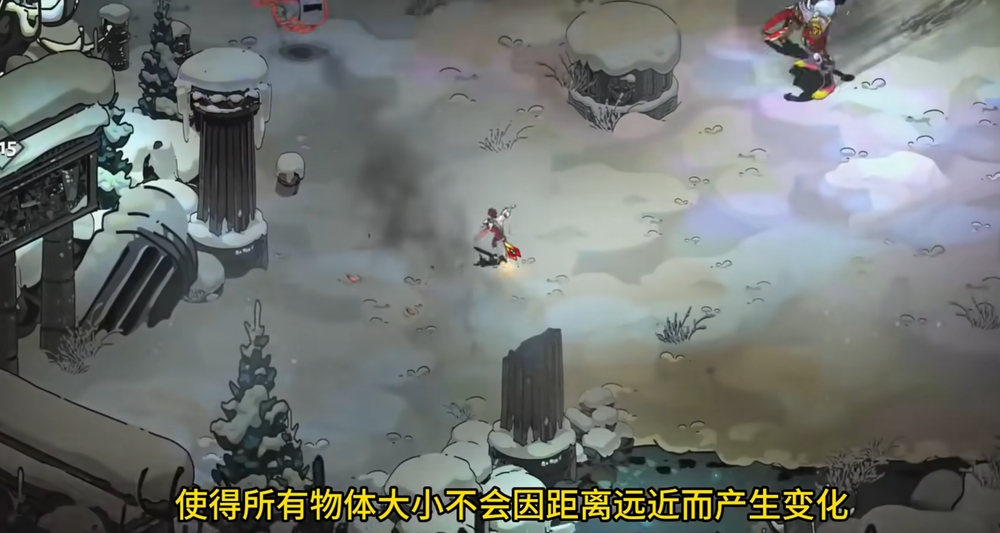

# 快速搭建游戏战斗系统 

## 3C(Camera,Character,Control)
###  相机Camera
影响其他几个因素，最先决定   
第三人称远视角，拉长相机和角色距离，提供更广阔视角，更适合表现动作   
     
横板游戏相机位于一侧，更好展示动作剪影    
     
正交摄像机   
   
###  角色Character
TPS或者类战神越肩视角，运动视角   
锁定运动朝向   
   
如果选择第三人称相机，通常采用轴向移动方式    
   
也会添加锁定目标键，会结合两种方式   

###  控制Control
键盘更适合射击类游戏   
   
手柄更适合轴向运动模式   
   
#### 招式切换  
#### 顿帧和震屏