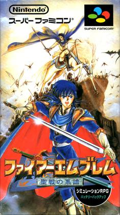
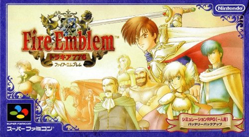
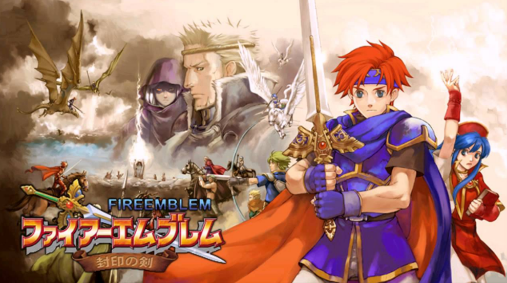
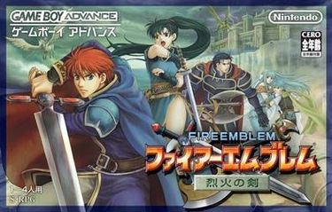
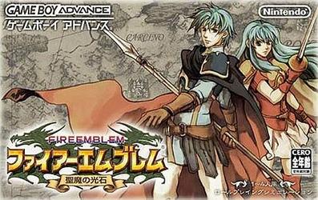
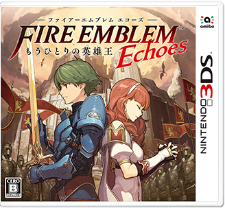
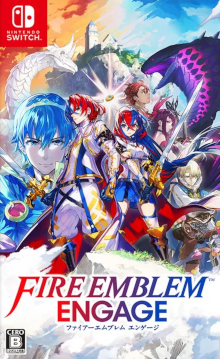

# 火焰之纹章系列作品总览

| 序号 | 游戏名称 | 游戏封面 | 发售时间 | 平台 | 剧情概要 | 玩法特色 |
|------|----------|----------|----------|------|----------|----------|
| 1 | 火焰之纹章 暗黑龙与光之剑 | | 1990年4月20日 | FC | 马尔斯王子讨伐暗黑龙梅迪乌斯，拯救国家。 | 首创SRPG系统，角色死亡永久消失。 |
| 2 | 火焰之纹章 外传 |  | 1992年3月14日 | FC | 阿雷武与赛莉卡在瓦伦西亚大陆对抗堕落神明。 | 加入地下城、自由移动，强化RPG要素。 |
| 3 | 火焰之纹章 纹章之谜 |  | 1994年1月21日 | SFC | 《暗黑龙》重制+新剧情，马尔斯续战。 | 双部构成，平衡优化，多职业系统。 |
| 4 | 火焰之纹章 圣战之系谱 |  | 1996年5月14日 | SFC | 西格尔特父子跨时代战争，揭示神血秘密。 | 恋爱/子代系统，武器三角，超大地图。 |
| 5 | 火焰之纹章 多拉基亚776 |  | 1999年9月1日 | SFC | 利夫在黑暗统治下奋战，救民于水火。 | 雾视野、捕获、极高难度与策略性。 |
| 6 | 火焰之纹章 封印之剑 |  | 2002年3月29日 | GBA | 罗伊王子率军平定战乱，掌握封印之剑。 | 加入支援系统，剧情影响角色成长。 |
| 7 | 火焰之纹章 烈火之剑 |  | 2003年4月25日 | GBA | 艾利乌德等三人旅途，探寻龙族与政变。 | 首作全球发行，含完整新手教程。 |
| 8 | 火焰之纹章 圣魔之光石 |  | 2004年10月7日 | GBA | 皇族双胞胎为复国抗敌，探寻圣石真相。 | 分支职业、地图探索、自由练级。 |
| 9 | 火焰之纹章 苍炎之轨迹 |  | 2005年4月20日 | GameCube | 艾克领导佣兵团，跨种族与女神之战。 | 全3D战斗，技能系统与体格机制。 |
| 10 | 火焰之纹章 暗黑之门（曙光之女神） |  | 2007年2月22日 | Wii | 曙光军与艾克联手对抗女神亚斯拉。 | 多主角、章节分组、继承前作进度。 |
| 11 | 火焰之纹章 新·暗黑龙与光之剑 |  | 2008年8月7日 | NDS | 初代重制作，讲述马尔斯王子的冒险之旅。 | 新增自创角色系统、难度选择，多分支章节。 |
| 12 | 火焰之纹章 新·纹章之谜 |  | 2010年7月15日 | NDS | 马尔斯继续面对背叛与暗流，展开新篇章。 | 引入“我的单位”系统，自定义主角设定，经典与新元素融合。 |
| 13 | 火焰之纹章 觉醒 |  | 2012年4月19日 | 3DS | 主角克罗姆与战术家罗宾一起对抗未来的毁灭。 | 结婚生子系统复活，支援对话丰富，首次引入“休闲模式”。 |
| 14 | 火焰之纹章 if（白夜王国/暗夜王国/隐秘王国） |  | 2015年6月25日 | 3DS | 主角卡姆依在两个王国之间做出抉择，影响世界命运。 | 三版本三条路线，加入在线城堡系统，强化角色自定义。 |
| 15 | 火焰之纹章 Echoes：另一位英雄王 |  | 2017年4月20日 | 3DS | 重制《外传》，阿雷武与赛莉卡双主角揭示神明真相。 | 完整语音演出，地下城探索、经典与现代融合的尝试。 |
| 16 | 火焰之纹章 风花雪月 |  | 2019年7月26日 | Switch | 主角贝雷特担任军校教师，三国学生之间的命运交织。 | 学园生活+战斗教学系统，多线剧情、分支结局，高自由度成长。 |
| 17 | 火焰之纹章 无双 风花雪月 |  | 2022年6月24日 | Switch | 动作游戏风格再现《风花雪月》角色与战争。 | 结合无双玩法与策略成长系统，多周目分支剧情。 |
| 18 | 火焰之纹章 Engage |  | 2023年1月20日 | Switch | 主角琉尔与历代纹章士联手，击退邪龙威胁世界和平。 | “Engage”系统召唤系列角色，强化战斗演出，经典系统回归。 |
详细对照   
<https://www.gamersky.com/handbook/202212/1550879.shtml>

### 火焰之纹章系列关键转折与创新迭代脉络

#### 一、**生死存亡的转折点**
1. **《觉醒》的背水一战（2012）**  
   - **背景**：2005-2010年系列因NGC《苍炎之轨迹》（54万销量）、Wii《晓之女神》（49万销量）及NDS重制版（如《新·纹章之谜》仅27万销量）连续失利，任天堂下达"最终作通牒"。  
   - **创新**：  
     - **休闲模式**：取消角色永久死亡机制，降低门槛；  
     - **结婚生子系统**：子代继承技能与剧情联动，增强角色培养深度；  
     - **DLC扩展**：新增挑战地图与角色养成内容。  
   - **成果**：销量228万创系列新高，拯救IP并开启新纪元。

2. **GBA三部曲的出海成功（2002-2004）**  
   - **简化系统**：《封印之剑》《烈火之剑》《圣魔之光石》引入新手教程与支援对话，全球销量突破百万（《烈火之剑》97万，《圣魔之光石》89万），首次打入欧美市场；  
   - **角色塑造**：支援对话解锁隐藏剧情，角色形象立体化。

#### 二、**销量与口碑的巅峰与争议**
1. **《风花雪月》（2019）的破圈效应**  
   - **融合玩法**：战棋+学院养成，角色好感度与多线叙事（四条路线）吸引轻度玩家；  
   - **销量突破**：382万销量问鼎系列之最，TGA 2019最佳策略游戏奖；  
   - **争议**：老玩家批评策略性削弱，养成占比过高。

2. **《Engage》（2023）的回归与困境**  
   - **玩法革新**：  
     - "Engage"系统召唤历代角色，地形破坏与自由技能搭配强化策略深度；  
     - 关卡设计被誉为系列巅峰，高难度需步步为营。  
   - **短板**：剧情平庸、材料肝度过高、多周目缺失，销量仅161万（不足《风花雪月》一半）。

#### 三、**玩法迭代的核心脉络**
1. **核心机制传承与革新**  
   - **武器三角与职业系统**：从初代延续至今（剑→斧→枪），职业差异化奠定策略基础；  
   - **子代系统**：《圣战之系谱》（1996）首创婚配遗传，《觉醒》《if》发展为技能继承与剧情联动。

2. **平台与技术升级**  
   - **3D化尝试**：NGC《苍炎之轨迹》首次全3D化（2005），Switch《风花雪月》实现高清建模与动态演出平衡；  
   - **掌机优势**：GBA与3DS作品通过便携性扩大用户，《烈火之剑》成欧美玩家入坑作。

3. **难度与受众平衡**  
   - **硬核到大众化**：早期SFC作品（如《多拉基亚776》）以高难度著称，NDS重制版加入中途存档，《觉醒》休闲模式降低门槛；  
   - **衍生拓展**：手游《火焰之纹章：英雄》以抽卡+精简战棋延续IP热度，《风花雪月无双》尝试动作化但口碑两极。
