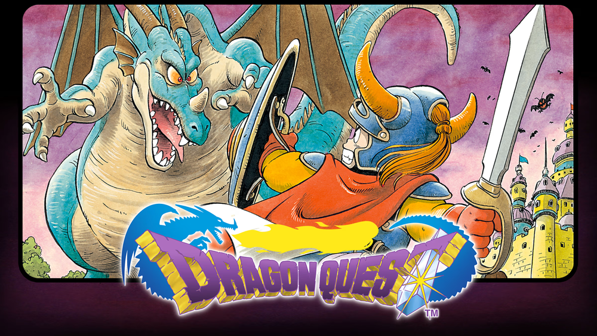
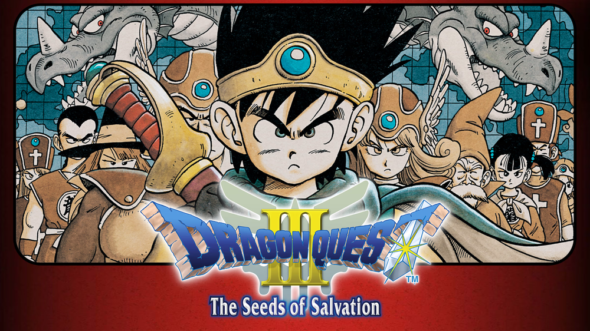
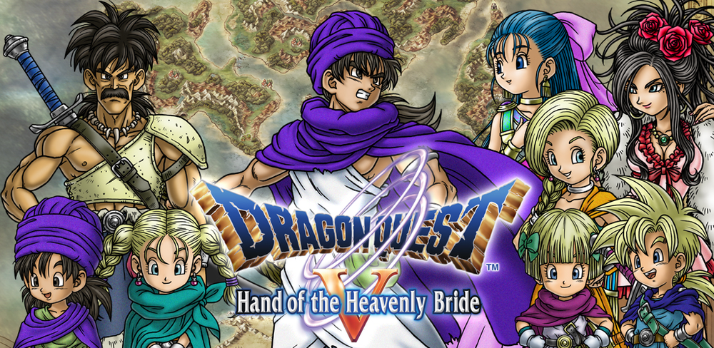
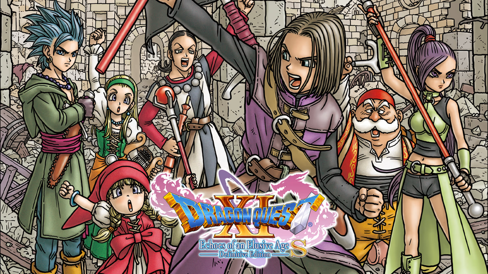

# 《勇者斗恶龙》全系列正传+衍生作详述
---

| 作品   | 首发平台 | 主要移植/重制平台 | 关键创新 | 核心剧情 | 移植版新增内容 | 历史地位 | 备注 |
|--------|----------|-------------------|----------|----------|----------------|----------|------|
| **DQⅠ** | FC       | SFC/GBC/Mobile/Switch | 单人冒险、开放式地图 | 勇者击败龙王拯救世界 | SFC版动画过场 Mobile自动战斗 | JRPG奠基之作 | Switch版收录于《DQ1-3合集》 |
| **DQⅡ** | FC       | SFC/GBC/Mobile/Switch | 多角色组队、船载具 | 三勇者后裔对抗邪神 | GBC版隐藏迷宫“邪神祭坛” | 首提“世界地图”概念 | 与DQ1共享合集移植 |
| **DQⅢ** | FC       | SFC/GBC/Mobile/Switch/PS4 | 职业系统、昼夜交替 | 洛特传说起源 | PS4/Switch版3D化+女性主角线 2021年HD-2D重制 | 销量破300万的里程碑 | HD-2D版含昼夜技能 |
| **DQⅣ** | FC       | PS1/NDS/Mobile | 章节叙事、马车系统 | 群像角色集结对抗魔王 | NDS版第6章（婚后剧情） PS1版角色配音 | 角色塑造典范 | 移动版支持竖屏操作 |
| **DQⅤ** | SFC      | PS2/NDS/Mobile | 怪物同伴、多世代传承 | 父子两代的反抗史诗 | PS2版3D化+怪物剧情 NDS版结婚支线 | 系列剧情巅峰 | 被誉“最佳重制版” |
| **DQⅥ** | SFC      | NDS/Mobile | 双世界设定、转职升级 | 梦境与现实交织的救赎 | NDS版“超级职业” 隐藏BOSS“魔神盖玛” | 非线性叙事先驱 | 移动版优化存档同步 |
| **DQⅦ** | PS1      | 3DS/Mobile | 时空穿越、职业精通 | 修复破碎历史的冒险 | 3DS版缩短序章+职业“海盗” | 硬核玩家最爱 | 剧情压缩至80小时 |
| **DQⅧ** | PS2      | 3DS/Mobile | 全3D化、炼金釜合成 | 诅咒公主的救赎之旅 | 3DS版新角色“莫利” 结局“杨格斯婚礼” | 革新之作，全球破圈 | 移动版阉割配音 |
| **DQⅨ** | NDS      | 无官方移植 | 多人联机、自定义角色 | 天使修复星之果实 | 仅模拟器支持其他平台 | 社交RPG标杆 | 联机功能已停服 |
| **DQⅩ** | Wii      | Wii U/PS4/Switch/PC | MMORPG化、动态事件 | 五种族联合抗魔 | PS4/Switch版4K画质 | 仅限日本的长线运营 | 需加速器联机 |
| **DQⅪ** | PS4/3DS  | Switch/PC/Xbox/PS5 | 2D/3D切换、技能盘 | 轮回勇者对抗命运 | Switch版语音+婚后支线 PS5版4K+拍照模式 | 集大成之作 | 全球销量600万 |
---

💡 **使用建议**：  
- **新玩家**：优先选择移植版（如Switch《DQ11S》或NDS《DQ5》），兼顾画面与内容完整性。  
- **怀旧党**：体验HD-2D版《DQ3》或原版《DQ4》PS1重制版。  
- **联机党**：仅《DQⅩ》支持跨平台联机（需日服账号+加速器）。

## 📌 **重点移植版解析**

### **《DQⅢ HD-2D 重制版》（2022年）**
- **平台**：Switch/PS4/PC/Xbox  
- **革新点**：  
  - **画面**：结合像素与3D光影（类似《八方旅人》）。  
  - **玩法**：新增“昼夜技能”（如盗贼夜晚开锁）。  
  - **剧情**：追加主角身世暗线，衔接DQ1洛特传说。

### **《DQⅧ 3DS版》（2015年）**
- **独占内容**：  
  - 新角色“莫利”可操作，拥有专属迷宫与技能。  
  - 拍照模式：通过3DS摄像头与现实场景互动。  
  - 结婚系统：可选择与特鲁妮克/杨格斯（伪）举办婚礼。

### **《DQⅪ S》（Switch/PC/PS4）**
- **定义版**：  
  - **角色配音**：全主线剧情日/英双语配音（原版无语音）。  
  - **2D怀旧模式**：可随时切换FC风格画面与回合制。  
  - **追加剧情**：魔神篇（暗黑勇者线）+ 雪妮亚婚后日常。

---

## 🌐 **跨平台差异指南**
1. **画质优先级**：  
   - **最佳体验**：PS5/Xbox版《DQⅪ》（4K/60帧）。  
   - **怀旧首选**：Switch版《DQ1-3》合集（HD-2D滤镜）。  
2. **内容完整性**：  
   - 避免移动版：DQ4-6移动版删减配音与过场动画。  
   - 首选重制版：如DQ5选NDS版，DQ7选3DS版。  
3. **联机功能**：  
   - 仅《DQⅩ》支持跨平台联机（Wii/PS4/Switch/PC互通）。  
   - 《DQⅨ》联机已停服，仅本地多人可用模拟器实现。

---

💡 **总结**：系列移植策略以 **“保留核心+新增内容”** 为主，优先推荐Switch/PS4等现代平台版本。重制版不仅优化体验，更是补完原作遗憾的绝佳机会！

## 🔧 **玩法进化轴**
1. **职业系统**：DQ3（基础职业）→ DQ6（高级转职）→ DQ7（技能保留）→ DQ9（自定义外观）。  
2. **探索维度**：步行（DQ1）→ 船（DQ2）→ 天马（DQ6）→ 全3D无缝地图（DQ8）。  
3. **战斗策略**：回合制（传统）→ AI指令（DQ4）→ 技能树（DQ8）→ 即时回合切换（DQ11）。

---
## ⚔️ **衍生作亮点**
- **《怪兽篇》**：宝可梦式怪物培养 + 繁育系统。  
- **《建造者》**：沙盒建造 + 剧情驱动（DQ1世界观重启）。  
- **《英雄集结》**：无双割草 + 经典角色联动。

---

## **正传系列（Ⅰ-Ⅺ）**

### **《勇者斗恶龙Ⅰ》（1986年）**

#### 📖 剧情  
- **核心脉络**：洛特勇者后裔击败龙王，揭露其曾是古代英雄的堕落真相。  
- **关键细节**：光之玉的牺牲封印黑暗，奠定系列“牺牲救世”基调。

#### 🎮 玩法特色  
- **单人成长**：无队友，纯靠等级/装备压制（如“洛特之剑”需Lv20+）。  
- **隐藏机制**：夜晚怪物强度+30%，部分商店关闭。

---

### **《勇者斗恶龙Ⅱ：恶灵之神》（1987年）**

#### 📖 剧情  
- **多线汇聚**：三勇者后裔对抗邪神哈根，揭示古代文明滥用神力导致灭世。  
- **黑暗结局**：哈根被击败后，其核心“恐惧之核”暗示人性之恶永存。

#### 🎮 玩法特色  
- **职业分工**：战士（物理）、公主（治疗）、王子（魔法）铁三角。  
- **船载具**：首次跨海探索，隐藏岛屿需解谜（如“罗达之镜”反射谜题）。

---

### **《勇者斗恶龙Ⅲ：传说的起点》（1988年）**

#### 📖 剧情  
- **时空闭环**：主角击败魔王巴拉莫斯，自身成为后世传颂的“洛特勇者”。  
- **震撼反转**：最终战揭示魔王是主角父亲，暗喻弑亲救世的道德困境。

#### 🎮 玩法特色  
- **职业系统**：8大基础职业 + 隐藏职业“贤者”（需转职+道具）。  
- **昼夜机制**：夜晚NPC变狼人，部分任务仅限夜间触发。

---

### **《勇者斗恶龙Ⅳ：被引导的人们》（1990年）**
   
#### 📖 剧情  
- **群像史诗**：五章节独立叙事（战士/公主/商人/姐妹/勇者），最终揭露魔族渗透人类王庭。  
- **角色弧光**：商人特鲁尼克从贪婪到无私的转变最具深度。

#### 🎮 玩法特色  
- **马车系统**：自由切换4名队员，针对BOSS弱点配队。  
- **AI战术**：可预设队友行为（如“优先治疗濒死者”）。

---

### **《勇者斗恶龙Ⅴ：天空的新娘》（1992年）**

#### 📖 剧情  
- **三代史诗**：主角从奴隶到父亲，子女继承使命唤醒天空之城。  
- **选择影响**：结婚对象（比安卡/芙萝拉）决定子女属性与隐藏剧情。

#### 🎮 玩法特色  
- **怪物同伴**：史莱姆系/龙系/恶魔系可捕捉培养，专属技能树。  
- **隐藏结局**：若未结婚，子女由NPC抚养但无法解锁天空城。

---

### **《勇者斗恶龙Ⅵ：幻之大地》（1995年）**

#### 📖 剧情  
- **双世界设定**：梦境世界（和平假象）与现实世界（毁灭真相）交织。  
- **哲学内核**：主角为梦境王子，觉醒后选择打破虚幻拯救现实。

#### 🎮 玩法特色  
- **转职树**：初级→高级→隐藏职业（如“游侠”需天马之蹄）。  
- **天马探索**：飞行跨越地形，解锁隐藏迷宫“天空墓场”。

---

### **《勇者斗恶龙Ⅶ：伊甸的战士们》（2000年）**

#### 📖 剧情  
- **时空修复**：通过石板解锁被封印的历史，揭露创世神灭世计划。  
- **悲情支线**：NPC艾拉自愿石化封印瘟疫，成就“最催泪NPC”。

#### 🎮 玩法特色  
- **职业精通**：保留技能（如战士“双刃斩”），隐藏职业需合成道具。  
- **移民系统**：支线任务影响“移民之町”人口与设施。

---

### **《勇者斗恶龙Ⅷ：天空与海洋与大地与被诅咒的公主》（2004年）**

#### 📖 剧情  
- **诅咒之旅**：勇者与石化公主特鲁妮克寻找神龙，揭露魔人迪尔姆多的“人性实验”。  
- **真结局**：集齐7龙珠复活神龙，公主恢复人形。

#### 🎮 玩法特色  
- **炼金釜**：合成公式（如“魔法铠甲=铁铠+圣者之灰”），失败会爆炸。  
- **技能树**：角色专属路线（勇者“勇气技”/杨格斯“人情技”）。

---

### **《勇者斗恶龙Ⅸ：星空的守护者》（2009年）**

#### 📖 剧情  
- **天使使命**：收集“星之泪”修复世界树，对抗堕天使科尔巴托。  
- **多周目**：通关后解锁创世神与恶魔的永恒战争篇章。

#### 🎮 玩法特色  
- **多人联机**：4人合作刷宝图，职业分工（战士/僧侣/魔法师/游侠）。  
- **纸娃娃系统**：装备实时显示，染色功能自定义外观。

---

### **《勇者斗恶龙Ⅹ：觉醒的五种族》（2012年）**

#### 📖 剧情  
- **MMO史诗**：五种族（人类/精灵/矮人等）联合对抗灭界魔族。  
- **阵营冲突**：矮人工业污染 vs 精灵自然信仰，需调解矛盾。

#### 🎮 玩法特色  
- **职业自由**：10大基础职业 + 进阶职业（魔剑士/占星师）。  
- **生活系统**：采矿/钓鱼/锻造影响装备产出。

---

### **《勇者斗恶龙Ⅺ：寻觅逝去的时光》（2017年）**

#### 📖 剧情  
- **轮回真相**：主角“恶魔之子”身份反转，真BOSS为创世神阴暗面。  
- **牺牲救赎**：同伴维罗妮卡牺牲重启时间线，催泪指数MAX。

#### 🎮 玩法特色  
- **2D/3D切换**：怀旧像素风与现代3D无缝转换（仅Switch版）。  
- **人化咒文**：变身龙骑士/恶魔形态，消耗“恶魔之魂”。

---

## **衍生作品全收录**

---

### **《勇者斗恶龙怪兽篇》系列**
#### 📖 主线  
- **Joker三部曲**（2006-2016）：驯兽师挑战怪兽大师，拯救被囚禁的亲人。  
- **最新作**：《怪兽篇3 魔族王子与精灵之旅》（2023年），主角为魔族王子与精灵混血。

#### 🎮 玩法特色  
- **繁育系统**：怪物交配继承技能与种族值（如“杀人机+史莱姆=金属凯撒”）。  
- **竞技场**：全球排位赛，赛季奖励稀有怪物蛋。

---

### **《勇者斗恶龙建造者》系列**
#### 📖 主线  
- **1代**（2016）：重建DQ1被毁灭的世界，对抗龙王。  
- **2代**（2018）：荒岛求生，揭露教团阴谋，复活“创造神”。

#### 🎮 玩法特色  
- **沙盒建造**：自由设计城镇/农场/机关陷阱。  
- **剧情驱动**：NPC根据建筑功能互动（如厨房吸引厨师定居）。

---

### **《勇者斗恶龙英雄集结》系列**
#### 📖 主线  
- **1代**（2015）：历代角色穿越对抗时空裂缝魔物。  
- **2代**（2016）：新增《DQ4》姐妹花与《DQ8》杨格斯，阻止世界树暴走。

#### 🎮 玩法特色  
- **无双割草**：角色专属清屏技（如特瑞“剑刃风暴”）。  
- **召唤兽**：合体召唤神龙/杀人机器，一击清场。

---

### **《勇者斗恶龙寻宝探险团》（2022年）**
#### 📖 剧情  
- **卡缪兄妹外传**：少年版卡缪与妹妹玛丽寻宝，揭秘“龙之泪”起源。  
- **主题**：亲情与冒险，填补《DQ11》角色背景。

#### 🎮 玩法特色  
- **开放寻宝**：怪物雷达扫描 + 地形破坏（炸开隐藏洞穴）。  
- **怪物协助**：收服怪物用于搬运/战斗/解谜。

---

### **《勇者斗恶龙 达尔大冒险》（2020年）**
#### 📖 剧情  
- **动画改编**：原作漫画主角达尔对抗魔王巴恩，还原经典桥段。  
- **原创内容**：新增“六大军团长”支线战役。

#### 🎮 玩法特色  
- **动作RPG**：连招Combo + 技能派生（如“龙斗气炮”蓄力技）。  
- **角色切换**：达尔（近战）/波普（魔法）/玛姆（辅助）实时切换。
