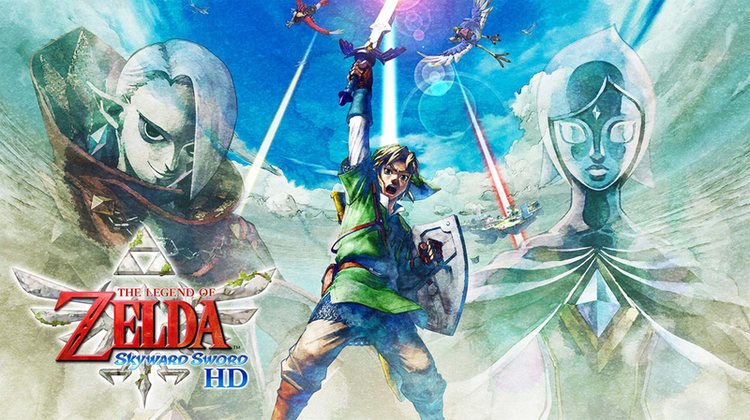
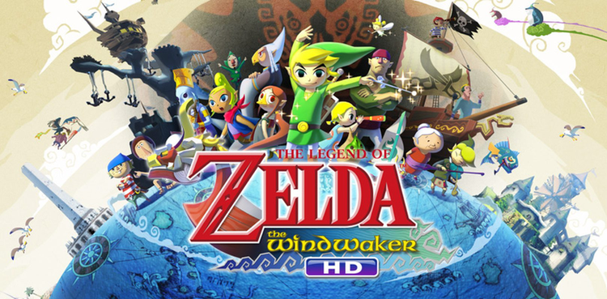
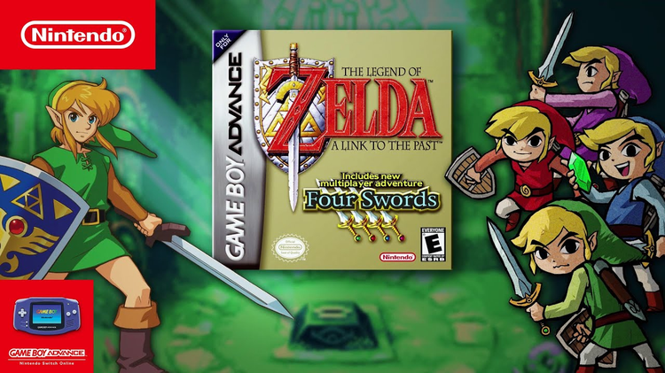
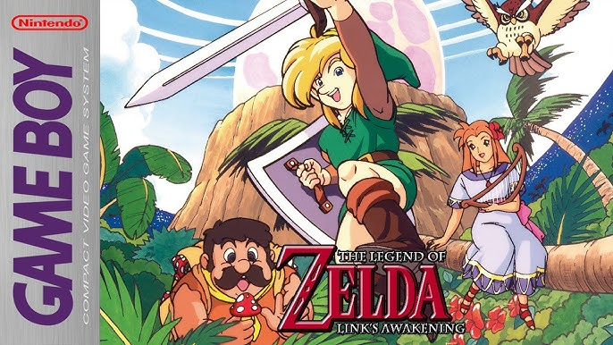
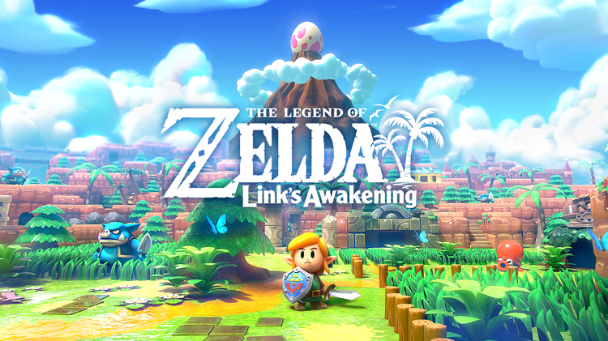

# 《塞尔达传说》系列

---

## 主机游戏

### 塞尔达传说：智慧的再现  
**The Legend of Zelda: Rebirth of Wisdom**  

- **平台**：Nintendo Switch  
- **发布日期**：2024年9月26日  
- **特色**：设计了复制品召唤这么一个巧妙的概念，将《塞尔达传说》经典2D作品中精心打造的迷宫、解谜房间和道具升级等元素与《塞尔达传说：王国之泪》所提供的高自由度结合到了一起。
- **剧情**：广阔的海拉鲁各处出现了神秘的裂缝，不只是林克，海拉鲁的人和物件，连海拉鲁国王与他的亲信们都被吞噬了。
幸存的塞尔达公主为了拯救父亲海拉鲁国王、人民与林克，踏上了海拉鲁巡回冒险之旅。

---

### 塞尔达传说：王国之泪  
**The Legend of Zelda: Tears of the Kingdom**  

- **平台**：Nintendo Switch  
- **发布日期**：2023年5月12日  
- **玩法特色**:
  - 开放世界玩法扩展，新增天空与地下区域。
  - 强化物理引擎与建造系统，玩家可以创造自己的交通工具与装置。
  - 具备高度自由的战斗和探索，探索环境与敌人之间的互动更加丰富。
- **剧情**：海拉鲁遭遇新的灾难，林克探索天空浮岛和地下深渊，阻止混沌之力的侵袭，揭开塞尔达公主的神秘命运。

---

### 塞尔达传说：旷野之息  
**The Legend of Zelda: Breath of the Wild**  

- **平台**：Nintendo Switch、Wii U  
- **发布日期**：2017年3月3日  
- **玩法特色**:
  - 完全开放世界，玩家可以自由探索海拉尔的每一个角落。
  - 高度自由的战斗与物理引擎，玩家可以与环境互动（例如砍树、引发雷电等）。
  - 提供多种武器、道具和烹饪系统，提升生存体验。
- **剧情**：海拉鲁王国被灾厄加农摧毁百年后，林克苏醒，海拉尔已被灾厄盖侬摧毁。玩家的任务是重建失落的力量，集合四位神兽，最终与盖侬决战，拯救海拉尔。

### 塞尔达传说：御天之剑  
**The Legend of Zelda: Skyward Sword**  

- **平台**：Nintendo Wii  
- **发布日期**：2011年11月18日  
- **玩法特色**:
  - 采用体感控制，玩家通过挥动Wii遥控器来模拟剑术。
  - 强调与环境互动和解谜元素，利用风、光等自然元素解决难题。
  - 引入了空中冒险和“飞行”的新机制，Link可骑乘飞行动物。
- **剧情**：讲述海拉鲁王国起源，林克与塞尔达从天上的天空城坠入地面，击败恶魔之王，并锻造出大师之剑。

---

### 塞尔达传说：黄昏公主  
**The Legend of Zelda: Twilight Princess**  

- **平台**：Nintendo GameCube、Wii  
- **发布日期**：2006年11月19日  
- **特色**：成熟黑暗风格，林克可变身为狼形态。
- **剧情**：林克与变身为狼的塞尔达协力抵抗黄昏领主赞特的侵略，保护海拉鲁免受黑暗势力吞噬。

---

### 塞尔达传说：四人之剑+  
**The Legend of Zelda: Four Swords Adventures**  

- **平台**：Nintendo GameCube  
- **发布日期**：2004年3月18日  
- **特色**：多人合作玩法，关卡式冒险设计。
- **剧情**：邪恶的魔王瓦堤苏醒，林克分裂成四个形态，与伙伴协力封印瓦堤，守护海拉鲁。

---

### 塞尔达传说：风之杖  
**The Legend of Zelda: The Wind Waker**  

- **平台**：Nintendo GameCube  
- **发布日期**：2002年12月13日  
- **特色**：航海冒险，卡通渲染画风。
- **剧情**：林克穿越被海洋覆盖的世界，救出被加农绑架的妹妹，揭开海拉鲁被遗忘的历史。

---

### 塞尔达传说：魔吉拉的面具  
**The Legend of Zelda: Majora's Mask**  

- **平台**：Nintendo 64  
- **发布日期**：2000年4月27日  
- **特色**：时间循环机制，强调角色的悲剧性与深度。
- **剧情**：林克意外进入特尔米娜平原，阻止月亮坠落，救助受到诅咒的居民，并解开神秘面具的真相。

---

### 塞尔达传说：时之笛  
**The Legend of Zelda: Ocarina of Time**  

- **平台**：Nintendo 64  
- **发布日期**：1998年11月21日  
- **特色**：首次3D化，时间旅行和光暗世界的设计。
- **剧情**：少年林克揭开命运，与加农展开光明与黑暗之战，使用时之笛穿越时间拯救海拉鲁。

---

### 塞尔达传说：众神的三角力量  
**The Legend of Zelda: A Link to the Past**  

- **平台**：超级任天堂（SNES）  
- **发布日期**：1991年11月21日  
- **特色**：光暗世界的设定，精巧的迷宫设计。
- **剧情**：林克探索光明与黑暗世界，解救被封印的七贤者后裔，并击败邪恶的加农多夫。

---

### 塞尔达传说：林克的冒险  
**The Legend of Zelda: Adventure of Link**  

- **平台**：FC  
- **发布日期**：1987年1月14日  
- **特色**：系列唯一横版动作冒险游戏。
- **剧情**：林克收集三角力量碎片，唤醒沉睡的塞尔达公主，并阻止加农的复活。

---

### 塞尔达传说  
**The Legend of Zelda**  

- **平台**：FC  
- **发布日期**：1986年2月21日  
- **特色**：系列首作，自由探索与迷宫挑战的结合。
- **剧情**：林克解救被加农绑架的塞尔达公主，收集分散的三角力量，拯救海拉鲁。

---

## 掌机游戏

### 塞尔达传说：三角力量英雄  
**The Legend of Zelda: Tri Force Heroes**  

- **平台**：Nintendo 3DS  
- **发布日期**：2015年10月22日  
- **特色**：三人合作冒险与解谜，强调团队配合。
- **剧情**：三位林克合作解救被诅咒的时尚女王，打破黑暗魔法的束缚。

---

### 塞尔达传说：众神的三角力量2  
**The Legend of Zelda: A Link Between Worlds**  

- **平台**：Nintendo 3DS  
- **发布日期**：2013年11月22日  
- **特色**：自由化解谜路径，墙壁变身功能。
- **剧情**：林克在平行世界劳鲁尔和海拉鲁间穿梭，阻止尤卡的野心，修复崩坏的世界。

---

### 塞尔达传说：大地的汽笛  
**The Legend of Zelda: Spirit Tracks**  

- **平台**：Nintendo DS  
- **发布日期**：2009年12月7日  
- **特色**：火车驾驶系统，塞尔达以灵魂形式协助林克。
- **剧情**：林克与塞尔达公主的灵魂合作，揭开火车轨道与邪恶魔王的秘密。

---

### 塞尔达传说：幻影沙漏  
**The Legend of Zelda: Phantom Hourglass**  

- **平台**：Nintendo DS  
- **发布日期**：2007年6月23日  
- **特色**：触控操作与航海探险，迷宫中的时间机制。
- **剧情**：林克与四分仪船长探索未知的海域，寻找塞尔达，打败海盗之王贝拉姆。

---

### 塞尔达传说：缩小帽  
**The Legend of Zelda: The Minish Cap**  

- **平台**：Game Boy Advance  
- **发布日期**：2004年11月4日  
- **特色**：林克可缩小进入微观世界，独特的帽子伙伴系统。
- **剧情**：林克缩小到微观世界，与皮克鲁族合作修复破碎的剑，击败魔法师瓦堤。

---

### 塞尔达传说：众神的三角力量与四人之剑  
**The Legend of Zelda: A Link to the Past & Four Swords**  

- **平台**：Game Boy Advance  
- **发布日期**：2002年12月2日  
- **特色**：双游戏合集，首次引入多人模式。
- **剧情**：除了重制经典的《众神的三角力量》，新增多人模式，对抗邪恶魔王瓦堤。

---

### 塞尔达传说：不可思议的果实  
**The Legend of Zelda: Oracle of Ages & Oracle of Seasons**  

- **平台**：Game Boy Color  
- **发布日期**：2001年2月27日  
- **特色**：双版本联动系统，时间与季节操控。
- **剧情**：林克穿越时间与季节，解救被囚禁的女神，拯救神秘的霍鲁德鲁王国。

---

### 塞尔达传说：织梦岛  
**The Legend of Zelda: Link's Awakening**  

- **平台**：Game Boy  
- **发布日期**：1993年6月6日  
- **特色**：系列首次掌机作品，梦境冒险主题。
- **剧情**：林克在神秘岛屿上苏醒，为离开岛屿唤醒风之鱼，发现一切不过是一场梦境。

---

## 重制作品

### 塞尔达传说：御天之剑 HD  
**The Legend of Zelda: Skyward Sword HD**  
- **平台**：Nintendo Switch  
- **发布日期**：2021年7月16日  
- **特色**：高清画质与优化动作感应。

---

### 塞尔达传说：织梦岛 (Switch)  
**The Legend of Zelda: Link's Awakening (Switch)**  

- **平台**：Nintendo Switch  
- **发布日期**：2019年9月20日  
- **特色**：全新卡通化重制，强化操作与视觉。

---

### 塞尔达传说：黄昏公主 HD  
**The Legend of Zelda: Twilight Princess HD**  
- **平台**：Nintendo Wii U  
- **发布日期**：2016年3月4日  
- **特色**：高清化视觉与提升细节。

---

### 塞尔达传说：魔吉拉的面具 3D  
**The Legend of Zelda: Majora's Mask 3D**  
- **平台**：Nintendo 3DS  
- **发布日期**：2015年2月13日  
- **特色**：优化体验，增强操作感和画质。

---

### 塞尔达传说：风之杖 HD  
**The Legend of Zelda: The Wind Waker HD**  
- **平台**：Nintendo Wii U  
- **发布日期**：2013年9月20日  
- **特色**：改进图像与帧率，优化游戏节奏。

---

### 塞尔达传说：时之笛 3D  
**The Legend of Zelda: Ocarina of Time 3D**  
- **平台**：Nintendo 3DS  
- **发布日期**：2011年6月16日  
- **特色**：高清重制，增强视觉与操作体验。

---