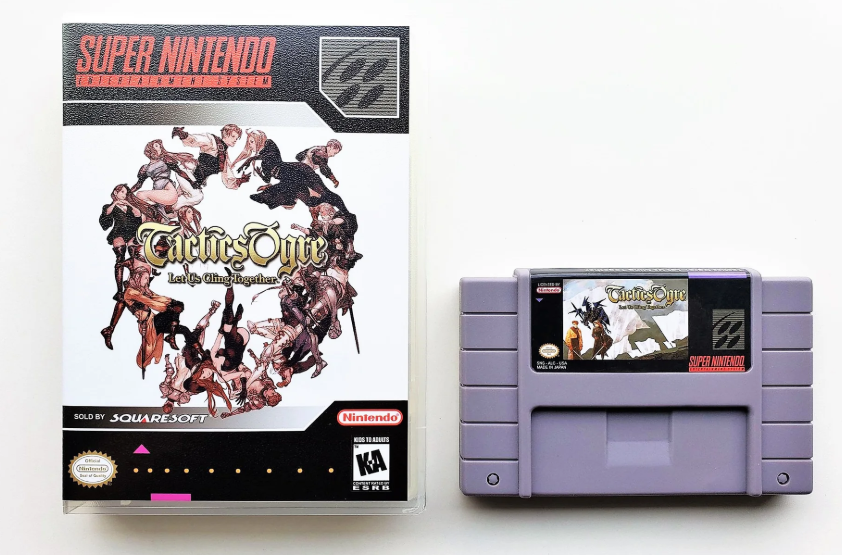
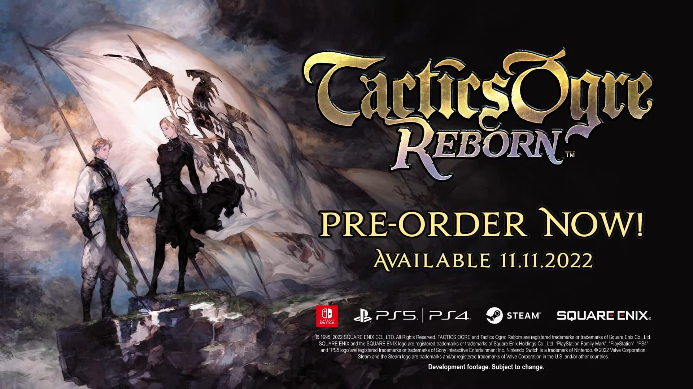

# 皇家骑士团系列作品
《皇家骑士团》（Tactics Ogre）系列是由松野泰己（Yasumi Matsuno）主导开发的战略角色扮演游戏（SRPG）系列，以其深刻的政治剧情、多线分支和复杂的战斗系统著称。   
该系列对后来的《最终幻想战略版》（Final Fantasy Tactics）等作品产生了深远影响。 

🎮 系列特色与评价
- 剧情深度：系列以复杂的政治背景和多线分支剧情著称，玩家的选择会直接影响故事走向和结局。

- 战斗系统：采用高低差立体地图，强调战术部署和单位位置，增加了战斗的策略性。

- 角色发展：丰富的职业系统和技能树，允许玩家根据喜好培养角色，提升了游戏的可玩性。

- 音乐与美术：由崎元仁和岩田匡治作曲，吉田明彦等人负责美术设计，营造出浓厚的中世纪幻想氛围。

| 序号 | 游戏名称 | 游戏封面 | 发售时间 | 平台 | 剧情概要 | 玩法特色 |
|------|----------|----------|----------|------|----------|----------|
| 1 | 皇家骑士团：命运之轮 Tactics Ogre: Let Us Cling Together |  | 1995年10月6日 | SFC、SS、PS、PSP | 讲述瓦雷利亚岛上三大民族之间的冲突，主角德尼姆在战争中做出抉择，影响故事走向。 | 引入多线剧情与多结局系统，战斗采用高低差立体地图，强调战术部署。 |
| 2 | 皇家骑士团：命运之轮（PSP重制版） Tactics Ogre: Let Us Cling Together (PSP) |  | 2010年11月11日 | PSP | 在原作基础上增加角色背景与剧情细节，丰富了故事层次。 | 新增“命运之轮”系统，允许玩家回溯关键决策点，探索不同剧情分支。 |
| 3 | 皇家骑士团：重生 Tactics Ogre: Reborn |  | 2022年11月11日 | PS4、PS5、Switch、PC | 基于PSP版进一步优化，保留原有剧情，提升画面与音效表现。 | 改进战斗系统，加入自动保存、战斗加速等功能，提升游戏体验。 |
