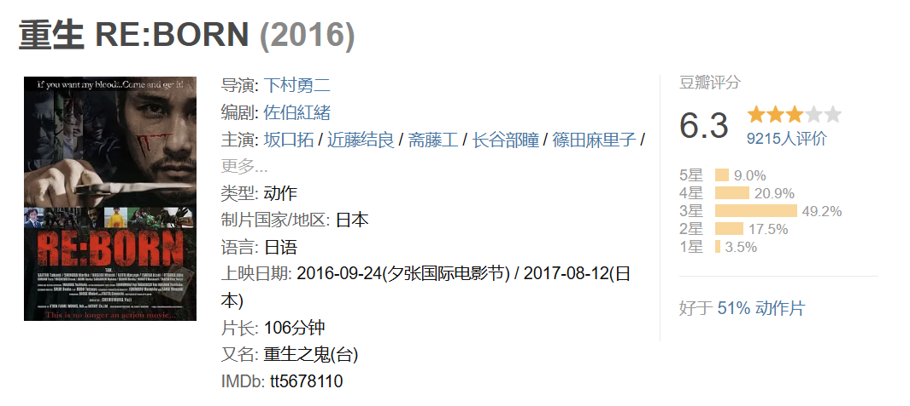

# 重生 RE:BORN
  
杀手对组织的复仇  
***
抓捕任务被团灭 

标题字幕 
***
小女孩大胆反常 善良举动，埋藏血污的死猫。  
画外音讲述谜面

男主和小女孩的关系，吃饭等。呵护小女孩

男主有心事和警觉性很高。

男主来看心理医生，说自己的反复缠绕的梦境   

男主被小混混欺负，很快息事宁人，表达并不是暴力狂 

受伤的朋友来看，交代一些过去的事的边角，朋友为了保护男主受伤，暗示过去有很激烈的战斗   

男主和小女孩告别离开   

受伤的朋友警觉到危险  
***
男主支开小女孩  

男主在广场被人暗中追杀，日常下交手，杀掉了多个杀手  

小女孩被杀手关注到，并有一点互动。男主回到小女孩身边  

女杀手出现，被混混调戏，和混混路人互动，很快解决掉混混，展示能力。

杀手组织开始布局展开行动。计划和分析 。出发

男主继续看心理医生，一些心路和反应的更多叙述 

和小女孩，店员等在店里短暂温馨的对话日常，新闻播报发生多起命案。男主警觉，托付照看小女孩  

一路干净利落杀掉了各种伪装的杀手。在店里微波炉热饭，杀完追来的杀手后，饭刚热好，吃饭前顺手干点最后一个杀手  

男主也有自己的小组织，男主杀掉之前的女杀手后，来到受伤的朋友这里 。受伤的朋友想要加入战斗。男主等厉兵秣马，准备好了大战   
***

小女孩被杀手组织顶上。男主收到小女孩不见的消息  

小女孩在反派基地里。和反派有对话 

男主小队追踪来到，战斗，杀掉很多人 

男主的一个搭子因为心软，被精英杀手杀掉。精英杀手想要自爆，男主报仇成功  

男主断后，面对源源不断的敌人，体力出现透支。闪回回忆，活动净胜加成，干掉所有人，继续前进  

男主曾经有分歧的队友好像在远处影现

***
反派基地收到警戒信号。大反派开始挑逗威胁小女孩  

基地内战斗。救下小女孩。继续出去和剩余堵截的敌人战斗。

和有宿怨的精英杀手战斗，惨胜

刚好小女孩互通了电话报了平安。最后的杀手组织大boss老头子出现在巷子尾。前面的铺垫都是陷阱，是要耗完男主

男主反将，其实也是局，为了让大boss现身。极限反杀  

***
小女孩又出现在沙滩，埋藏童话书（又象征意义，呼应前面）
画外音和前面讲述的谜面接上

