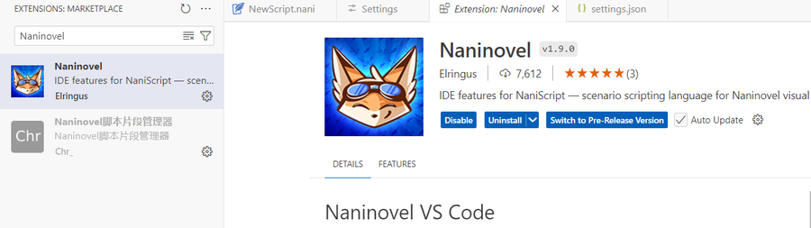

# IDE环境配置
<video controls src="./NaniScript.mp4" title="Title"></video>
  
## 安装
- VS Code 编辑器 中View -> Extensions通过菜单在 VS Code 中打开扩展窗口
- 搜索“Naninovel”并点击“安装”按钮
- 当打开 .nani 文件时，扩展程序将自动激活   

## 拼写检查
Visual Studio Code代码拼写插件   
  
用于忽略 Unity 自动生成的元文件、启用语义语法突出显示、自动换行和拼写检查。并禁用基于单词的建议（这样它们不会在您键入通用文本行时不断弹出）  
https://naninovel.com/guide/ide-extension#vs-code-settings


```gantt
dateFormat  YYYY-MM-DD
title       Adding GANTT diagram functionality to mermaid
excludes    weekends
%% (`excludes` accepts specific dates in YYYY-MM-DD format, days of the week ("sunday") or "weekends", but not the word "weekdays".)

section A section
Completed task            :done,    des1, 2014-01-06,2014-01-08
Active task               :active,  des2, 2014-01-09, 3d
Future task               :         des3, after des2, 5d
Future task2              :         des4, after des3, 5d

section Critical tasks
Completed task in the critical line :crit, done, 2014-01-06,24h
Implement parser                    :crit, done, after des1, 2d
Create tests for parser             :crit, active, 3d
Future task in critical line        :crit, 5d
Create tests for renderer           :2d
Add to mermaid                      :1d

section Documentation
Describe gantt syntax               :active, a1, after des1, 3d
Add gantt diagram to demo page      :after a1  , 20h
Add another diagram to demo page    :doc1, after a1  , 48h

section Last section
Describe gantt syntax               :after doc1, 3d
Add gantt diagram to demo page      :20h
Add another diagram to demo page    :48h
```

https://github.com/chr233/nn-tools