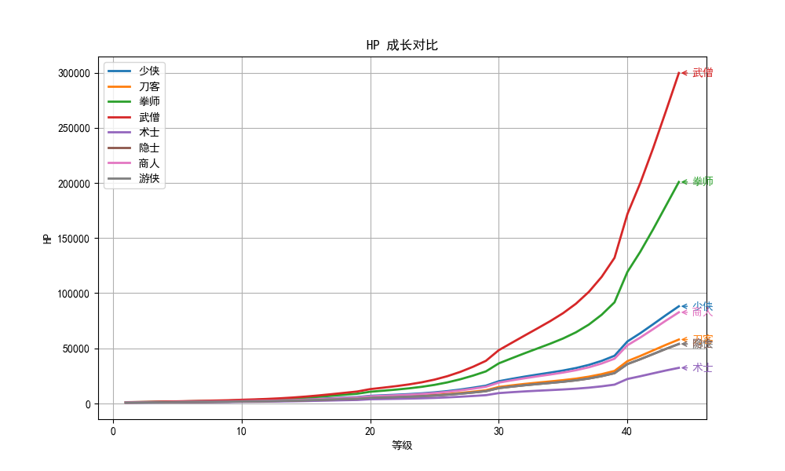

# 职业数值升级

## 总体规律
- **成长速度**：每个职业的属性有不同的成长速度，影响了不同职业在战斗中的角色定位。成长速度较高的属性会在后期增幅更为显著，而成长较低的属性可能在后期增幅较小。通过对比不同职业的属性曲线，可以更好地理解各职业的优势与弱点。

## 各职业之间的差异
   
### 少侠 (Light Green)
- **高成长属性**：HP、MP、ATK 和 MATK 都表现出较好的成长，特别是 MP（1.15）和 ATK（1.08），可以持续提供稳定的输出和支援。
- **低成长属性**：SPD 和 Agility 较低，适合偏向防御或输出的角色，但较难在高速战斗中表现突出。

### 刀客 (Light Pink)
- **高成长属性**：ATK 和 SPD 都有不错的成长，特别是 ATK（1.11），能在中后期展现出强大的物理输出能力。
- **低成长属性**：MATK 和 MDEF 相对较低，刀客偏向物理输出而非魔法输出，且其魔法防御较弱。

### 拳师 (Burlywood)
- **高成长属性**：DEF 和 HP 是拳师最突出的属性，符合其坦克型角色定位。其防御力高，使其能够承受大量伤害。
- **低成长属性**：SPD 和 Agility 较低，反映出拳师的机动性较差，更侧重于耐久性和防御。

### 武僧 (Khaki)
- **高成长属性**：HP、MP 和 MATK 成长较好，适合兼具生存能力和魔法输出的角色。
- **低成长属性**：ATK 和 SPD 较低，武僧并不注重攻击输出或速度，适合耐久型和支援型战斗。

### 术士 (Powder Blue)
- **高成长属性**：MP 和 MATK 的成长非常突出，尤其是 MP（1.18），使其成为主要依赖魔法输出的角色。
- **低成长属性**：HP 和 ATK 成长较低，术士较弱的防御和物理输出让其在近战时容易受到压制。

### 隐士 (Thistle)
- **高成长属性**：SPD 和 Agility 在隐士中表现突出，反映出其较强的机动性和攻击频率。
- **低成长属性**：MATK 和 HP 成长一般，隐士更多依赖机动性和敏捷性，而非强大的魔法或生命值。

### 商人 (Sandy Brown)
- **高成长属性**：MP 和 MATK 的成长较好，MP（1.13）有助于提供支援技能和魔法输出。
- **低成长属性**：ATK 和 SPD 较低，商人更多依赖辅助能力而非攻击力或速度。

### 游侠 (Light Blue)
- **高成长属性**：ATK 和 Agility 表现突出，尤其是 Agility（1.10），使其具备较强的机动性和攻击频率，能够迅速做出反应并进行多次攻击。
- **低成长属性**：HP 和 DEF 较低，虽然游侠具备强大的攻击能力，但其生存能力相对较弱，需依赖队友支援。

## 各属性的规律分析

### 1. HP (生命值)
- **图表说明：HP 对比**
  - 从图表可以看出，**少侠**和**武僧**的 HP 成长较快，特别是武僧（1.13）的 HP 成长在所有职业中领先，表现出其作为坦克型职业的特征。
  - **刀客**的 HP 成长相对较慢，但依然维持了基本的生存能力。
  - **术士**的 HP 成长较低，反映出其脆弱的生命值和相对较强的魔法输出能力。

### 2. MP (魔法值)
- **图表说明：MP 对比**
  - **术士**的 MP 成长在所有职业中是最高的（1.18），表明其主要依赖魔法输出。
  - **少侠**、**隐士**和**武僧**的 MP 成长也表现较好，适合有一定法术支援需求的职业。
  - **刀客**和**拳师**的 MP 成长较慢，偏向物理输出，魔法值需求较少。

### 3. ATK (攻击力)
- **图表说明：ATK 对比**
  - **刀客**的 ATK 成长非常突出（1.11），其攻击输出能力在后期将大幅提升。
  - **少侠**和**拳师**的 ATK 也有不错的成长，适合需要持续输出的角色。
  - **术士**的 ATK 成长较低，更多依赖魔法输出。

### 4. DEF (防御力)
- **图表说明：DEF 对比**
  - **拳师**和**武僧**的 DEF 成长非常突出，拳师的防御在所有职业中排名第一，适合以高耐久性为主的战斗风格。
  - **刀客**和**少侠**的防御相对较低，更多依赖攻击和机动性。
  - **术士**的 DEF 成长极低，缺乏防御力，需要依赖队友保护。

### 5. MATK (魔法攻击力)
- **图表说明：MATK 对比**
  - **术士**的 MATK 成长极为突出（1.12），表明其为魔法输出职业。
  - **隐士**的 MATK 成长也相对较高，表明其具备一定的魔法攻击能力。
  - **刀客**和**拳师**的 MATK 成长非常低，几乎没有魔法攻击能力。

### 6. MDEF (魔法防御力)
- **图表说明：MDEF 对比**
  - **拳师**和**武僧**的 MDEF 成长较好，适合抵御魔法攻击。
  - **刀客**和**少侠**的 MDEF 较低，可能需要依靠队友进行魔法防护。
  - **术士**的 MDEF 较低，魔法防御较弱。

### 7. SPD (速度)
- **图表说明：SPD 对比**
  - **刀客**和**隐士**的 SPD 成长较好，特别是隐士，表现出其机动性和攻击频率。
  - **拳师**和**武僧**的 SPD 成长相对较低，速度较慢，适合偏向防御和耐久的战斗方式。

### 8. Agility (敏捷)
- **图表说明：Agility 对比**
  - **隐士**和**刀客**的 Agility 成长较为突出，适合进行快速反应和频繁攻击的职业。
  - **拳师**和**武僧**的 Agility 成长较低，反映出其较为迟缓的行动速度。

## 总结
- **防御类职业**（如拳师、武僧）侧重于 HP 和 DEF 的增长，重视生存能力。
- **物理输出类职业**（如刀客和少侠）注重 ATK 和 SPD 的成长，强调攻击和机动性。
- **魔法类职业**（如术士、隐士）注重 MP 和 MATK 的成长，偏重法术输出和魔法支援。
- **综合性职业**（如商人）通常各属性之间的成长较为均衡，没有单一的突出点，适合多角色发展。

这些规律有助于根据职业的成长特性制定合理的玩法策略，比如选择适合的职业配合游戏中的战斗方式。