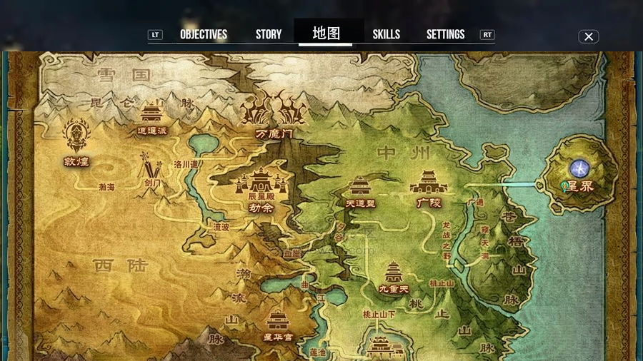

# 游戏世界地图系统

## 核心设计  
2D平面世界地图（UI层） + 独立3D场景（游戏层）   
  
## 世界地图（2D UI层）  
- 地图由多个"节点"组成，节点映射到独立的3D场景
- 节点之间通过路径连接，表示可行走路线
- 节点以图标表示其类型与状态
- 玩家缩放并移动视点，可选择目标节点进行跳转  
- 地图迷雾只存在于2D地图UI层，3D场景中无迷雾概念
- 未解锁区域以迷雾遮盖，区域范围内用文字表示，只显示主城节点图标
- 当玩家探索新3D场景后，2D地图相应区域解锁（去除迷雾），地图迷雾以“整片式”方式解锁：一个节点对应一块区域的迷雾去除，2D地图显示该节点图标
- 地图不实时更新角色在场景内的位置，显示颗粒度没这么细    
 

## 节点类型  
| **节点类型**       | **功能描述**                                                                 | **特性**        |
|---------------------|-----------------------------------------------------------------------------|---------------| 
| **主城节点**       | 触发大型3D城镇场景，含商店、NPC对话、任务接取点                             | 安全区，常含存档点 |
| **副本节点**       | 进入独立迷宫场景（洞穴/城堡），需解谜或击败BOSS                             |线性或分支结构   |
| **资源节点**       | 采集点（矿石/草药），触发迷你3D采集场景                                      |独立探索结构    |
| **事件节点**       | 动态生成任务（护送NPC/击退怪物），影响世界状态                              | 有特定触发条件   |

## 3D地图（游戏层）  
- 玩家触发到3D场景的出入口时，加载出出入口对应配置的3D场景
- 黑屏/渐隐加载过渡处理
- 每个3D场景是独立的，世界由多个独立场景组合而成
- 非开放世界，彼此间仅逻辑上连通，物理上不相邻

## 任务与地图交互
- 某些节点在地图上标记任务图标
- 任务追踪系统可高亮相关节点
- 支持快速跳转到任务目的地（前提是已解锁）
- 完成任务后，地图上的节点状态图标发生变化（如任务已完成）
- 未解锁节点但任务已存在，地图以灰色图标展示提示

## 素材及教程
### The Hobbit: A Journey through Middle Earth  
  
这个项目是由谷歌和华纳兄弟在2013年合作推出的，用于推广《霍比特人》三部曲电影。它允许用户以3D方式探索中土世界的各个地点，并根据不同的缩放显示相关信息。但由于这是一个限时的宣传项目，后来在电影推广结束后被移除。
### [在线地图生成 Fantasy-Map-Generator](https://azgaar.github.io/Fantasy-Map-Generator/)  
可以生成数据导出   
### [dungeondraft](https://dungeondraft.net/)  
Dungeondraft是一款用于幻想角色扮演游戏（RPG）的地图制作工具。适用于任何使用俯视艺术风格的游戏。具有许多有用的系统，如内置照明和智能物体放置。  
### [地图素材商店CartographyAssets](https://cartographyassets.com/assets/)  
### [Inkarnate Complete Aesthetic Guide](https://loreteller.notion.site/Inkarnate-World-Map-Aesthetic-Guide-4b35441527b8454bafa1123a72eb51b0)

