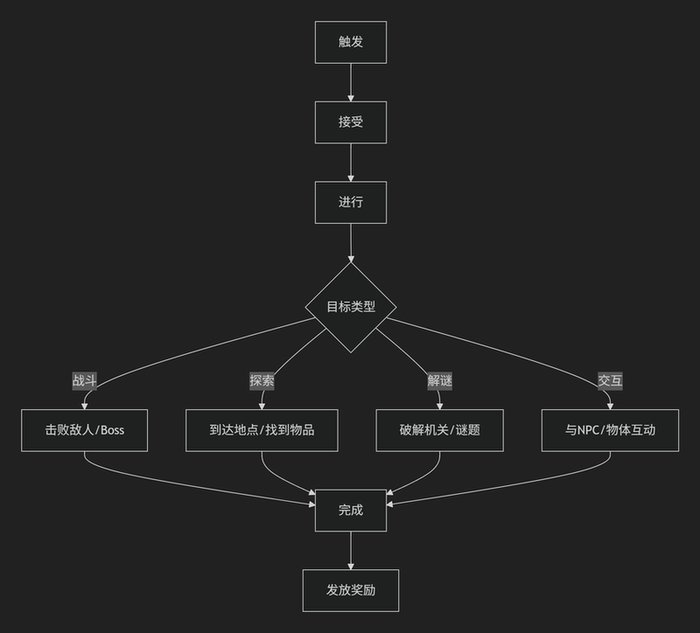
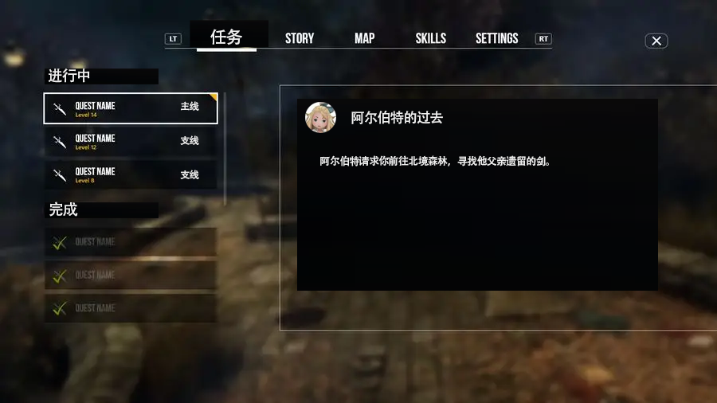

# JRPG任务系统开发文档   

## 1. 概述

本任务系统专为经典JRPG设计，核心目标是：

- **推动剧情发展**：任务为剧情推进的主要载体  
- **角色塑造**：通过任务呈现角色背景与成长  
- **世界观构建**：补充主线之外的世界细节  
- **玩家引导**：自然引导玩家探索世界、了解机制  

**设计原则：**

- **简洁性**：避免过于复杂的机制，确保开发效率与系统可维护性  
- **叙事优先**：所有任务设计以服务故事与角色为首要目标  
- **沉浸感**：减少UI干扰，任务内容应融入世界逻辑与氛围中 

## 2. 任务类型

| 类型       | 占比  | 触发条件        | 核心目的          | 示例        |
| -------- | --- | ----------- | ------------- | --------- |
| **主线任务** | 60% | 剧情强制触发      | 推动核心剧情，解锁新区域  | 击败邪神，拯救王国 |
| **角色任务** | 30% | 特定角色对话/剧情节点 | 揭示角色背景，解锁技能   | 战士的复仇之路   |
| **世界任务** | 8%  | 地图探索        | 扩展世界观，奖励稀有遗物  | 古代石碑之谜    |
| **委托任务** | 2%  | 城镇NPC对话     | 丰富场景细节，提供基础资源 | 找回遗失顶链    |

> 除主线任务外，其余任务可跳过，不影响通关流程。

在开发中优先实现​​主线任务框架+2~3个角色支线​​作为原型，确保叙事流畅性后再扩展收集类任务。   
开发优先级：主线任务系统 → 角色任务 → 世界探索任务   

## 3. 任务结构

### 3.1 任务生命周期


#### 3.1.1 触发

- 剧情事件（过场动画后自动接受）
- NPC对话（NPC头顶有对话框，但哪个NPC有任务不做强提示）
- 场景交互（阅读石碑／拾取信件）

#### 3.1.2 接受

- 主线任务无接受界面，满足条件后自动进入流程
- 支线任务，委托任务等弹出接受确认窗口
- 最多激活主线 + 3 个其他任务，超出时提示任务上限

#### 3.1.3 进行

目标类型包括：

- **战斗**：击败指定敌人或Boss  
- **探索**：到达目标地点/获取指定物品  
- **解谜**：完成机关或谜题  
- **交互**：与特定NPC/物件互动 

### 3.2 任务放弃

- 主线任务不可放弃  
- 支线任务完成状态不影响主线推进  
- 某些支线任务在章节推进后自动失效 

### 3.3 任务失败

- 战斗失败会出现gameover的UI，回到存档点
- 其他任务无失败状态，可无限重试

### 3.4 任务成功

- 主线任务触发后续剧情
- 支线任务返回NPC或区域交还 
- 奖励发放：和NPC对话或剧情完成后，获得遗物/金币/技能

## 4. 任务数据结构

### 4.1 Tasks（任务主表）

| 字段名                | 类型     | 必填 | 描述                                 |
| ------------------ | ------ | ---- | ---------------------------------- |
| id                 | string | 是    | 任务唯一ID（例：main_01）                 |
| type               | enum   | 是    | 类型：main, character, world, request |
| title              | string | 是    | 任务名称（显示在日志中）                        |
| desc               | string | 是    | 任务描述                        |
| trigger_condition  | string | 否    | 触发条件（例：after_main_03）            |
| objectives         | array  | 是    | 目标列表（见子表结构）                             |
| rewards            | array  | 是    | 奖励列表（见子表结构）                              |
| expireOnChapter | int | 否 | 超过该章节自动失效 |
| autoTriggerCutscene | string | 否 | 完成后自动播放剧情段ID |
| turnInToNpcId            | string  | 否    | 若该任务需回NPC交还，填NPC ID（否则视为自动完成）                              |

### 4.2 Objectives（目标子表）

| 字段名   | 类型     | 必填 | 描述                                |
| -------- | -------- | ---- | ----------------------------------- |
| type     | enum     | 是    | kill, move, collect, interact       |
| target   | string   | 是    | 目标ID（敌人ID/物品ID/场景ID）       |
| amount   | int      | 否    | 数量（如击败怪物数量，默认1）        |
| location | string   | 否    | 目标位置（场景ID）                   |
| hint     | string   | 否    | 环境提示文本（例："石像的第三只眼睛似乎可以转动"） |

### 4.3 Rewards（奖励子表）

| 字段名      | 类型     | 必填 | 描述                      |
| -------- | ------ | -- | ----------------------- |
| type     | enum   | 是  | item, gold, skill, flag |
| id       | string | 是  | 相应ID                    |
| quantity | int    | 否  | 数量（默认1）                 |
| narrative | string    | 否  | 获得时的叙事文本（"你领悟了艾琳家传的剑技"）                 |

### 示例配置

```json
{
  "id": "char_alb",
  "type": "character",
  "title": "阿尔伯特的过去",
  "desc": "阿尔伯特请求你前往北境森林，寻找他父亲遗留的剑。",
  "trigger_condition": "talked_to_albert>=3",
  "expireOnChapter": 4,
  "turnInToNpcId": "npc_albert",
  "autoTriggerCutscene": "cs_alb_sword_return",
  "objectives": [
    { "type": "move", "target": "north_forest", "location": "field_01" },
    { "type": "collect", "target": "sword_relic", "amount": 1 }
  ],
  "rewards": [
    { "type": "item", "id": "knight_sword", "quantity": 1 },
    { "type": "skill", "id": "royal_guard" }
  ]
}
```

## 5. 任务逻辑实现

### 5.1 运行时
任务管理器​​：单例类QuestSystem，管理任务状态（进行中/已完成）。
```csharp
public class QuestSystem : MonoBehaviour
{
    // 当前激活任务列表
    private Dictionary<string, ActiveQuest> activeQuests;
    
    // 任务状态枚举
    public enum QuestState { Inactive, Active, Completed, Abandoned,Failed }
    
    // 初始化任务系统
    void Initialize() 
    {
        // 加载任务配置数据
        // 绑定游戏事件监听器
    }
    
    // 任务触发检测
    void Update() 
    {
        foreach (var condition in triggerConditions) 
        {
            if (CheckCondition(condition)) 
            {
                StartQuest(condition.questId);
            }
        }
    }
    
    // 开始新任务
    public void StartQuest(string questId)
    {
        // 验证是否可接受
        // 创建ActiveQuest实例
        // 触发游戏内事件
        EventSystem.OnQuestStarted?.Invoke(questId);
    }
    
    // 更新任务进度
    public void UpdateObjective(string questId, string objectiveId, int progressDelta)
    {
        // 更新目标进度
        // 检查是否完成
        if (quest.IsComplete) 
        {
            CompleteQuest(questId);
        }
    }
}
```
📌 自动清理过期任务
```csharp
void OnChapterAdvanced(int newChapter)
{
    foreach (var quest in activeQuests.Values.ToList())
    {
        if (quest.expireOnChapter > 0 && newChapter >= quest.expireOnChapter)
        {
            AbandonQuest(quest.questId); // 清除任务
            EventSystem.OnQuestExpired?.Invoke(quest.questId);
        }
    }
}
```
📌 完成后自动触发剧情
```csharp
void CompleteQuest(string questId)
{
    var quest = activeQuests[questId];
    quest.state = QuestState.Completed;
    
    if (!string.IsNullOrEmpty(quest.autoTriggerCutscene))
    {
        CutsceneManager.Play(quest.autoTriggerCutscene);
    }

    // 发放奖励等
}
```
📌 回交型任务
```csharp
void TryTurnInQuest(string questId, string npcId)
{
    var quest = activeQuests[questId];
    if (quest.turnInToNpcId == npcId && quest.IsComplete)
    {
        CompleteQuest(questId);
    }
}
```
### 5.2 事件监听
```csharp
// 战斗系统事件。玩家击杀敌人 → 更新kill类目标
CombatSystem.OnEnemyDefeated += (enemyId) => 
{
    QuestSystem.Instance.UpdateObjectiveByTarget(enemyId, 1);
};

// 探索系统事件。玩家进入场景 → 更新move类目标
ExplorationSystem.OnLocationEntered += (locationId) => 
{
    QuestSystem.Instance.UpdateObjectiveByTarget(locationId, 1);
};

// 物品系统事件。玩家获得物品 → 更新collect类目标
InventorySystem.OnItemAcquired += (itemId, amount) => 
{
    QuestSystem.Instance.UpdateObjectiveByTarget(itemId, amount);
};
```
⚠️ 没有自动保存，需要到特定存档点手动保存    
⚠️ 进度保存：各目标独立记录，失败或退出不清除已完成部分

### 5.3 任务日志实现
#### UI结构示意


交互​​：仅支持查看/切换任务，无管理功能

#### 任务UI数据结构
```csharp
public class QuestLogEntry
{
    public string questId;
    public string title;
    public string description;
    public QuestState state;
    public CharacterPortrait character; // 关联角色
    public List<string> currentObjectives;
    public string hintLocation;
    public string turnInNpcName; // 如果是交还任务完成。用于日志中显示“请回到艾琳处交付任务”
}
```
解释：  
> public CharacterPortrait character; // 关联角色    

这是为任务日志中显示角色头像或任务来源角色的视觉标识而设计的字段    
JRPG游戏中的角色通常有鲜明的性格与背景，任务不仅是功能性目标，更是角色塑造的一部分。   
为此，在任务日志UI中展示相关角色的头像或代表形象，可以增强玩家对角色与任务之间关系的理解和情感链接。    
CharacterPortrait 是一个结构体或类，用于表示任务关联角色的视觉信息，例如： 
```csharp
public class CharacterPortrait
{
    public string characterId; // 如 "ayrin"
    public Sprite avatar;      // 角色头像图像
    public string displayName; // "艾琳"
}
```  
以下是几个典型使用方式:
```
任务名称：艾琳的请求
[头像图标] 艾琳：请你帮我去圣殿寻找父亲的佩剑。
目标：
- 进入圣殿
- 找到佩剑
```
UI 会根据 character.avatar 和 character.displayName 渲染头像和发言者。

## 6. 数据流向


## 7. 开发规范

### 7.1 命名规则

| 元素     | 规范                         | 示例                                |
| -------- | ---------------------------- | ----------------------------------- |
| 任务ID   | [类型]\_[角色/节点]\_[序号] | `char_ayrin_03`                     |
| 目标ID   | [类型]\_[描述]\_[地区]       | `item_ceremonial_sword_temple`     |
| 脚本事件 | OnQuest[Action]              | `OnQuestStarted`, `OnQuestCompleted` |

### 7.2 配置规范

- 所有任务配置由策划通过数据表驱动，禁止硬编码
- 叙事文本使用本地化键值，支持多语言键值对

### 7.3 测试用例

```gherkin
Feature: Ayrin's Personal Quest

Scenario: Complete sword retrieval quest
  Given player has progressed to Chapter 2
  When player speaks to Ayrin in the tavern
  Then quest "char_ayrin_01" becomes active

  Given quest "char_ayrin_01" is active
  When player enters Ancient Temple location
  Then objective "loc_ancient_temple" completes

  Given player finds "item_ceremonial_sword"
  When player returns to Ayrin
  Then quest completes and skill "double_slash" is unlocked
```

## 8. 性能与优化

- **内存管理**：每章仅加载相关任务；UI复用对象池  
- **任务存档结构**：
```json
"quests": {
  "active": [
    {
      "id": "char_ayrin_01",
      "progress": {
        "obj_temple": 1,
        "obj_sword": 0
      }
    }
  ],
  "completed": ["main_01", "world_ancient_seal"]
}
```
- **调试工具命令**：

```
/quest start char_ayrin_01
/quest complete active
/quest debug
```

## 9. 交付清单

1. 核心模块：
   - `QuestManager.cs`：任务生命周期管理
   - `ActiveQuest.cs`：任务实例逻辑
   - `QuestLogUI.cs`：任务日志界面控制器
2. 数据资源配置表（CSV/JSON）
3. 任务日志UI
4. 编辑器插件与调试模块
5. 开发文档（本文件）

---

**文档版本**：1.0  
**最后更新**：2025-06-16