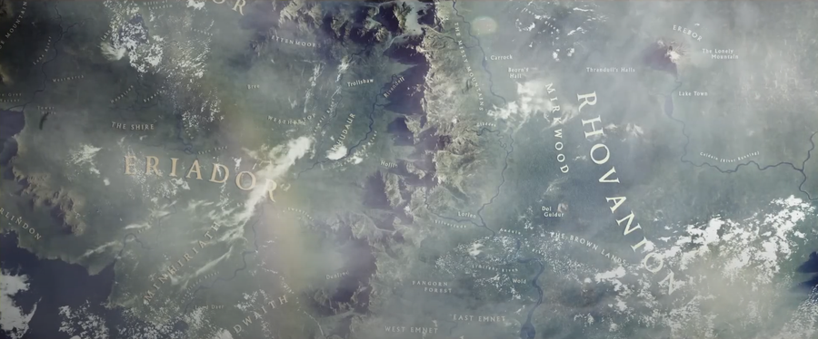

# 地图

## 素材及教程

### The Hobbit: A Journey through Middle Earth  
  
这个项目是由谷歌和华纳兄弟在2013年合作推出的，用于推广《霍比特人》三部曲电影。它允许用户以3D方式探索中土世界的各个地点，并根据不同的缩放显示相关信息。但由于这是一个限时的宣传项目，后来在电影推广结束后被移除。
### [在线地图生成 Fantasy-Map-Generator](https://azgaar.github.io/Fantasy-Map-Generator/)  
可以生成数据导出   
### [dungeondraft](https://dungeondraft.net/)  
Dungeondraft是一款用于幻想角色扮演游戏（RPG）的地图制作工具。适用于任何使用俯视艺术风格的游戏。具有许多有用的系统，如内置照明和智能物体放置。  
### [地图素材商店CartographyAssets](https://cartographyassets.com/assets/)  
### [Inkarnate Complete Aesthetic Guide](https://loreteller.notion.site/Inkarnate-World-Map-Aesthetic-Guide-4b35441527b8454bafa1123a72eb51b0)

## 规划设计
